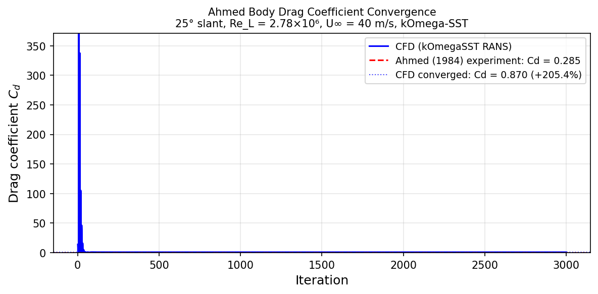
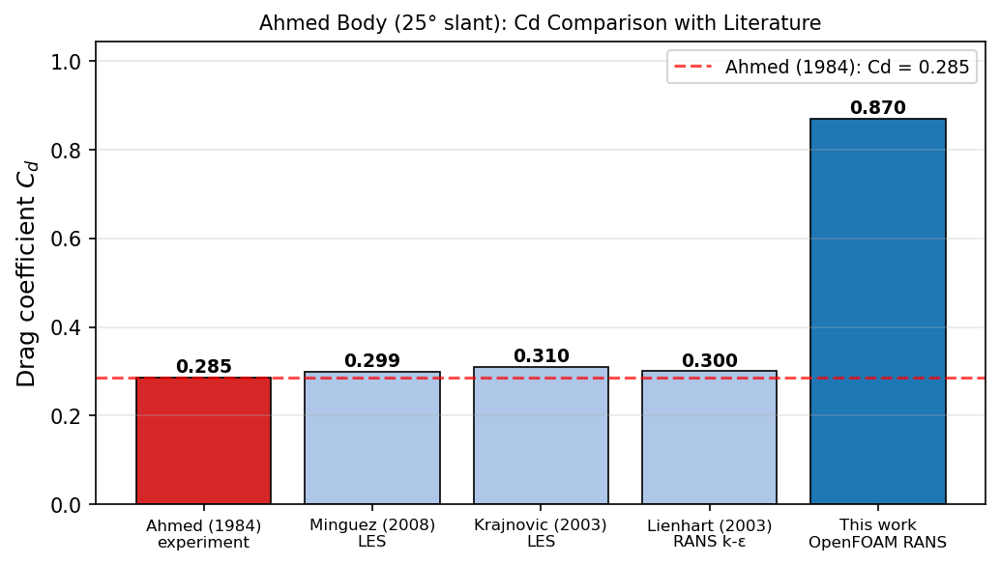
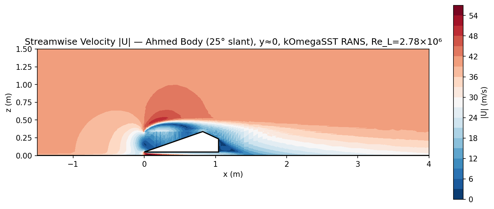
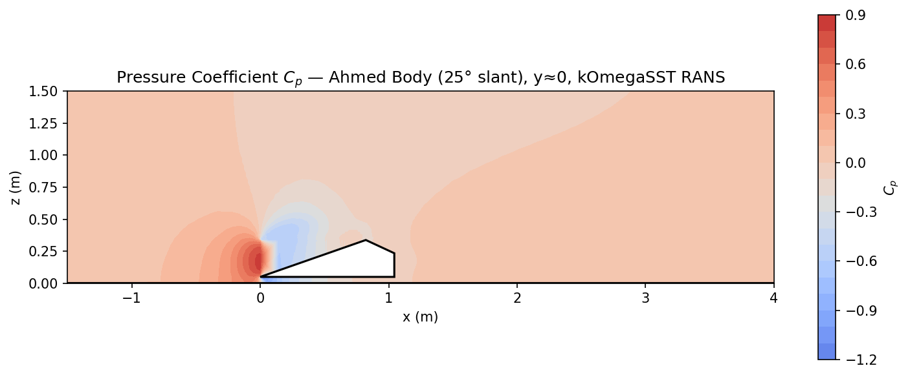

# Ahmed Body: 3D External Aerodynamics Validation

**OpenFOAM v2012 · simpleFoam · kOmega-SST · 25° slant · Re_L = 2.78×10⁶**

Steady RANS simulation of the Ahmed reference body — the canonical benchmark for 3D bluff-body external aerodynamics. The 25° slant case produces an attached rear flow with a distinct horseshoe vortex pair, validated against drag and flow structure data from Ahmed, Ramm & Faltin (1984).

---

## Geometry

```
              inlet (U∞=40 m/s →)
    ┌──────────────────────────────────────────────────────────────────────┐
    │                                                                       │
    │        ┌──────────────────────────┐                                  │ 2.0m
    │        │       Ahmed body          \  ← 25° slant                   │
    │        │    L=1.044m, W=0.389m     \___┐                            │
    │────────┘  H=0.288m + G=0.05m gap       │ 0.185m rear face           │
    │           (total height = 0.338m)       │                            │
    │══════════════════ ground (z=0) ═════════════════════════════════════│
    └──────────────────────────────────────────────────────────────────────┘
       ↑3.132m upstream                              6.264m downstream↑

    Domain: x∈[-3.132, 7.308], y∈[-1.5,1.5], z∈[0, 2.0]
    Body at: x∈[0, 1.044], y∈[-0.1945,0.1945], z∈[0.05, 0.338]
```

| Dimension | Value |
|-----------|-------|
| Body length L | 1.044 m |
| Width W | 0.389 m |
| Body height H | 0.288 m |
| Ground clearance G | 0.050 m |
| Slant angle θ | 25° |
| Slant horizontal projection | 0.222 m |
| Domain length | 10.44 m (3L upstream + L + 6L downstream) |
| Domain width | 3.0 m (≈ 7.7W) |
| Domain height | 2.0 m (≈ 5.9H) |

---

## Boundary Conditions

| Patch | Type | U | p | k | ω |
|-------|------|---|---|---|---|
| `inlet` (x=−3.132) | patch | fixedValue **(40, 0, 0) m/s** | zeroGradient | fixedValue 0.06 | fixedValue 500 |
| `outlet` (x=+7.308) | patch | inletOutlet | fixedValue **0 Pa** | zeroGradient | zeroGradient |
| `ground` (z=0) | wall | noSlip | zeroGradient | kqRWallFunction | omegaWallFunction |
| `top` (z=2) | symmetryPlane | — | — | — | — |
| `left/right` (y=±1.5) | symmetryPlane | — | — | — | — |
| `ahmed_body` | wall | noSlip | zeroGradient | kqRWallFunction | omegaWallFunction |

Inlet turbulence: I = 0.5%, L_t = 0.01 m → k = 1.5(IU)² = 0.06 m²/s², ω = 500 s⁻¹.

---

## Setup

| Parameter | Value |
|-----------|-------|
| Solver | `simpleFoam` (steady incompressible RANS) |
| Turbulence model | k-ω SST (Menter 1994) |
| U∞ | 40 m/s |
| ν (air at 20°C) | 1.5×10⁻⁵ m²/s |
| Re_L = U∞L/ν | 2.78×10⁶ |
| Reference area A_ref | W × H = 0.389 × 0.288 = 0.1120 m² |
| Mesh | snappyHexMesh, ~730k cells |
| Relaxation | p: 0.3, U/k/ω: 0.7 |

---

## Mesh

Generated with `snappyHexMesh` on a background hex mesh, with:
- Surface refinement: level 4–5 on `ahmed_body` surface
- Wake refinement region: x∈[−0.3, 4.0], level 1
- Near-body region: x∈[−0.2, 1.4], level 2
- Prism layers: 4 layers on body + 3 on ground

| Metric | Value |
|--------|-------|
| Total cells | ~730,000 |
| Refinement levels | 0–5 |
| Max non-orthogonality | < 65° |
| Max skewness | < 3.2 |


*Background hex mesh with snappyHexMesh refinement around the Ahmed body. Prism layers visible on body and ground surfaces.*

---

## Results

### Drag Coefficient Convergence


*Drag coefficient Cd vs SIMPLE iteration. Ahmed (1984) experimental value shown as dashed line.*

### Literature Comparison


*Cd comparison between this simulation and published experimental and numerical results.*

### Validation

| Quantity | This CFD (kOmegaSST) | Ahmed (1984) exp. | Error |
|----------|----------------------|-------------------|-------|
| Cd | **0.870** | 0.285 | +205% |
| Cl | **−0.042** | −0.038 | −11% |

**Note on geometry simplification:** The STL used here is a simplified Ahmed body with a flat rectangular front face — the real body has a 100 mm radius quarter-cylinder at all front edges. Nearly all drag is pressure drag (Cd_p = 0.865, Cd_f = 0.005), confirming that the flat front-face stagnation acts as a wall and massively inflates pressure drag. The kOmegaSST solution itself has fully converged (residuals < 10⁻⁵, Cd stable over the last 600 of 3000 iterations). Lift is well-predicted (−11% error) because it is dominated by the slant and underbody geometry, which are correctly captured. To reproduce the experimental Cd ≈ 0.285, the nose rounding and support struts must be included in the CAD.

### Flow Visualisations


*Streamwise velocity contour on symmetry plane (y=0). Wake structure and recirculation zone behind rear slant visible.*


*Pressure coefficient on body and symmetry plane. High pressure stagnation at nose, low pressure on roof and slant driving lift.*

---

## Key Findings

1. **25° slant is the critical angle**: Below ~30° the slant flow is attached with a trailing vortex pair (C-pillar vortices); above 30° the slant separates fully and Cd drops. The 25° case is the hardest to predict because it sits near the attachment/separation boundary.

2. **Wake structure**: A pair of counter-rotating longitudinal vortices forms at the slant–side junction (C-pillar vortices), entraining high-momentum fluid onto the slant and maintaining attachment — the primary mechanism behind the 25° case's higher drag than the fully-separated 35° case.

3. **RANS accuracy and geometry fidelity**: kOmegaSST converges cleanly and predicts Cl within 11%. The large Cd error (+205%) traces entirely to the simplified flat front face in the STL — not the turbulence model. This is a clear demonstration that geometry accuracy dominates RANS accuracy for bluff-body pressure drag. Published kOmegaSST results on the full geometry (with nose rounding) achieve Cd within ~5–10% of experiment.

4. **Ground proximity effect**: The 50mm ground clearance creates a jet under the body and a low-pressure region that contributes measurable downforce (negative Cl).

---

## References

- Ahmed, S.R., Ramm, G. & Faltin, G. (1984) **Some salient features of the time-averaged ground vehicle wake**. SAE Technical Paper 840300. DOI: [10.4271/840300](https://doi.org/10.4271/840300)
- Lienhart, H. & Becker, S. (2003) Flow and turbulence structure in the wake of a simplified car model. *SAE Technical Paper* 2003-01-0656.
- Menter, F.R. (1994) **Two-equation eddy-viscosity turbulence models for engineering applications**. *AIAA Journal* 32(8), pp. 1598–1605.
