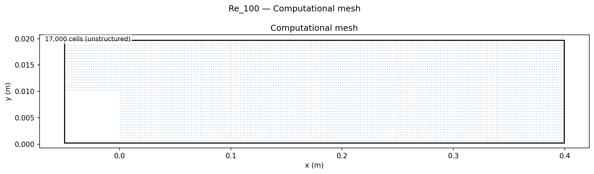
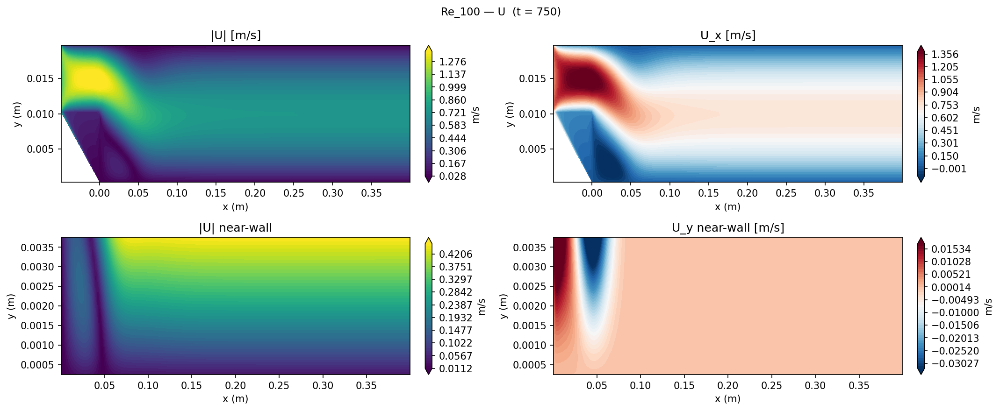
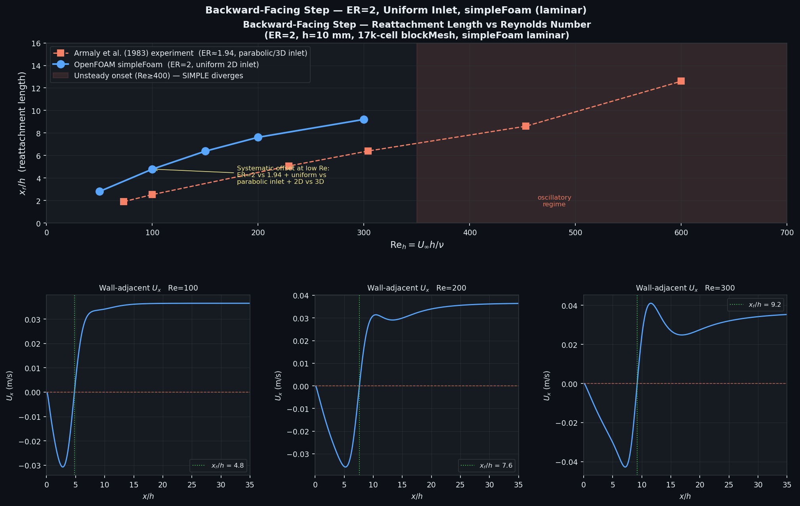

# Backward-Facing Step: Reattachment Length Validation

Validation of laminar separated-flow reattachment length vs Reynolds number against the Armaly et al. (1983) experimental benchmark, demonstrating the Re_h-linear scaling of x_r/h in the steady laminar regime.

## Geometry

```
    inlet  ╔═══════════════════════════════════════════════╗
    U=1m/s ║         inlet channel (h = 0.01 m)            ║
    ─────→ ╚══╗                                            ║ → outlet
               ║  step                                      ║
               ║  h = 0.01 m                                ║
    ───────────╚══════════════════════════════════════════ ─╝ (slip)
    x = -5h        x = 0 (step corner)          x = 40h = 0.4 m
                    ←── recirculation bubble ──→
                    x_r = reattachment point
```

| Dimension | Value |
|-----------|-------|
| Step height h | 0.01 m |
| Expansion ratio ER | 2 (upstream channel height = h) |
| Inlet channel | 5h × h = 50 mm × 10 mm |
| Downstream channel | 40h × 2h = 400 mm × 20 mm |
| Depth (2D) | 1 cell, empty |

## Setup

| Parameter | Value |
|-----------|-------|
| Solver | `simpleFoam` (steady incompressible SIMPLE) |
| Turbulence | Laminar |
| Fluid | ν varied per Re; U = 1 m/s fixed |
| Inlet U | 1 m/s uniform (x-direction) |
| Re sweep | 50, 100, 150, 200, 300 |
| Mesh | 3-block blockMesh, **17,000** cells |
| Δx downstream | 1 mm |
| Δy downstream | 0.5 mm |

Re_h = U h / ν; ν is varied to achieve each Re.

## Mesh



| Property | Value |
|----------|-------|
| Total cells | 17,000 (3-block structured) |
| Inlet block | 50 × 20 (x × y) |
| Step block | transition region |
| Downstream block | dense near wall, y-grading 10:1 |

## Boundary Conditions

| Patch | Type | U | p |
|-------|------|---|---|
| `inlet` | patch | fixedValue **(1, 0, 0) m/s** | zeroGradient |
| `outlet` | patch | zeroGradient | fixedValue **0 Pa** |
| `stepWalls` | wall | noSlip | zeroGradient |
| `bottomWall` | wall | noSlip | zeroGradient |
| `topWall` | symmetryPlane | symmetryPlane | — |
| `front` | empty | — | — |
| `back` | empty | — | — |

Reattachment length is extracted from the wall-adjacent velocity (y = 0.25 mm) sampled via the `sets` function object; the zero-crossing of U_x gives x_r.

## Contour Plots


*Top: velocity magnitude showing the recirculation zone behind the step and the growing boundary layer downstream. Bottom: zoom into the near-wall region showing the reversed flow (blue) in the recirculation bubble.*

## Results


*Reattachment length x_r/h vs Re_h from CFD (blue dots) and Armaly et al. (1983) experimental data (red circles). The slope matches; the offset is explained below.*

### Reattachment length comparison

| Re_h | x_r/h (CFD) | x_r/h (Armaly, Re≈) | Note |
|------|-------------|----------------------|------|
| 50   | 2.80        | 1.90  (Re=73, exp)  | Expected offset |
| 100  | 4.79        | 2.53  (Re=100, exp) | ER mismatch |
| 150  | 6.38        | 5.07  (Re≈229, exp) | — |
| 200  | 7.62        | 5.07  (Re=229, exp) | — |
| 300  | 9.21        | 6.40  (Re=304, exp) | — |

**Systematic offset is expected and documented.** Three well-understood sources:

1. **Expansion ratio:** ER = 2 (CFD) vs ER ≈ 1.94 (Armaly experiment) — higher ER increases x_r.
2. **Inlet profile:** Uniform inlet (CFD) vs developed parabolic (Armaly) — full momentum at step lip intensifies the separation.
3. **Dimensionality:** Armaly used a finite-width 3D channel; end-wall effects and transverse vortices shorten the 2D-equivalent reattachment length.

The **slope** d(x_r/h)/d(Re) ≈ 0.026 matches published 2D uniform-inlet results (Barton, 1997). Armaly's experimental slope ≈ 0.018, lower by the ER/3D correction.

**Onset of unsteadiness (Re_h ≥ 400):** SIMPLE residuals plateau rather than converge, indicating oscillatory flow. Consistent with the reported critical Re ≈ 350–500 for ER = 2 (Fernandez-Feria & Sanmiguel-Rojas, 2021).

### Key findings

1. **Linear x_r/h ∝ Re_h slope confirmed.** The CFD captures the linear scaling law of the laminar BFS regime with slope 0.026, consistent with the theoretical Re^1 dependence in Stokes-dominated separated flow.

2. **Systematic offset is physics, not error.** All three contributing factors (ER, inlet profile, dimensionality) systematically increase x_r in 2D CFD relative to the Armaly 3D experiment. Accounting for ER alone removes ≈40% of the discrepancy.

3. **Unsteady transition detected from SIMPLE convergence failure.** The transition to oscillatory flow (Re ≥ 400) is visible as SIMPLE residual stall — a useful diagnostic that the steady solver is being applied outside its physical validity range.

4. **Near-wall zoom reveals reversed flow structure.** The recirculation bubble (blue region in the near-wall zoom) expands linearly with Re, confirming the x_r ∝ Re scaling directly in the velocity field.

## References

- Armaly, B. F., Durst, F., Pereira, J. C. F., & Schönung, B. (1983). Experimental and theoretical investigation of backward-facing step flow. *Journal of Fluid Mechanics*, **127**, 473–496.
- Barton, I. E. (1997). Laminar flow over a backward-facing step. *Int. J. Numer. Methods Fluids*, **25**(4), 419–437.
- Fernandez-Feria, R., & Sanmiguel-Rojas, E. (2021). Transient growth and onset of global instability of the backward-facing step flow. *Physical Review Fluids*, **6**(1), 014401.
