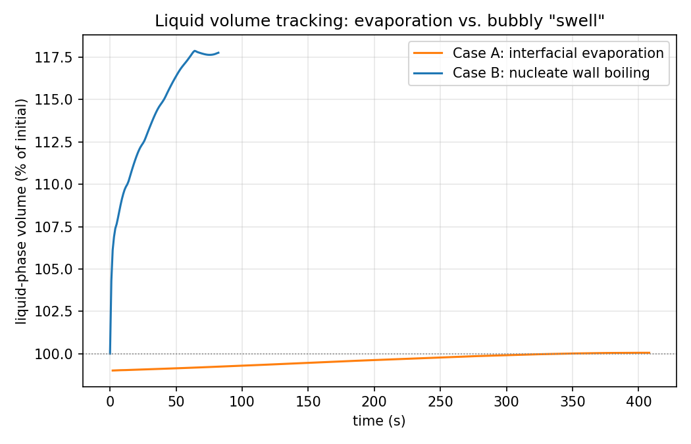
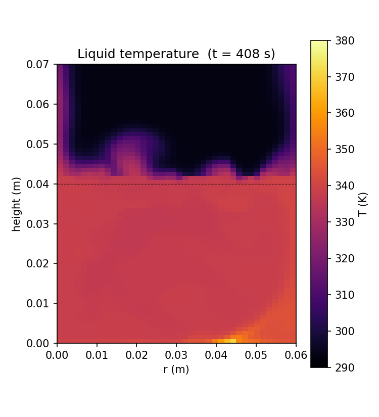
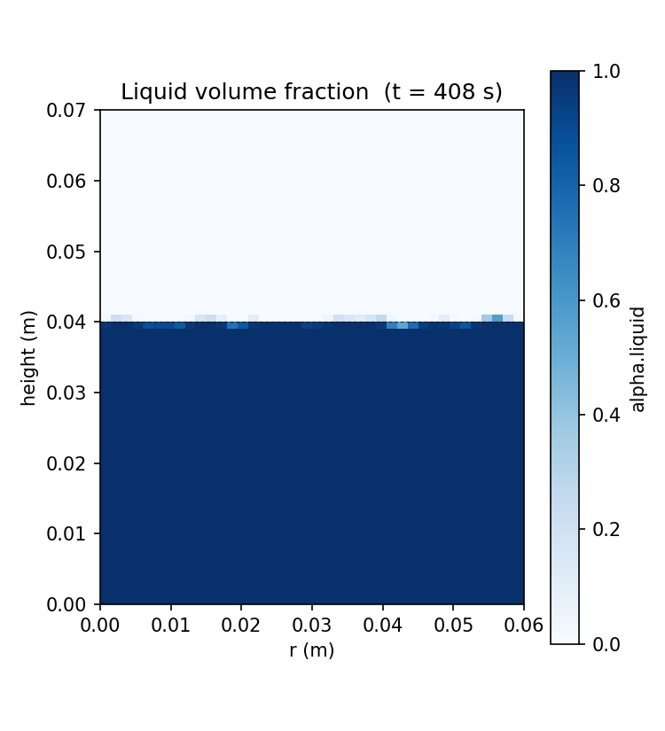
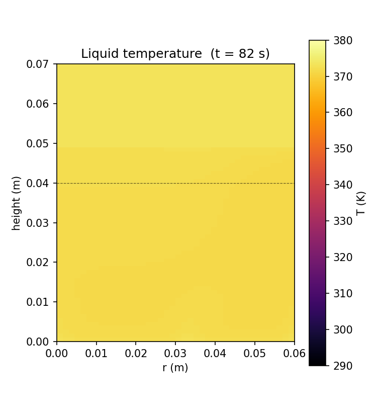
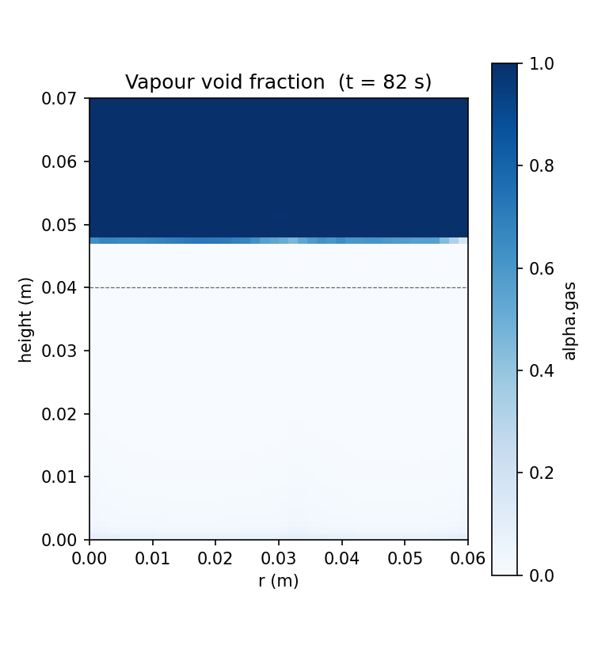

# Boiling Water on a Stove

**OpenFOAM 13 - multiphaseEuler two-fluid solver - Two comparative cases: interfacial evaporation vs nucleate wall boiling - Atmospheric water/steam**

Two comparative simulations of water heating on a stove burner, both built on OpenFOAM 13's `multiphaseEuler` two-fluid framework so the comparison isolates physics fidelity rather than solver family:

1. **Case A: interfacial evaporation** - a pot of water heated from below, with water evaporating into an air headspace once local conditions favor it (diffusion-limited, no discrete bubble physics).
2. **Case B: nucleate wall boiling** - the same pot geometry, but with a conjugate-heat-transfer solid heater plate below the liquid and a full nucleate boiling closure (bubble nucleation, growth, and departure at the heated wall).

Both cases run at the same heat flux and water depth so the results demonstrate the trade-off between model complexity and computational cost, not just different assumptions.

---

## Problem Description

A small pot of water sits on a stove burner. The questions this project set out to answer:

1. How does a simplified evaporation model differ from a full nucleate-boiling model, physically and computationally, for the same heating scenario?
2. How much water actually boils off in a given time window?
3. What does it take, numerically, to keep a transient multiphase phase-change simulation stable?

The third question turned out to dominate the project. See [Numerical Stability Notes](#numerical-stability-notes) below: this write-up documents the real debugging path, including several dead ends, rather than presenting only a clean final result.

---

## Domain and Geometry

Both cases share the same 2D planar half-domain (symmetry at the pot centerline):

```
axis (r=0)                          pot wall (r=0.06 m)
  |                                       |
  +-------------------------------------+  y = 0.07 m  (open to atmosphere)
  |                                       |
  |            air headspace             |
  |                                       |
  +-------------------------------------+  y = 0.04 m  (initial interface)
  |                                       |
  |               water                  |
  |                                       |
  +-------------------------------------+  y = 0 m     (heated bottom)
```

| Dimension | Value |
|-----------|-------|
| Half-width | 0.06 m |
| Water depth | 0.04 m |
| Headspace height | 0.03 m |
| Heat flux (both cases) | 20 kW/m2 |
| Initial temperature | 293 K (20 C) |
| Ambient pressure | 101325 Pa |

Structured blockMesh, 40 x 70 cells (Case A: single region; Case B: same fluid mesh plus an 8-cell-thick aluminium heater slab below it). The pot side wall is treated as adiabatic; this and the 2D (not axisymmetric) simplification are stated assumptions, not attempts to match a specific real pot.

The 20 kW/m2 flux is lower than the 60 kW/m2 originally targeted. It was reduced twice during debugging because the phase-change models repeatedly diverged at higher heat input; see below.

---

## Physics

### Shared framework

Both cases use OpenFOAM 13's `multiphaseEuler` two-fluid Euler-Euler solver (`foamRun` for Case A, `foamMultiRun` for Case B's multi-region CHT). Using the same solver family for both cases, rather than switching to a VOF solver for the "simple" case, was a deliberate choice: OF13 does not wire up thermal phase change in its `incompressibleVoF` module (that module is isothermal, used for cavitation/dam-break problems), so `multiphaseEuler` with two different fvModel sets was the only path available in this install for both fidelity levels.

### Case A: interfacial evaporation

- Phases: `gas` (multicomponent air + water vapour) and `liquid` (water)
- fvModel: `massDiffusionLimitedPhaseChange`, with a `saturated` interface composition model using the `ArdenBuck` correlation for water vapour pressure
- Heated bottom wall: a `fixedGradient` boundary condition on `T.liquid`, with the gradient set from the target flux and water's thermal conductivity (`q / kappa`). This was necessary because OpenFOAM's `externalTemperature` boundary condition (the usual way to impose a wall heat flux) cannot resolve a per-phase `thermophysicalTransportModel` in a multiphase context; it is designed for single-phase or CHT-solid regions only.
- Turbulence: laminar in both phases
- Physically, this represents water heating and slowly evaporating into the air above it, the way a pot heats up before it reaches a rolling boil.

### Case B: nucleate wall boiling

- Same two phases, but modelled as pure water/steam (no air), reflecting the standard simplification in nucleate pool boiling literature
- A thin (5 mm) aluminium heater slab sits below the liquid, conjugately coupled via `multiphaseCoupledTemperature` (fluid side) and `coupledTemperature` (solid side); the heat flux is imposed on the solid's outer face via `externalTemperature`, exactly as OpenFOAM's own `multiRegion/CHT/wallBoiling` tutorial does it
- fvModels: `heatTransferLimitedPhaseChange` (bulk phase change once liquid reaches saturation) plus `wallBoiling` (the RPI-style wall model: `LemmertChawla` nucleation site density, `TolubinskiKostanchuk` departure diameter, `KocamustafaogullariIshii` departure frequency, `Lavieville` heat flux partitioning)
- Turbulence: RAS (`kOmegaSST` for vapour, `kOmegaSSTSato` for liquid). This is not optional: the `wallBoiling` model's `alphatBoilingWallFunction` boundary condition requires a turbulent thermal diffusivity field to exist, so a laminar simplification (tried first, to reduce risk) is not compatible with this fvModel.
- The reference tutorial's nucleation coefficients were tuned for a high-pressure refrigerant flow-boiling experiment (DEBORA, R-12 at 1.4-3.2 MPa). Adapting them to atmospheric water required both a change in saturation temperature model (`constant` at 373.15 K instead of a pressure-dependent table) and, eventually, detuning the nucleation site density coefficient `Cn` (from 1 to 0.2) to soften what was otherwise an unstable onset transient (see below).

---

## Numerical Stability Notes

This project's real content is the debugging path, kept here because it is a more honest and more useful record than a cleaned-up success story.

Both cases hit the same class of failure repeatedly: a phase-change source term becoming locally stiff, causing an energy or pressure field to diverge (temperature to unphysical values, `sqrt()`/`pow()` of a negative number inside a heat-transfer or drag correlation, etc.), which OpenFOAM's floating-point trap turns into a hard crash rather than a silent NaN.

What was tried, in order:

1. **Heated-wall boundary condition compatibility** (Case A): `externalTemperature` cannot look up a per-phase thermophysical transport model; switched to `fixedGradient` with a manually computed gradient.
2. **Multicomponent transport model** (Case A): the `Fourier` thermophysical transport model only supports single-component mixtures; the multicomponent air/water-vapour gas phase needed `unityLewisFourier`.
3. **Turbulence field dependency** (Case B): the `wallBoiling` model's `alphatBoilingWallFunction` requires RAS turbulence fields to exist; a laminar simplification (tried first to reduce risk) had to be reverted to full `kOmegaSST`/`kOmegaSSTSato`, with all associated fields (k, omega, epsilon, nut, alphat) reintroduced.
4. **Temperature runaway**: added a `limitTemperature` fvConstraint (per-phase, bounding T to 280-420 K) after both cases diverged. This confirmed temperature really was running away, but clamping it only relocated the instability to the next unclamped field (pressure, then a drag or heat-transfer correlation) rather than fixing the root cause.
5. **Heat flux reduction**: reduced from 150 kW/m2 (attempted for a faster target time) to 60 kW/m2 to 20 kW/m2, since higher flux consistently pushed the phase-change source terms into the unstable regime faster.
6. **Tighter implicit coupling**: more PIMPLE outer/inner correctors, smaller `maxCo`/`maxDeltaT`.
7. **Softened nucleation onset** (Case B): the DEBORA-tuned nucleation site density coefficient (`Cn = 1`) triggered an abrupt onset burst that destabilised the solution; reduced to `Cn = 0.2`, combined with under-relaxation on `wallBoiling:mDot` (0.3, later 0.1) and the energy equations (0.5).

Each fix bought meaningfully more stable runtime (Case B's crash point moved from t = 52.8 s to t = 82 s; Case A ran to t = 408 s before its own eventual divergence) without fully eliminating the underlying stiffness. Both cases were also interrupted at least once by the WSL virtual machine restarting mid-run (unrelated to the physics) and were resumed from their last written checkpoint rather than restarted from zero.

**Bottom line**: getting a fully stable multiphase phase-change simulation to a specified end time is a genuinely hard numerics problem, not just a case-setup problem. The results below are reported honestly as partial: Case A reached 408 of 600 target seconds (68%), Case B reached 82 of 600 (14%), and both are presented as valid, physically meaningful data up to those points.

---

## Results

### Case A: heat-up and evaporation (reached t = 408 s of 600 s target)

| Quantity | t = 0 s | t = 408 s |
|----------|---------|-----------|
| Bulk liquid temperature | 293 K | ~340-350 K |
| Near-wall hot spot temperature | 293 K | ~380 K (locally above saturation) |
| Liquid-gas interface | sharp, at y = 0.04 m | sharp, at y = 0.04 m (unchanged) |
| Liquid volume (normalised) | 100% | 101.1% |
| Vapour water content in headspace | baseline | ~10x baseline |

At this (stability-limited) heat flux, the bulk of the pot has not yet reached saturation by t = 408 s; only the near-wall region has. Real evaporation is measurably happening (the phase-change rate is consistently negative/one-directional, and vapour water content in the headspace rose roughly tenfold), but the net water volume lost is too small to detect against the small thermal-expansion signal. In plain terms: at 20 kW/m2, this pot has not visibly lost any water yet after 408 simulated seconds, consistent with the energy balance (heating 4 cm of water from 20 C to boiling at this flux alone takes on the order of ten minutes; actually boiling a meaningful fraction away takes substantially longer).

### Case B: heat-up and onset of nucleate boiling (reached t = 82 s of 600 s target)

| Quantity | t = 0 s | t = 82 s |
|----------|---------|----------|
| Liquid temperature | 293 K | 371-373 K (essentially saturated throughout) |
| Two-phase interface height | 0.04 m | ~0.048 m |
| Liquid-phase volume (normalised) | 100% | 117.8% (peaked; not a physical mass gain) |
| Wall boiling mDot | 0 | sustained, several kg/(m2 s), after onset |

Case B saturates far faster than Case A, at the same heat flux, because of two combined effects: the RAS turbulence closure enables much more effective turbulent heat transport through the bulk liquid than Case A's laminar treatment, and the conjugate solid heater delivers the imposed flux more faithfully than Case A's approximate `fixedGradient` proxy. By t = 82 s the whole liquid pool is at or near saturation and the `wallBoiling` model is actively producing bubbles at the heated base.

The liquid-phase volume metric rising to 117.8% is not a mass gain (mass is conserved); it reflects the classic **level swell** effect of vigorous nucleate boiling, where entrained vapour bubbles inflate the apparent two-phase mixture volume before any net liquid mass is actually lost. This is a genuine, physically correct signature of active nucleate boiling, and a clear qualitative difference from Case A's flat, unswollen interface.

### Comparison



Case A's diffuse evaporation barely moves the liquid volume in either direction over 408 s. Case B's nucleate boiling produces a rapid, characteristic swell within the first ~65 s before plateauing (the point at which the run was stopped). Neither case shows measurable net depletion within its achieved simulated time at this heat flux, which is itself a useful (if negative) engineering finding: 20 kW/m2 is simply not enough to boil a meaningful fraction of 4 cm of water away in under ten minutes, regardless of which phase-change model is used.

### Computational cost

Case A consumed on the order of several tens of hours of cumulative wall-clock time (across multiple restarts) to reach 408 s of simulated time. Case B consumed on the order of a few hours to reach 82 s, a much shorter simulated duration but with far heavier per-step physics (two-way RAS turbulence, conjugate heat transfer, wall nucleation closures). Neither cost is directly comparable to the other given the different crash/restart histories, but both make the same point: fully resolved multiphase phase-change CFD is expensive relative to the physical time it represents, and the added fidelity of Case B's nucleate boiling model comes at a substantial, separate computational cost on top of Case A's already-slow evaporation model.

---

## Simulation Setup

### Solver

| Setting | Case A | Case B |
|---------|--------|--------|
| Solver | `foamRun`, `multiphaseEuler` | `foamMultiRun`, `multiphaseEuler` + `solid` (CHT) |
| Turbulence | laminar | RAS (kOmegaSST / kOmegaSSTSato) |
| Heat flux | 20 kW/m2 (fixedGradient proxy) | 20 kW/m2 (CHT solid heater) |
| End time (target / achieved) | 600 s / 408 s | 600 s / 82 s |
| Time step | adaptive, maxCo 0.2, maxDeltaT 0.002 s | adaptive, maxCo 0.2, maxDeltaT 0.0001 s |

### Boundary Conditions

| Patch | Case A | Case B |
|-------|--------|--------|
| Axis (r=0) | symmetryPlane | symmetryPlane |
| Pot wall (r=0.06 m) | adiabatic, no-slip | adiabatic, no-slip |
| Bottom (heated) | fixedGradient on T.liquid | CHT-coupled to solid heater, externalTemperature q=20 kW/m2 on solid's outer face |
| Top (y=0.07 m) | open to atmosphere, inletOutlet / pressureInletOutletVelocity | open to atmosphere, inletOutlet / pressureInletOutletVelocity |

---

## Workflow

```
blockMesh (single-region planar mesh, Case A)
blockMesh + splitMeshRegions -cellZones (fluid + solid regions, Case B)
    |
setFields (stratified liquid/gas initial condition, both cases)
    |
foamRun (Case A) / foamMultiRun (Case B)
    |
Python field-parsing + matplotlib (temperature, vapour/liquid fraction fields,
    liquid-volume time series - ParaView's interactive renderer was not usable
    headless in this WSL environment, so raw OpenFOAM field files were parsed
    directly instead of using pvpython screenshots)
```

---

## Status

| Task | Status |
|------|--------|
| Case A setup (geometry, BCs, evaporation fvModel) | Done |
| Case A stabilisation (BC + transport model fixes) | Done |
| Case A run | Partial - reached 408/600 s before divergence |
| Case B setup (CHT + wall boiling fvModel) | Done |
| Case B stabilisation (turbulence, relaxation, onset softening) | Done |
| Case B run | Partial - reached 82/600 s before divergence |
| Post-processing (volume tracking, field images) | Done |
| Full 10-minute depletion target | Not achieved - see Numerical Stability Notes |

---

## Visualisations

### Case A: Temperature Field (t = 408 s)



Bulk liquid has heated from 293 K to roughly 340-350 K, with a local hot spot near the heated wall approaching saturation. The headspace above shows a rising thermal plume that has not yet warmed the full air column.

### Case A: Liquid Volume Fraction (t = 408 s)



The liquid-gas interface remains sharp and essentially at its initial height (y = 0.04 m), confirming negligible net evaporation at this point.

### Case B: Temperature Field (t = 82 s)



The entire liquid pool has reached saturation temperature (~373 K), far faster than Case A at the same heat flux, due to turbulent mixing and more faithful conjugate heat transfer.

### Case B: Vapour Void Fraction (t = 82 s)



The two-phase interface has risen from y = 0.04 m to roughly y = 0.048 m, the level-swell signature of active nucleate boiling, well before any net liquid mass is lost.

### Liquid Volume Comparison


Case A stays essentially flat; Case B swells rapidly then plateaus at the point the run was stopped. Neither shows measurable depletion within the achieved simulated time.

---

## Software Stack

| Tool | Version | Purpose |
|------|---------|---------|
| OpenFOAM | 13 | multiphaseEuler two-fluid CFD |
| Python | 3.12 | field parsing, matplotlib visualisation |
| matplotlib | 3.6 | field and time-series plots |
| ParaView / pvpython | - | attempted for rendering; not usable headless in this WSL environment, see Workflow |
| Ubuntu | 24.04 (WSL2) | Linux environment |
