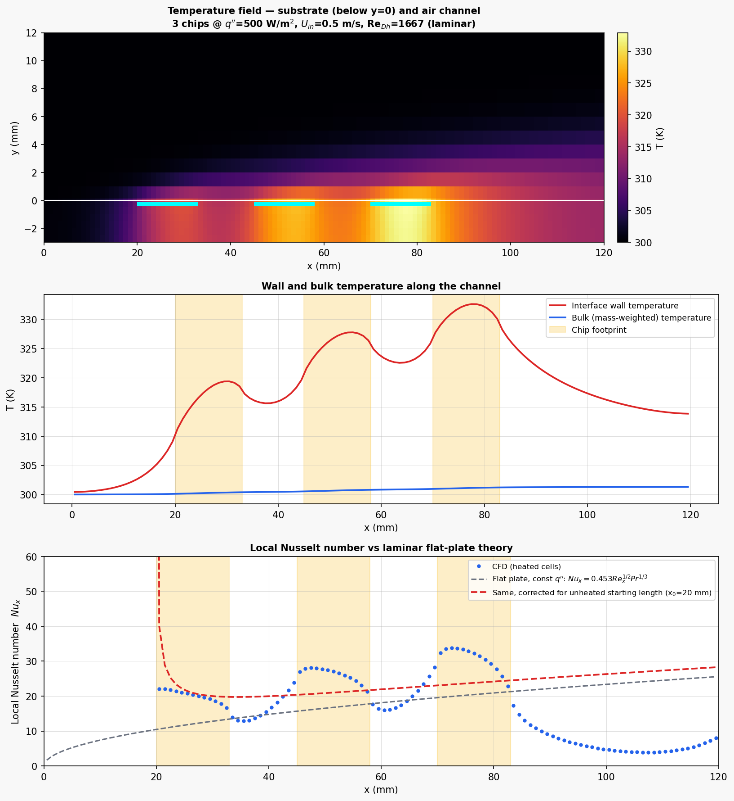

# Conjugate Heat Transfer: Air-Cooled Electronics on a PCB

**OpenFOAM v2012 · chtMultiRegionSimpleFoam · 2D · Laminar forced convection**

Two-region conjugate heat transfer simulation of three flush-mounted heat-dissipating
components on an FR4 substrate, cooled by forced airflow in a parallel-plate channel.
Solid conduction and fluid convection are solved simultaneously and coupled at the
interface, so the chip temperatures emerge from the physics rather than from an assumed
heat transfer coefficient.

---

## Geometry

```
                    adiabatic top wall
   ┌──────────────────────────────────────────────────────────┐
   │                                                          │
 → │                    air channel                           │ →
 U │                     H = 25 mm                            │  outlet
   │ ▓▓▓▓▓▓▓▓▓▓▓▓▓▓▓▓▓▓▓▓▓▓▓▓▓▓▓▓▓▓▓▓▓▓▓▓▓▓▓▓▓▓▓▓▓▓▓▓▓▓▓▓▓▓▓▓ │  ← coupled interface (y = 0)
   ├───█████────────█████────────█████────────────────────────┤
   │   chip1        chip2        chip3      FR4 substrate     │  3 mm
   └──────────────────────────────────────────────────────────┘
                    insulated underside
   x = 0        20   33   45   58   70   83                 120 mm
```

| Parameter | Value |
|-----------|-------|
| Channel length L | 120 mm |
| Channel height H | 25 mm |
| Substrate thickness | 3 mm |
| Chip footprint | 13 mm × 0.5 mm (embedded in substrate top surface) |
| Chip positions (x) | 20–33, 45–58, 70–83 mm |
| Unheated gaps | 12 mm between chips |
| Depth (2D) | 1 mm, `empty` |

---

## Mesh

Two regions split from a single `blockMesh` using `topoSet` + `splitMeshRegions`,
producing a conformal `mappedWall` interface pair.

| Region | Cells (x × y) | Total | Δx | Δy |
|--------|---------------|-------|-----|-----|
| `fluid` (air channel) | 120 × 25 | 3 000 | 1.0 mm | 1.0 mm |
| `solid` (FR4 substrate) | 120 × 6 | 720 | 1.0 mm | 0.5 mm |

Interface: `fluid_to_solid` ↔ `solid_to_fluid`, 120 faces each, `sampleMode nearestPatchFace`.

---

## Material Properties

| Property | Air (fluid) | FR4 (solid) |
|----------|-------------|-------------|
| ρ | 1.2 kg/m³ (`rhoConst`) | 1900 kg/m³ |
| Cp | 1005 J/(kg·K) | 1300 J/(kg·K) |
| μ | 1.8×10⁻⁵ Pa·s | — |
| Pr | 0.713 | — |
| k | 0.02537 W/(m·K) (= μCp/Pr) | 0.30 W/(m·K) |
| Thermo model | `heRhoThermo` / `pureMixture` / `hConst` | `heSolidThermo` / `constIso` |

---

## Boundary Conditions

### Fluid

| Patch | U | p_rgh | T |
|-------|---|-------|---|
| `inlet` | `fixedValue` (0.5 0 0) | `fixedFluxPressure` | `fixedValue` 300 K |
| `outlet` | `inletOutlet` | `fixedValue` 101 325 Pa | `inletOutlet` 300 K |
| `topWall` | `noSlip` | `fixedFluxPressure` | `zeroGradient` (adiabatic) |
| `fluid_to_solid` | `noSlip` | `fixedFluxPressure` | `compressible::turbulentTemperatureCoupledBaffleMixed` |
| `frontAndBack` | `empty` | `empty` | `empty` |

### Solid

| Patch | T |
|-------|---|
| `solid_to_fluid` | `compressible::turbulentTemperatureCoupledBaffleMixed` (`kappaMethod solidThermo`) |
| `substrateBottom` | `zeroGradient` (insulated underside) |
| `substrateInlet` / `substrateOutlet` | `zeroGradient` |
| `frontAndBack` | `empty` |

The insulated underside and adiabatic top force **all** dissipated power to leave through
the outlet, which makes the global energy balance an exact closure check rather than an
approximate one.

---

## Setup

| Parameter | Value |
|-----------|-------|
| Solver | `chtMultiRegionSimpleFoam` (steady, segregated multi-region) |
| Turbulence | **Laminar** — see note below |
| Inlet velocity U_in | 0.5 m/s (uniform) |
| Hydraulic diameter D_h = 2H | 0.05 m |
| **Re_Dh = U D_h / ν** | **1 667 → laminar** |
| Pr | 0.713 |
| Heat flux per chip q″ | 500 W/m² |
| Power per chip | 6.5 mW (q″ × 13 mm × 1 mm) |
| Total dissipated power | 19.5 mW |
| Heat source | `scalarSemiImplicitSource` on `h`, `volumeMode absolute`, in the **solid** heater cellZones |
| Gravity | (0 0 0) — pure forced convection, no buoyancy |
| Relaxation | p_rgh 0.7, U 0.3, h 0.3 |
| Iterations | 3 000 |
| Final residuals | p_rgh ~4×10⁻⁸, h ~1×10⁻⁸ |

### Why laminar, not k-ε

Re_Dh = 1 667 is well below the ~2 300 transition threshold for internal flow, so a
turbulence model is not merely unnecessary here — it is wrong. An eddy viscosity applied
to a laminar field artificially thickens the thermal boundary layer and suppresses the
local Nusselt peaks that are the whole point of this case.

### Why the heat sources sit in the solid

The dissipation physically occurs inside the components, and routing it through the
substrate is what makes this a *conjugate* problem: the FR4 (k = 0.3 W/m·K, a poor
conductor) spreads heat laterally and sets the spreading resistance, which in turn sets
the interface temperature distribution. Injecting the same power directly into the fluid
cells would bypass the substrate entirely and reduce the case to a prescribed-flux
convection problem.

---

## Results



*Top: temperature field across both regions (substrate below y = 0, air channel above);
cyan bars mark the chip footprints. Middle: interface wall temperature and mass-weighted
bulk temperature. Bottom: local Nusselt number against laminar flat-plate theory.*

### Energy balance (verification)

| Quantity | Value |
|----------|-------|
| Power in (3 chips) | 0.019 50 W |
| Bulk temperature rise at outlet | 1.294 K |
| Power out = ṁ·Cp·ΔT_bulk | 0.019 50 W |
| **Closure error** | **0.00 %** |

With ṁ = ρ·U·H·b = 1.5×10⁻⁵ kg/s. Exact closure confirms the multi-region interface
conserves energy — the primary correctness check for a CHT setup.

### Component temperatures

| Chip | x (mm) | Mean surface T | Peak surface T |
|------|--------|----------------|----------------|
| 1 | 20–33 | 317.2 K (44.1 °C) | 319.6 K (46.5 °C) |
| 2 | 45–58 | 326.3 K (53.1 °C) | 328.1 K (54.9 °C) |
| 3 | 70–83 | 331.4 K (58.3 °C) | 332.9 K (59.7 °C) |

Temperatures rise monotonically downstream even though every chip dissipates identical
power. Two effects compound: the thermal boundary layer thickens with x, reducing the
local heat transfer coefficient, and each chip sits in air already preheated by those
upstream. The **last component is 14.2 °C hotter than the first** — the classic reason
thermal design places the most power-dense part nearest the inlet.

Note the bulk air only warms by 1.3 K while chip surfaces run 30–33 K above inlet. The
thermal resistance here is almost entirely boundary-layer resistance, not bulk fluid
capacity — adding flow rate would help far less than disrupting the boundary layer.

### Local Nusselt number

Compared against the laminar flat-plate constant-flux correlation, with the
unheated-starting-length (USL) correction for the 20 mm of unheated wall upstream of the
first chip:

Nu_x = 0.453 Re_x^½ Pr^⅓ , corrected as Nu_x / [1 − (x₀/x)^¾]^⅓

| Chip | x (mm) | Nu (CFD) | Nu (flat plate) | Nu (USL-corrected) | vs USL |
|------|--------|----------|-----------------|--------------------|--------|
| 1 | 26.5 | 20.39 | 12.03 | 20.91 | **−2.5 %** |
| 2 | 51.5 | 27.05 | 16.77 | 21.01 | +28.7 % |
| 3 | 76.5 | 32.23 | 20.44 | 23.78 | +35.5 % |

**Chip 1 agrees to −2.5 %**, which validates the interface coupling and the
near-wall resolution: it is the only chip for which the correlation's assumption — a
single unheated starting length followed by continuous heating — actually holds.

**Chips 2 and 3 exceed the correlation by 29–36 %, and this is physically correct.** The
USL correlation assumes heating is continuous from x₀ = 20 mm onward. In reality there
are 12 mm unheated gaps between the chips, and in each gap the thermal boundary layer
partially decays toward the cold free stream. Each downstream chip therefore meets
thinner, cooler near-wall fluid than a continuously heated wall would present, raising
its local Nusselt number. The sawtooth in the bottom panel — Nu spiking at every chip
leading edge, decaying across the chip, recovering in the gap — is this mechanism
directly visible. Discrete sources outperform the continuous-heating correlation, and the
gap between them is the reason.

---

## Limitations

- **2D.** No spanwise conduction in the substrate and no side-wall effects. Real PCB
  spreading is three-dimensional and would lower peak chip temperatures further.
- **Flush-mounted chips.** The components sit level with the substrate surface, so there
  is no flow separation, recirculation, or bluff-body wake. Real packages protrude and
  trip the boundary layer, substantially increasing heat transfer downstream.
- **No radiation.** At 60 °C surface temperature radiation is a small but non-zero
  contribution (roughly 5–8 % of total dissipation for a typical ε ≈ 0.9 surface).
- **No discretisation uncertainty quantified.** A single mesh was used, so the Celik et
  al. (2008) GCI procedure — which requires three systematically refined meshes — has not
  been applied. The Nu values carry no discretisation error bar. This is the main
  outstanding work for this case.
- **Uniform inlet velocity.** The hydrodynamic entry length for this channel
  (L_h ≈ 0.05·Re·D_h ≈ 4.2 m) far exceeds the 120 mm domain, so the flow is developing
  throughout and never reaches a parabolic profile. This is realistic for a short
  electronics enclosure, and the boundary layer at the last chip (δ ≈ 7.6 mm) is still
  thin relative to the 12.5 mm half-channel, which is what justifies the flat-plate
  comparison above.

---

## Software Stack

| Tool | Version | Purpose |
|------|---------|---------|
| OpenFOAM | v2012 | `chtMultiRegionSimpleFoam`, `splitMeshRegions`, `topoSet` |
| Python / matplotlib | 3.x | Field extraction, energy balance, Nu analysis |
| Ubuntu (WSL2) | 22.04 | OS |

---

## References

- Incropera, F.P. & DeWitt, D.P. (2002). *Fundamentals of Heat and Mass Transfer*, 5th ed.
  — laminar flat-plate constant-flux correlation and the unheated-starting-length correction.
- Kays, W.M. & Crawford, M.E. (1993). *Convective Heat and Mass Transfer*, 3rd ed.
  — thermal boundary layer development over discretely heated surfaces.
- Celik, I.B. et al. (2008). Procedure for estimation and reporting of uncertainty due to
  discretization in CFD applications. *J. Fluids Eng.*, **130**(7).

---

Part of the [OpenFOAM Portfolio](https://github.com/samuelsimmons99/OpenFOAM-Portfolio).
