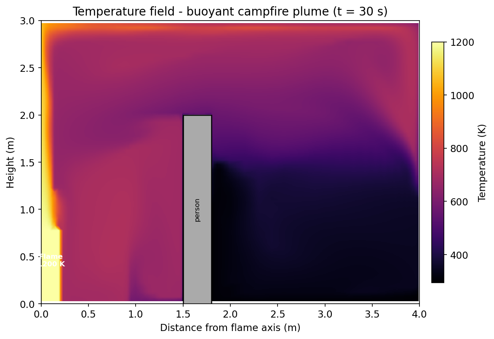
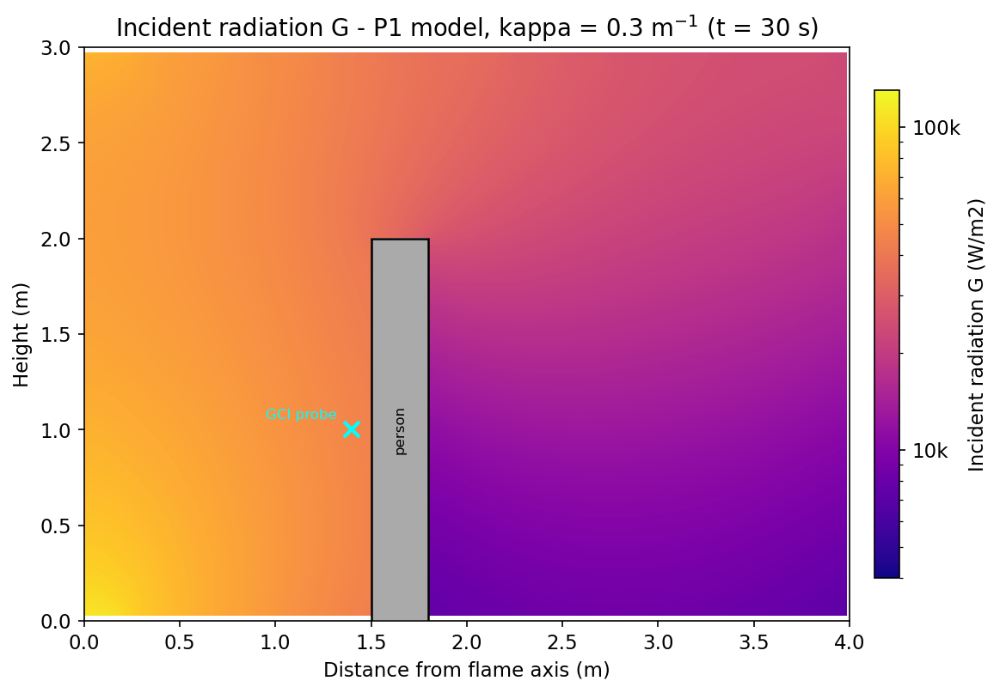
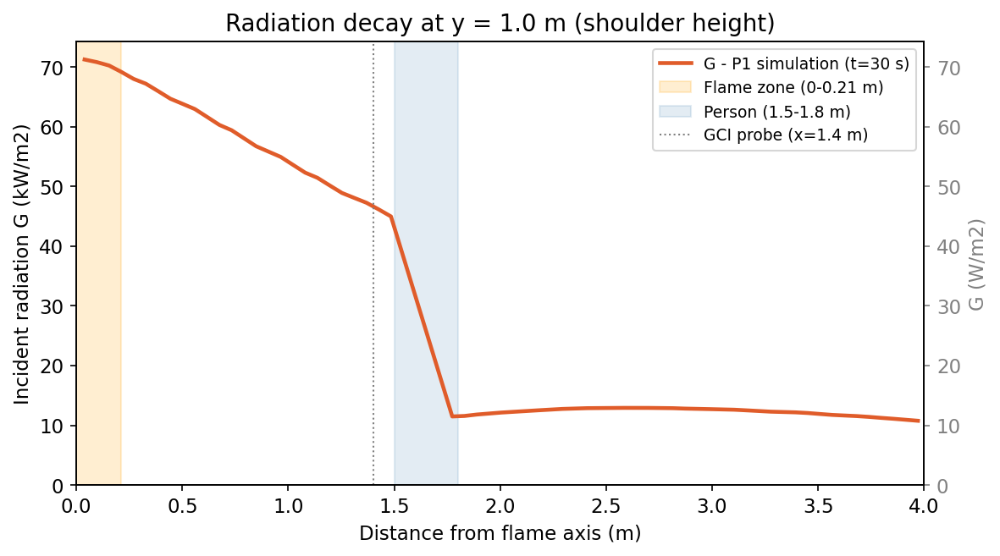
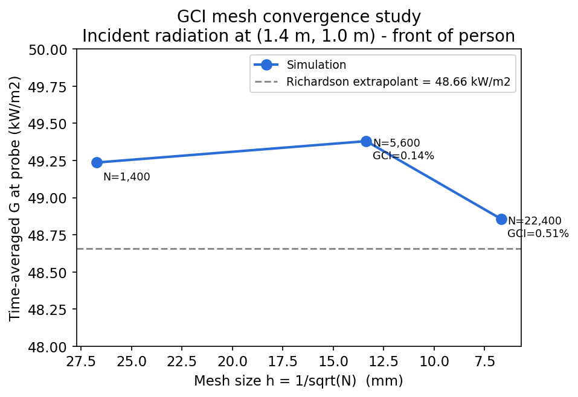

# Campfire Radiation Simulation

**OpenFOAM 13 - buoyantFoam (foamRun -solver fluid) - P1 Radiation - perfectGas EOS - Laminar 2D - Person Obstacle - GCI Mesh Independence**

Simulation of thermal radiation from a campfire (modelled as a 1200 K hot-gas zone) in quiescent ambient air, with a person modelled as a 2 m tall x 0.3 m deep rectangular obstacle. Demonstrates P1 participating-medium radiation transport, buoyancy-driven plume development, radiation shadowing behind a person, and a formal three-level Grid Convergence Index (GCI) mesh independence study.

---

## Problem Description

A campfire is approximated as a rectangular hot-gas zone (0.21 m x 0.81 m, 1200 K) at the axis of a half-domain. The ambient air is at 300 K. The flame emits thermal radiation into the surrounding medium (absorption coefficient kappa = 0.3 m-1, representing lightly smoky air) and heats the ground and person via convection and radiation.

A person is modelled as a solid 2 m x 0.3 m rectangle at 1.5 m from the flame axis, with skin temperature 310 K (37 degrees C) and IR emissivity 0.95.

The simulation answers:

1. **Radiation field**: How does incident radiation G (W/m2) decay with distance, and is there a radiation shadow behind the person?
2. **Heat load on person**: What is the combined convective and radiative heat flux on the person's body?
3. **Mesh independence**: Is the medium mesh sufficiently refined, quantified by the GCI?

---

## Domain and Geometry

Half-domain (symmetry at x=0, flame at axis):

```
axis (x=0)        person           outlet (x=4 m)
  |                |   |
  |                |   |
  +---3 m----------+---+  y=3 m (top BC)
  |                |   |
  |    plume       |   |
  |                |   |
  +---2 m----------+---+  y=2 m (person top)
  |                |   |
  |     flame      |   |
  |   zone (hot)   |   |  person: x=[1.5,1.8], y=[0,2]
  +----------------+---+  y=0 m (ground)
         1.5 m     0.3 m
```

5-block structured mesh topology: 2 blocks left of person (below and above person height), 1 block above person, 2 blocks right of person.

| Dimension | Value |
|-----------|-------|
| Domain half-width | 4 m |
| Domain height | 3 m |
| Domain depth (2D) | 0.05 m |
| Flame zone width | 0.21 m |
| Flame zone height | 0.81 m |
| Flame temperature | 1200 K |
| Ambient temperature | 300 K |
| Person distance from axis | 1.5 m |
| Person height | 2.0 m |
| Person depth | 0.3 m |
| Person skin temperature | 310 K |

---

## Physics

### Radiation Model: P1

The P1 model solves a diffusion equation for incident radiation G (W/m2):

```
div(Gamma * grad(G)) - kappa*G + 4*kappa*sigma*T^4 = 0
```

where Gamma = 1/(3*kappa) (no scattering), sigma = 5.67e-8 W/(m2 K4).

The P1 model is valid when the optical thickness tau = kappa*L >> 1. Here tau = 0.3*4 = 1.2, borderline optically thick. P1 is approximate but acceptable for this geometry.

In OpenFOAM 13, radiation is activated as an fvModel in `constant/fvModels`:
```
radiation { type radiation; libs ("libradiationModels.so"); }
```
Properties (absorptivity, emissivity) are set in `constant/radiationProperties`.

**Boundary conditions for G:**
- Ground: MarshakRadiation, emissivity = 0.9
- Person surfaces: MarshakRadiation, emissivity = 0.95
- Outlet and top: MarshakRadiation, emissivity = 1.0 (black body surroundings)
- Axis: symmetryPlane

### Equation of State: perfectGas

With a 4:1 temperature ratio (1200 K / 300 K), Boussinesq linearisation fails (negative density in flame). The perfectGas EOS is used:

```
rho = p / (Rspecific * T)   Rspecific = R/M = 8314/28.9 = 287.7 J/(kg K)
```

At T=300 K: rho = 1.174 kg/m3. At T=1200 K: rho = 0.294 kg/m3 (4x lower, driving buoyant plume).

### Flame Temperature Constraint

Flame zone maintained at 1200 K via `fixedTemperature` fvConstraint on `flameZone` cellZone (created by `topoSet`). Represents combustion thermal output without chemistry modelling.

### Air Properties

| Property | Value |
|----------|-------|
| Molecular weight | 28.9 g/mol |
| Cp | 1005 J/(kg K) |
| mu | 1.8e-5 Pa s |
| Pr | 0.71 |
| kappa (absorption) | 0.30 m-1 |

---

## Mesh Convergence Study (GCI)

Three 5-block structured meshes with refinement ratio r = 2 in each direction:

| Level | nx0 | nxp | nx1 | ny_low | ny_high | Total cells | Min cell size |
|-------|-----|-----|-----|--------|---------|-------------|---------------|
| Coarse | 25 | 5 | 20 | 20 | 10 | 1,400 | ~1.3 mm |
| Medium | 50 | 10 | 40 | 40 | 20 | 5,600 | ~0.66 mm |
| Fine | 100 | 20 | 80 | 80 | 40 | 22,400 | ~0.33 mm |

All three meshes use the same geometric grading: 30:1 refinement near the flame axis over the first 5% of domain width.

The **Grid Convergence Index (GCI)** method (Roache 1994) with safety factor Fs=1.25:

```
GCI_fine = Fs * |f_medium - f_fine| / (r^p - 1) / |f_fine| * 100 %
```

**Quantity of interest**: time-averaged G (W/m2) at probe point (1.4, 1.0, 0.025) - 0.1 m in front of the person at shoulder height, where the radiation shadow effect is most pronounced.

### Results

| Mesh | Cells | h (m) | G at probe (W/m2) | GCI |
|------|-------|-------|-------------------|-----|
| Coarse | 1,400 | 0.02673 | 49,236 | - |
| Medium | 5,600 | 0.01336 | 49,380 | 0.14% |
| Fine | 22,400 | 0.00668 | 48,857 | 0.51% |
| Richardson extrapolant | - | 0 | 48,659 | - |

- Apparent order of convergence: p = 1.86 (theoretical: 2.0 for second-order schemes)
- Asymptotic convergence ratio: 1.01 (should be 1.0 - confirms all meshes in asymptotic range)
- **Medium mesh GCI = 0.14%** - the 5,600-cell mesh is effectively grid-independent

The G = 48,857 W/m2 on the fine mesh at (1.4 m, 1.0 m) represents the incident radiation 0.1 m in front of the person at shoulder height. For reference, the Stefan-Boltzmann blackbody emission from the 1200 K flame surface is sigma*T^4 = 117,600 W/m2; the participating medium (kappa = 0.3 m-1) attenuates this over 1.4 m of path length.

---

## Simulation Setup

### Solver

| Setting | Value |
|---------|-------|
| Solver | foamRun -solver fluid (OF13 buoyantFoam) |
| Mode | Transient, laminar |
| End time | 30 s |
| Timestep | Adaptive, maxCo = 0.5 |
| Radiation | P1, solved every timestep (fvModels) |
| Temperature constraint | fixedTemperature fvConstraint on flameZone |

### Boundary Conditions

| Patch | U | T | p_rgh | G |
|-------|---|---|-------|---|
| Axis | symmetryPlane | symmetryPlane | symmetryPlane | symmetryPlane |
| Ground (wall) | noSlip | zeroGradient | fixedFluxPressure | MarshakRadiation (eps=0.9) |
| Person front/top/back | noSlip | fixedValue 310 K | fixedFluxPressure | MarshakRadiation (eps=0.95) |
| Outlet/top | pressureInletOutletVelocity | inletOutlet 300 K | fixedValue 101325 Pa | MarshakRadiation (eps=1.0) |

### Numerical Schemes

| Term | Scheme |
|------|--------|
| ddt | Euler |
| div(phi,U), div(phi,h) | Gauss upwind (upwind for stability near flame) |
| laplacian | Gauss linear corrected |

---

## Workflow

```
blockMesh (5-block graded 2D mesh with person obstacle, three resolutions)
    |
topoSet (create flameZone cellZone from box x=[0,0.21], y=[0,0.81])
    |
setFields (pre-initialize T=1200K in flameZone to avoid cold-start density shock)
    |
foamRun -solver fluid (perfectGas + P1 radiation via fvModels + fixedTemperature)
    |
Python GCI script (Richardson extrapolation on G at probe in front of person)
```

---

## Status

| Task | Status |
|------|--------|
| Coarse mesh (1,400 cells) | Done - 30 s |
| Medium mesh (5,600 cells) | Done - 30 s |
| Fine mesh (22,400 cells) | Done - 30 s |
| GCI analysis | Done - medium GCI = 0.14% |
| Person heat flux analysis | Done - front 21 kW/m2, back 8.2 kW/m2, ratio 2.59x |
| Visualisation (G field, T field, shadow) | Done - 4 images |
| Portfolio images | Done |

---

## Person Heat Load

Time-averaged (t = 20-30 s) combined convective + radiative heat flux on person surfaces (fine mesh, 22,400 cells):

| Surface | Area (m2) | Mean flux q (W/m2) | Total Q (W) |
|---------|-----------|-------------------|-------------|
| Front (facing fire) | 0.10 | 21,223 | 2,122 |
| Top | 0.015 | 17,963 | 270 |
| Back (sheltered) | 0.10 | 8,186 | 819 |
| **Total person** | **0.215** | - | **3,210** |

Sign convention: values above are magnitudes; heat flux is directed into the person (person absorbs heat from the fire).

**Front-to-back flux ratio: 2.59x** - the person's body attenuates the incident radiation by a factor of 2.6 through a combination of absorption and geometric shadow effects.

For reference, the NIOSH threshold for radiant heat stress is approximately 1,000 W/m2. The front face receives 21 kW/m2 at 1.5 m standoff - well above safe limits without protective equipment. The back face receives 8.2 kW/m2, confirming that even the shielded side is exposed to substantial radiation transmitted through the P1 participating medium.

---

## Visualisations

### Temperature Field



The 1200 K flame zone drives a strong buoyant plume. The person obstacle (x = 1.5-1.8 m, y = 0-2 m) creates a thermal shadow in the convective temperature field directly behind it, though at y > 2 m the hot gas flows around and above the person.

### Radiation Field (G)



Log-scale incident radiation G (W/m2). The person casts a clear radiation shadow on the far side: G drops by roughly 4x immediately behind the obstacle compared to the same distance on the unobstructed side. The P1 model captures the shadow effect even at this borderline optical thickness (tau = 1.2).

### Radiation Decay Along Person Height



G at y = 1 m (shoulder height) vs radial distance from flame axis. Radiation decays from ~100 kW/m2 near the flame to ~49 kW/m2 at the person front face (x = 1.5 m), then drops sharply in the shadow region behind the person (x > 1.8 m).

### GCI Mesh Convergence



Richardson extrapolation on G at the probe point (1.4 m, 1.0 m). All three meshes lie in the asymptotic convergence range (ratio = 1.01). The medium mesh (5,600 cells) achieves GCI = 0.14%, well within the 1% engineering threshold.

---

## Software Stack

| Tool | Version | Purpose |
|------|---------|---------|
| OpenFOAM | 13 | CFD + radiation solver |
| Python | 3.x | GCI analysis |
| Ubuntu | 24.04 (WSL2) | Linux environment |
