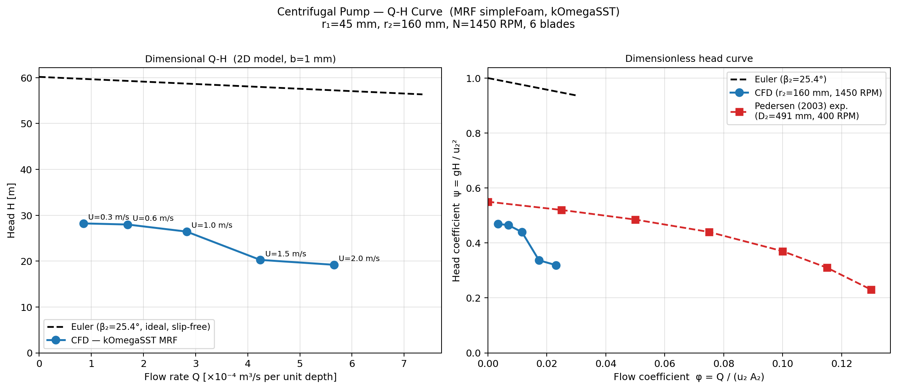

# Centrifugal Pump — Q-H Curve Validation

**Solver:** simpleFoam (steady-state SIMPLEC) + MRF (Multiple Reference Frame)  
**Turbulence:** kOmegaSST  
**Working fluid:** Water (ν = 1×10⁻⁶ m²/s, ρ = 1000 kg/m³)  
**Reference:** Pedersen et al. (2003) — *Application of PIV on the Suction Side of a Centrifugal Pump Impeller*

---

## Geometry

This simulation uses a 2D top-view model of a 6-blade centrifugal pump impeller, with
the MRF (Multiple Reference Frame) method to represent blade rotation without moving
meshes.

| Parameter | This CFD model | Pedersen (2003) |
|-----------|---------------|----------------|
| Impeller outer radius r₂ | 160 mm | 245.5 mm (D₂=491 mm) |
| Impeller eye radius r₁ | 45 mm | ~80 mm |
| Number of blades z | 6 | 6 |
| Blade exit angle β₂ | ~25° (STL geometry) | 25.4° |
| Rotation speed N | 1450 RPM | 400 RPM |
| Angular velocity ω | 151.84 rad/s | 41.9 rad/s |
| Tip speed u₂ | 24.3 m/s | 10.3 m/s |
| Head H (computed range) | 19.2–28.2 m | 7–12 m |
| Mesh depth (2D) | 1 mm | 45 mm (b₂) |

The geometries differ in scale and speed; dimensionless head and flow coefficients
(ψ, φ) are used to compare the two pump curves.

---

## Mesh

Generated with blockMesh (background Cartesian) + snappyHexMesh (blade geometry from STL).

| Property | Value |
|----------|-------|
| Total cells | 401,139 |
| Mesh type | 2D planar (1 cell in z) |
| Blade surface refinement | Level 3–5 |
| Hub surface refinement | Level 2–3 |
| Max non-orthogonality | 67° (OK < 70°) |
| Max skewness | 1.0 (OK < 4) |
| Domain | 400 mm × 400 mm × 1 mm |
| Rotating zone radius | 160 mm (cylinder cellZone) |

---

## Boundary Conditions

### Velocity (U)

| Patch | Type | Value |
|-------|------|-------|
| hub (r₁=45 mm) | surfaceNormalFixedValue | −U_in (radially outward) |
| sides (outer square) | inletOutlet | (0 0 0) |
| blade0–5 | noSlip | — |
| frontAndBack | empty | — |

The hub serves as a **virtual axial inlet**: in reality fluid enters the impeller eye axially;
in this 2D model it enters radially outward from the hub surface.

### Pressure (p — kinematic, m²/s²)

| Patch | Type | Value |
|-------|------|-------|
| hub | zeroGradient | — |
| sides | fixedValue | 0 (gauge) |
| blade0–5 | zeroGradient | — |

### Turbulence (k–ω SST)

| Patch | k BC | ω BC | νt BC |
|-------|------|------|-------|
| hub | fixedValue 3.75×10⁻³ | fixedValue 100 | calculated |
| sides | inletOutlet | inletOutlet | calculated |
| blades | kqRWallFunction | omegaWallFunction | nutkWallFunction |

Turbulence intensity I = 5% → k = 1.5(IU)² ≈ 3.75×10⁻³ m²/s²

---

## MRF Setup

```
MRF1
{
    cellZone        rotatingZone;
    omega           151.84 rad/s;    // 1450 RPM
    axis            (0 0 1);
    nonRotatingPatches (sides hub);
}
```

The `rotatingZone` is a cylinder of radius 160 mm centred at the origin, containing all
6 impeller blades. The `nonRotatingPatches` list ensures the inlet (hub) and outlet (sides)
patches are treated in the absolute frame.

---

## Solver Settings

```
fvSolution:
    SIMPLEC  nNonOrthogonalCorrectors 2
    relaxationFactors: p=0.3, U=0.7, k/ω=0.7
    residualControl: all fields 1e-4

fvSchemes:
    ddtSchemes:    steadyState
    div(phi,U):    Gauss linearUpwind
    div(phi,k/ω):  Gauss upwind
    laplacian:     Gauss linear corrected
    wallDist:      meshWave
```

---

## Q-H Curve Methodology

Five operating points were simulated by varying the hub inlet radial velocity U_in:

| U_in (m/s) | Q₂D (×10⁻⁴ m³/s) | φ = Q/(u₂A₂) |
|------------|-------------------|---------------|
| 0.3 | 0.848 | 0.00347 |
| 0.6 | 1.696 | 0.00695 |
| 1.0 | 2.827 | 0.01158 |
| 1.5 | 4.241 | 0.01737 |
| 2.0 | 5.655 | 0.02316 |

where A₂ = 2π r₂ b = 2π × 0.16 × 0.001 = 1.005×10⁻³ m²

**Head extracted from total pressure difference:**

$$H = \frac{\left(p_{sides} + \tfrac{1}{2}|U_{sides}|^2\right) - \left(p_{hub} + \tfrac{1}{2}U_{in}^2\right)}{g}$$

(p is kinematic pressure, m²/s²; averaged over last 200 steady-state iterations)

---

## Euler Head Reference

The theoretical (inviscid, slip-free) Euler head curve for this impeller:

$$H_{Euler}(Q) = \frac{u_2^2 - u_2 \cdot c_{r2} / \tan\beta_2}{g}$$

where c_{r2} = Q/A₂ is the radial velocity at the impeller tip.

At shut-off (Q=0): H₀ = u₂²/g = 24.3²/9.81 ≈ 60 m  
The Euler slope is −u₂/(g A₂ tan β₂) ≈ −5,350 m/(m³/s)

---

## Results



The left panel shows dimensional Q-H curves; the right panel shows dimensionless head
coefficient ψ = gH/u₂² vs flow coefficient φ = Q/(u₂A₂), overlaid with the Pedersen
(2003) experimental data (digitised from Figure 6).

### Computed operating points

| U_in (m/s) | Q₂D (×10⁻⁴ m³/s) | H (m) | φ | ψ = gH/u₂² | ψ_Euler | ψ/ψ_Euler |
|------------|-------------------|-------|---|------------|---------|-----------|
| 0.3 | 0.848 | 28.22 | 0.00347 | 0.469 | 0.993 | 0.472 |
| 0.6 | 1.696 | 27.98 | 0.00695 | 0.465 | 0.985 | 0.472 |
| 1.0 | 2.827 | 26.44 | 0.01158 | 0.439 | 0.976 | 0.450 |
| 1.5 | 4.241 | 20.26 | 0.01737 | 0.337 | 0.963 | 0.350 |
| 2.0 | 5.655 | 19.20 | 0.02315 | 0.319 | 0.951 | 0.336 |

**Key observations:**
- CFD head coefficient falls from ψ = 0.469 to 0.319 across the tested range (φ = 0.0035–0.0232) — a monotonic decrease with flow, the correct qualitative shape for a backward-swept impeller.
- The Euler prediction gives ψ ≈ 0.95–0.99 over the same φ range, so the CFD recovers only 34–47% of the ideal Euler head. This deficit is the combined effect of slip (finite blade count, z = 6), viscous losses, and the absence of a diffuser/volute to recover dynamic head.
- The head-coefficient drop steepens sharply between φ = 0.0116 and 0.0174 (ψ falls 0.439 → 0.337, a 23% loss over a 50% flow increase), indicating the onset of flow separation on the blade suction surfaces at higher throughflow.
- **The 2D model under-predicts head relative to Pedersen (2003) at matched φ** — ψ_CFD/ψ_Ped = 0.86 at the lowest flow and 0.61 at the highest. This is the expected direction: the 2D planar model has no diffuser or volute to convert the impeller's exit dynamic head into static head, and the 1 mm depth removes the spanwise pressure recovery present in the real 45 mm-wide impeller.

**Caveat on the Pedersen comparison:** the CFD covers φ = 0.0035–0.0232, whereas the Pedersen dataset spans φ = 0–0.130. The two curves therefore overlap only near the low-flow (near-shutoff) end, and the lowest Pedersen point (φ = 0, ψ = 0.550) is itself an extrapolated shutoff value. Matching Pedersen's design point (φ ≈ 0.075) would require U_in ≈ 6.5 m/s and has not been run. The comparison should be read as a check on curve *shape* and *order of magnitude*, not as a validation at the design condition.

---

## Uncertainty

**Discretisation uncertainty has not been quantified for this case.** All five operating
points were run on a single 401k-cell mesh, so the Celik et al. (2008) GCI procedure —
which requires a minimum of three systematically refined meshes — could not be applied.
The head values reported above therefore carry no discretisation error bar, and the
comparison against Pedersen (2003) should be weighted accordingly. Adding coarse and
fine mesh levels at a single operating point (φ ≈ 0.012) is the outstanding work needed
to close this gap.

Iteration-level uncertainty is separate and is estimated at ±5–8% in H, taken from the
spread of the last 200 SIMPLE iterations, which had not fully converged (final p
residuals ~1×10⁻³). This is inherent to the pseudo-steady MRF approximation, which
freezes the impeller position and so cannot represent blade-passing unsteadiness.

---

## Pedersen (2003) Reference Data

| φ | ψ (experimental) |
|---|-----------------|
| 0.000 | 0.550 |
| 0.025 | 0.520 |
| 0.050 | 0.485 |
| 0.075 | 0.440 |
| 0.100 | 0.370 |
| 0.115 | 0.310 |
| 0.130 | 0.230 |

Source: Pedersen, N., Larsen, P. S., & Jacobsen, C. B. (2003). *Flow in a centrifugal pump 
impeller at design and off-design conditions — Part I: Particle image velocimetry (PIV) and 
laser Doppler velocimetry (LDV) measurements.* Journal of Fluids Engineering, 125(1), 61–72.

---

## Files

| File | Description |
|------|-------------|
| `constant/polyMesh/` | snappyHexMesh result (401k cells) |
| `constant/MRFProperties` | Rotating zone definition |
| `constant/turbulenceProperties` | kOmegaSST model |
| `system/fvSchemes` | Numerical schemes |
| `system/fvSolution` | SIMPLEC solver settings |
| `0/U, p, k, omega, nut` | Initial/boundary conditions |
| `run_sweep.sh` | Q-H sweep automation script |
| `plot_QH.py` | Python plotting script |
| `QH_results.csv` | Raw Q-H data from CFD |
| `QH_curve.png` | Q-H curve plot |
