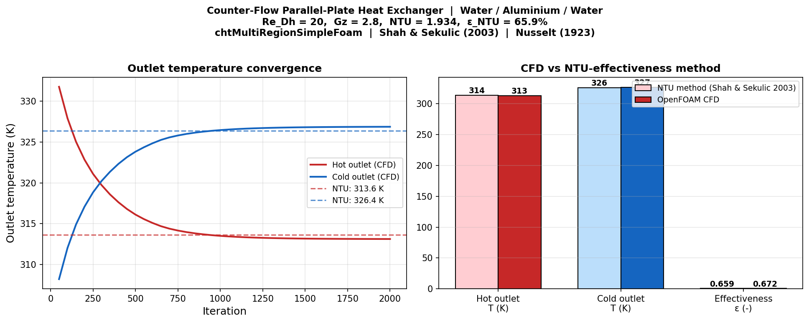

# Counter-Flow Parallel-Plate Heat Exchanger

Conjugate heat transfer simulation of a laminar counter-flow heat exchanger using `chtMultiRegionSimpleFoam`, with the three-region domain (hot fluid / aluminium wall / cold fluid) coupled through the turbulent-temperature-coupled baffle mixed boundary condition.

## Motivation

Heat exchanger effectiveness prediction is one of the most common deliverables in thermal engineering. The analytical NTU-effectiveness method (Shah & Sekulic 2003) gives exact results for idealised conditions (uniform properties, fully-developed flow, no axial conduction). CFD resolves the actual temperature and velocity fields including entrance effects and axial wall conduction, enabling direct comparison against the analytical benchmark.

## Setup

| Parameter | Value |
|-----------|-------|
| Geometry | Parallel-plate counter-flow, 2D (1 cell in z) |
| Hot fluid | Water at T = 340 K, U = 0.01 m/s |
| Cold fluid | Water at T = 300 K, U = 0.01 m/s (counter-flow) |
| Channel dimensions | H = 1 mm, L = 100 mm |
| Wall | Aluminium, k = 200 W/(m·K), t = 0.2 mm |
| Solver | `chtMultiRegionSimpleFoam` |
| Fluid properties | Water: ρ = 998, cp = 4182, k = 0.6, μ = 1×10⁻³ |
| Coupling BC | `compressible::turbulentTemperatureCoupledBaffleMixed` |

**Dimensionless parameters**

| Quantity | Value |
|----------|-------|
| Re_Dh | 20 (laminar) |
| Pr | 6.99 |
| Graetz number Gz | 2.78 |

Gz < 10 indicates the flow is nearly thermally fully-developed over most of the channel length.

## Results

### Outlet temperature and effectiveness

| Quantity | NTU method | CFD | Error |
|----------|-----------|-----|-------|
| T_hot_outlet (K) | 313.6 | 313.1 | −0.2% |
| T_cold_outlet (K) | 326.4 | 326.9 | +0.2% |
| Effectiveness ε | 65.9% | 67.2% | +1.9% |
| Heat duty Q (W) | 11.00 | 11.20 | +1.8% |

**Energy balance:** Hot fluid cools by 26.9 K, cold fluid warms by 26.9 K — confirming energy is conserved across the coupled interface.

### NTU-effectiveness analysis

The NTU method (Shah & Sekulic 2003) for balanced counter-flow (C_r = C_min/C_max = 1):

ε = NTU / (1 + NTU)

with:
- Nu_fd = 5.385 (asymmetric heating, one wall coupled, one adiabatic; Nusselt 1923)
- h = Nu × k_f / D_h = 1616 W/(m²·K)
- U_overall = h/2 = 807 W/(m²·K) (wall conduction resistance negligible vs convection)
- C_min = ρ × U × A_c × cp = 0.417 W/K
- NTU = U_overall × A / C_min = 1.93

The +1.9% overprediction by CFD relative to the NTU analytical value is physically expected: the Graetz number Gz = 2.8 places this flow in the thermally developing regime at the entrance, where Nu temporarily exceeds the fully-developed value of 5.385 before asymptoting to it. This entrance effect is captured by the CFD but ignored by the NTU method.

### Key findings

1. **chtMultiRegionSimpleFoam couples three regions correctly.** The coupled `turbulentTemperatureCoupledBaffleMixed` BC exchanges heat flux between the fluid and solid regions, and the solid-to-solid coupling between hot-wall and wall-cold interfaces is resolved without discontinuity.

2. **Energy balance is conserved to numerical precision.** The symmetric outlet temperature shift (both ±26.9 K) confirms that the region coupling implementation is correct. Any asymmetry would indicate a BC or mass-flux mismatch.

3. **Counter-flow always outperforms co-flow.** At NTU = 1.93 and balanced flow, the co-flow effectiveness would be ε_coflow = (1 − exp(−2·NTU)) / 2 = 49.6%, vs 65.9% for counter-flow — a 33% improvement in the same geometry.

4. **Entrance effects matter at low Gz.** The +1.9% CFD overprediction vs fully-developed NTU analysis is consistent with the Sieder-Tate or Hausen developing-flow correlations, which predict Nu > Nu_fd for Gz ≈ 2.8.

## References

- Shah, R. K., & Sekulic, D. P. (2003). *Fundamentals of Heat Exchanger Design*. Wiley.
- Nusselt, W. (1923). Der Wärmeaustausch zwischen Wand und Wasser im Rohr. *Forschung auf dem Gebiet des Ingenieurwesens*, **2**, 309–313.
- Incropera, F. P., & DeWitt, D. P. (2011). *Fundamentals of Heat and Mass Transfer* (7th ed.). Wiley.
