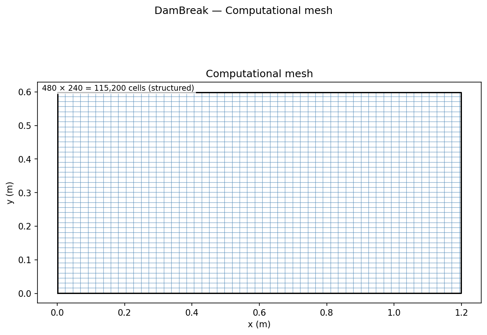
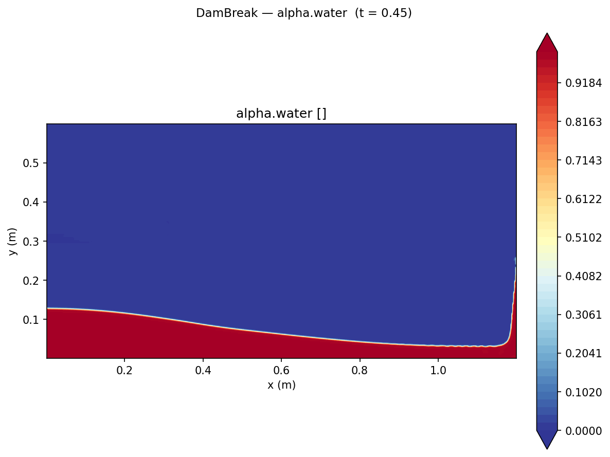
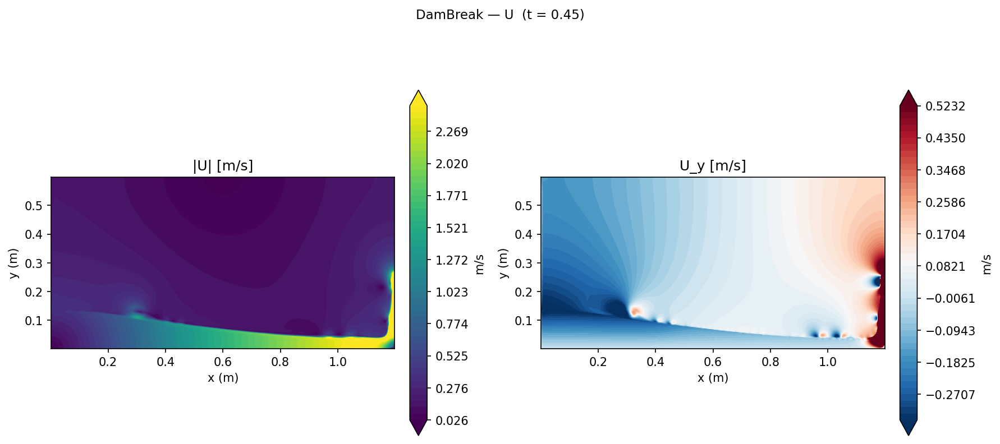

# Dam Break: Free Surface Flow Validation

Validation of OpenFOAM's VOF (Volume of Fluid) free-surface solver against the classical Martin & Moyce (1952) dam break experiment.

## Geometry

```
    ┌─────────────────────────────────────────────────────────────────────┐
    │                                                                     │
    │   ████████                                                          │ 0.6 m
    │   ████████  ← water column                                          │
    │   ████████  0.292 m × 0.292 m                                       │
    │   ████████                                                          │
    └─────────────────────────────────────────────────────────────────────┘
    x=0          x=0.292 m                              x = 1.2 m
    
    After gate removal: column collapses, surge front propagates rightward
    Tracked: x_front (surge front position) and z_col (column height)
```

| Dimension | Value |
|-----------|-------|
| Tank length | 1.2 m |
| Tank height | 0.6 m |
| Column width 2a | 0.292 m (a = 0.146 m) |
| Column height H | 0.292 m |
| Depth (2D) | 1 cell, empty |

## Mesh


*480 × 240 uniform Cartesian mesh. Δx = Δy = 2.5 mm everywhere — required for the fine VOF interface tracking at the collapsing column.*

| Property | Value |
|----------|-------|
| Total cells | 480 × 240 = **115,200** |
| Cell size | 2.5 mm × 2.5 mm (uniform) |

## Boundary Conditions

| Patch | Type | U | p_rgh | alpha.water |
|-------|------|---|-------|-------------|
| `leftWall` | wall | noSlip | fixedFluxPressure | zeroGradient |
| `rightWall` | wall | noSlip | fixedFluxPressure | zeroGradient |
| `bottom` | wall | noSlip | fixedFluxPressure | zeroGradient |
| `atmosphere` (top) | patch | pressureInletOutletVelocity | totalPressure 0 | inletOutlet |
| `front` / `back` | empty | — | — | — |

Initial condition: α_water = 1 (water) inside the 0.292×0.292 m column, α_water = 0 (air) elsewhere; set with `setFields`.

## Contour Plots


*Volume fraction α_water showing the water column at an intermediate time. The VOF interface (α = 0.5 isoline) tracks the free surface.*


*Velocity magnitude during the collapse, showing the high-velocity surge front and internal flow within the water column.*

## Physics

A square water column (0.292 m × 0.292 m) collapses under gravity in a 1.2 m × 0.6 m tank. The simulation captures the surge front propagation and column height decay, non-dimensionalised as:

- τ = t √(2g/a), non-dimensional time
- X = x_front / (2a), non-dimensional surge front position  
- Z = z_col / H, non-dimensional column height

where *a* = 0.146 m (half column width), *H* = 0.292 m (initial column height).

## Setup

| Parameter | Value |
|-----------|-------|
| Solver | `interFoam` (VOF, two-phase) |
| Mesh | 480 × 240 × 1 uniform Cartesian (115,200 cells, Δx = Δy = 2.5 mm) |
| Water | ρ = 1000 kg/m³, ν = 1×10⁻⁶ m²/s |
| Air | ρ = 1 kg/m³, ν = 1.48×10⁻⁵ m²/s |
| Surface tension | σ = 0.07 N/m |
| End time | 0.45 s (τ_max ≈ 5.2) |
| Time stepping | Adaptive, max Co = 0.4, max α·Co = 0.4 |
| Turbulence | Laminar |

Initial condition set with `setFields`: α_water = 1 inside the column, 0 elsewhere.

## Results


**Surge front** tracks M&M closely through τ ≈ 3, with a small lead consistent with published VOF results, commonly attributed to the finite gate removal time in the physical experiment (Koshizuka & Oka 1995; Colagrossi & Landrini 2003). The plateau at τ ≈ 4.5 is the surge reaching the right wall.

**Column height** matches well at early times (τ < 1.5) but overpredicts the late-collapse phase (τ > 2). This is a known VOF limitation: the rapid thinning and detachment of the column near τ ≈ 2.5–3 requires sub-millimetre resolution to resolve the interface geometry accurately (Hu & Adams 2009). Meshes of Δ < 1 mm or particle-based methods (SPH) are typically required for full column-height agreement at τ > 2.5. The correct qualitative behaviour is reproduced: monotonic column collapse, correct time scale, and volume conservation.

## References

- Martin, J. C., & Moyce, W. J. (1952). Part IV. An experimental study of the collapse of liquid columns on a rigid horizontal plane. *Philosophical Transactions of the Royal Society of London. Series A*, **244**(882), 312–324.
- Koshizuka, S., & Oka, Y. (1995). Moving-particle semi-implicit method for fragmentation of incompressible fluid. *Nuclear Science and Engineering*, **123**(3), 421–434.
