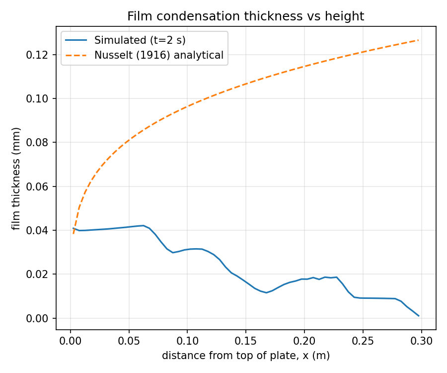
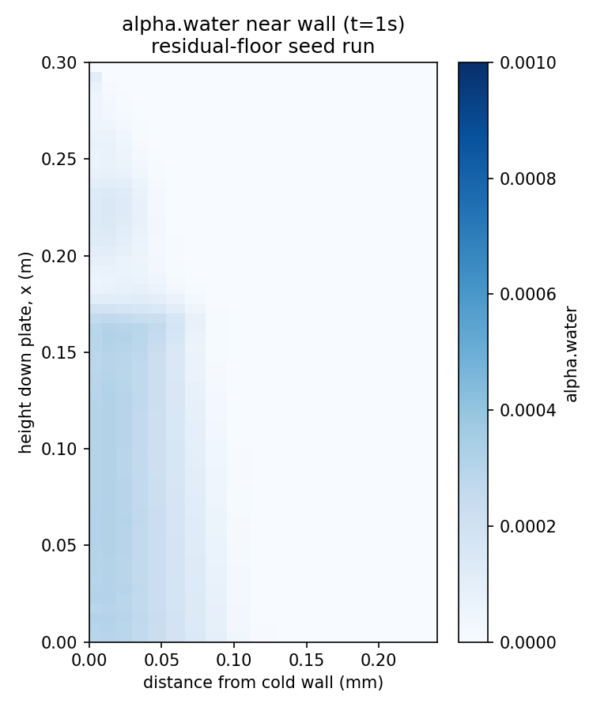

# Film Condensation on a Cold Vertical Plate

**OpenFOAM 13 - multiphaseEuler two-fluid solver - Attempted validation against Nusselt (1916) laminar film condensation theory - Inconclusive: documented tool-selection finding**

This project set out to validate CFD against a second classic phase-change benchmark, complementing the [Boiling Water](../Boiling%20Water/) project: laminar film condensation on a cold vertical plate, compared against the closed-form Nusselt (1916) correlation for film thickness and average Nusselt number. Unlike Boiling Water, this write-up does not end with a working (even if partial) result. It ends with a clear, useful negative finding: neither multiphase framework available in this OpenFOAM 13 install is actually well-suited to this specific problem, and the reasons why are worth recording.

---

## Motivation

Film condensation was chosen deliberately as a *lower-risk* follow-up to the Boiling Water project's nucleate-boiling instability. Unlike nucleate boiling (a positive-feedback, cliff-edge onset process), laminar film condensation is smooth and self-limiting: a thickening film insulates the wall and reduces local heat flux. It also has a clean, closed-form analytical target:

- Local film thickness: delta(x) = [4 k_l mu_l (Tsat-Tw) x / (rho_l (rho_l-rho_v) g h_fg)]^(1/4)
- Average Nusselt number: Nu_avg = 0.943 * [rho_l (rho_l-rho_v) g h_fg L^3 / (mu_l k_l (Tsat-Tw))]^(1/4)

That gentler-physics assumption turned out to be correct in one sense (no violent onset transient like nucleate boiling) but the project still failed to produce a valid comparison, for reasons unrelated to numerical stiffness in the usual sense.

---

## What was built

- Vertical half-domain, 0.01 m wide x 0.3 m tall, graded blockMesh (near-wall cell as fine as ~2-9 micron depending on iteration, coarsening to ~1 mm away from the wall)
- Cold wall at x=0 (`fixedValue` T=350 K, subcooling 23 K below Tsat=373.15 K), open top (saturated steam supply) and bottom (condensate/vapour outlet), symmetryPlane far-field
- `multiphaseEuler` two-fluid solver, phases `steam` and `water` (pure substances, no air), `heatTransferLimitedPhaseChange` fvModel only (deliberately no `wallBoiling` nucleation model, learning directly from the Boiling Water debugging)
- Laminar, matching the pattern confirmed stable in OF13's own `tutorials/multiphaseEuler/steamInjection` reference case, which uses this exact fvModel standalone

This is documented in detail because the setup itself worked, ran stably, and did not crash. The problem was not stability. It was that the results were not physically meaningful.

---

## What went wrong, in order

### 1. Mesh cost vs timestep

The first mesh (near-wall cell ~2 micron, needed to resolve the ~0.13 mm expected film thickness with good resolution) forced a Courant-limited timestep of order 1e-5 s. After nearly 15 hours of wall-clock time the simulation had only reached t=3 s of a 60 s target. Coarsening the near-wall cell to ~9 micron (still ~20 cells across the expected film) recovered roughly a 15x speedup. This part of the investigation worked as intended and is a genuinely useful, reusable lesson: near-wall resolution needed to resolve a thin film directly trades off against wall-clock cost, and it is worth checking that trade-off with a quick hand calculation (film Reynolds number, expected thickness) before committing to a mesh.

### 2. A recurring residual-alpha stiffness, again

Once running, the timestep periodically collapsed toward zero (down to ~2e-9 s at one point), the same "stall" failure mode seen repeatedly in the Boiling Water project. The cause here: `residualAlpha` was set to 1e-6 (very tight), and once the water phase fraction in a cell approached that floor, its energy equation became numerically stiff (one solve needed the full 1000-iteration cap without converging). Raising `residualAlpha` to 1e-3 (matching the value used in OF13's own `steamInjection` reference tutorial, rather than the tighter value copied from the Boiling Water case) resolved this cleanly: temperatures settled into the exact physically-expected range (water between the wall temperature and Tsat, no limiter clamping) and the timestep recovered. This is a second genuinely useful, transferable finding: `residualAlpha` is not just a numerical safety margin, its value materially affects whether a two-fluid model stays well-posed in low-alpha regions, and 1e-6 is too tight for this class of problem.

### 3. Initial condition and film-thickness discrepancy

With the case otherwise running stably, the actual comparison against the Nusselt correlation failed. Seeding a uniform 0.2 mm liquid film everywhere (a pragmatic starting point, since it avoids initializing at a hard zero) produced a film thickness that matched Nusselt theory reasonably well at the very top of the plate but *decreased* going down the plate, dropping to nearly zero at the bottom outlet, the opposite of the theory's monotonic growth. This traced back to the initial condition itself: the uniform seed was far thicker than the true local equilibrium almost everywhere except near the bottom, so most of the domain was draining excess seed material rather than growing a physically accumulating film.

### 4. The real problem: a modeling-paradigm mismatch

Switching to a proper "dry start" (near-zero water fraction everywhere, matching the true physical initial condition) should have fixed this. It did not: with alpha.water at or near its residual floor everywhere, no meaningful condensation occurred at all (the interfacial mass-transfer rate stayed at the ~1e-12 kg/m3/s level, negligible). Investigating why revealed the actual issue: `multiphaseEuler`'s `linear` phase-blending scheme, at low alpha (below its `minPartlyContinuousAlpha` threshold of 0.3), treats the water phase as **dispersed droplets suspended in a continuous vapour phase**, and computes interfacial heat transfer using a droplet-in-vapour correlation (`RanzMarshall`) with a specified nominal "droplet diameter." That is a fundamentally different physical picture from a **continuous liquid film adhering to a cold wall**. Direct inspection of the field data confirmed it: after further runtime, the mean water fraction had *decreased* below its initial seed almost everywhere (net evaporation, not condensation), with the water essentially fully evaporated away near the outlet.

`multiphaseEuler` is, at its core, a dispersed-phase (bubbly/droplet) two-fluid Euler-Euler solver. It is not built to represent a thin adherent wall film, no matter how the initial condition or blending parameters are tuned.

### 5. The "correct" tool doesn't have the needed physics either

OpenFOAM does have a purpose-built framework for exactly this kind of problem: `surfaceFilmModels`, a proper thin-film continuity/momentum/energy formulation solved on the wall surface (`tutorials/isothermalFilm`, `tutorials/film`, `tutorials/multiRegion/film/*`). A full search of this OF13 install's film tutorials and source tree, however, found no phase-change (evaporation/condensation) submodel available for it, only droplet ejection (`filmCloudTransfer`, for splashing/dripping film breakup into a Lagrangian spray) and basic conduction. The right conceptual tool for this problem exists in OpenFOAM's architecture but is not present with the needed physics in this particular install/version.

---

## Bottom line

This investigation is being closed here rather than continued, by agreement, once it became clear that further tuning within `multiphaseEuler` would not fix a modeling-paradigm mismatch (fighting a dispersed-phase solver into representing a continuous wall film), and the alternative framework in this install lacks the required phase-change physics entirely. Getting a genuine Nusselt-film-condensation validation would require either a different OpenFOAM version/build with a thermal, phase-change-capable film model, or a custom source-term implementation, both larger undertakings than this project's scope.

What this investigation did produce, and what makes it worth keeping in the portfolio: two directly transferable numerical-stability findings (the mesh-resolution/timestep trade-off, and the `residualAlpha` sensitivity) that generalize to any two-fluid Euler-Euler multiphase case, and a clear, evidence-based conclusion about which OpenFOAM solver family is and is not appropriate for adherent-film phase-change problems, reached by direct investigation rather than assumption.

---

## Visualisations

### Film thickness vs height: simulated vs Nusselt theory

Simulated film thickness (uniform-seed run, t=2 s) against the Nusselt (1916) analytical curve. Reasonable agreement only right at the top of the plate; the simulated profile decreases with height instead of the theory's predicted monotonic growth, the draining-seed artifact described above.

### Near-wall water fraction: the net-evaporation finding

alpha.water near the cold wall (residual-floor seed run, t=1 s). Mean water fraction had dropped below the 0.001 initial seed almost everywhere, confirming net evaporation rather than condensation once the model was operating in its dispersed-droplet regime, the direct evidence for the modeling-paradigm mismatch described above.

---

## Software Stack

| Tool | Version | Purpose |
|------|---------|---------|
| OpenFOAM | 13 | multiphaseEuler two-fluid CFD |
| Python | 3.12 | field parsing, matplotlib visualisation |
| matplotlib | 3.6 | field and comparison plots |
| Ubuntu | 24.04 (WSL2) | Linux environment |
