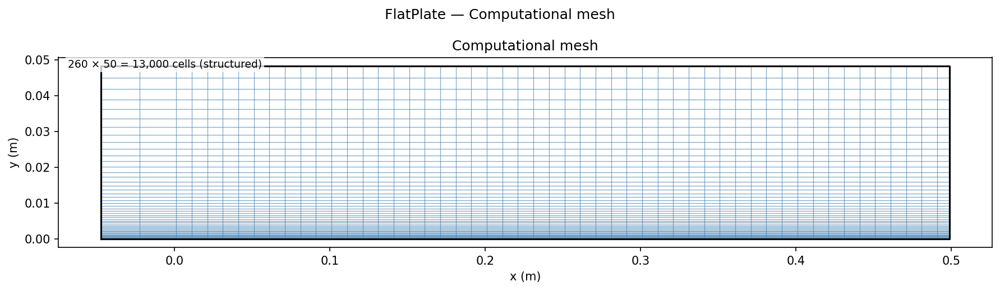
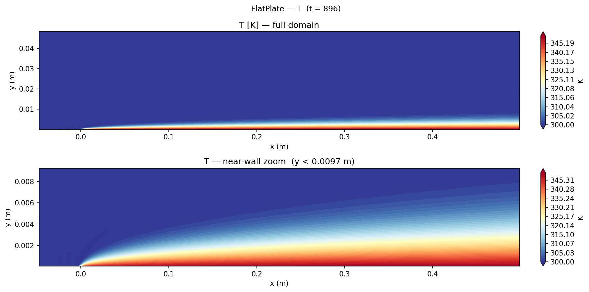
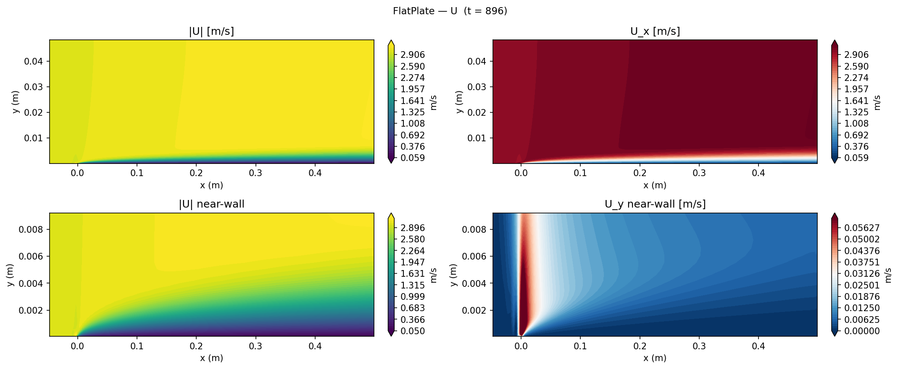

# Laminar Flat Plate Forced Convection

Steady forced-convection simulation over an isothermal flat plate using `buoyantSimpleFoam`, validating the local Nusselt number distribution against the Pohlhausen (1921) similarity solution and confirming the Re_x^½ scaling law.

## Geometry

```
         Symmetry plane (free stream, T=300K)
    ┌──────────────────────────────────────────────────────┐
    │          →→→→  U∞ = 3 m/s, T∞ = 300 K  →→→→         │ 0.05 m
    │                                                      │
────┤───────────┬─────────────────────────────────────────→ outlet
 inlet        x=0      Plate (T=350 K, no-slip)         x=0.5 m
 (−0.05 m)    Leading edge
    Slip wall (adiabatic approach region)
```

| Dimension | Value |
|-----------|-------|
| Plate length L | 0.5 m |
| Approach region | 0.05 m upstream of leading edge |
| Domain height H | 0.05 m |
| Depth (2D) | 0.001 m (1 cell, empty BC) |

## Setup

| Parameter | Value |
|-----------|-------|
| Solver | `buoyantSimpleFoam` (compressible, laminar) |
| Fluid | Air, ρ = 1.177 kg/m³, μ = 1.84×10⁻⁵ Pa·s |
| Cp | 1006 J/(kg·K), Pr = 0.71 |
| k_fluid | 0.026 W/(m·K) |
| U∞ | 3 m/s (x-direction) |
| T_wall | 350 K (isothermal plate) |
| T∞ | 300 K |
| Re_L | U∞ L/ν = 3 × 0.5 / 1.56×10⁻⁵ = **9.6 × 10⁴** (laminar) |
| Buoyancy | Disabled (g = 0) — pure forced convection |

## Mesh



| Property | Value |
|----------|-------|
| Total cells | 260 × 50 × 1 = **13,000** |
| Streamwise | 10 cells (approach) + 250 cells (plate), uniform |
| Wall-normal | 50 cells, grading ratio 30 (clustered at wall) |
| First cell Δy | ≈ 0.11 mm |
| Cells across δ_T at mid-plate | ≈ 35 |

## Boundary Conditions

| Patch | Type | U | T | p_rgh |
|-------|------|---|---|-------|
| `inlet` | patch | fixedValue (3, 0, 0) m/s | fixedValue 300 K | fixedFluxPressure |
| `outlet` | patch | zeroGradient | zeroGradient | fixedValue 0 Pa |
| `plate` | wall | noSlip | fixedValue **350 K** | fixedFluxPressure |
| `slipWall` | symmetryPlane | symmetryPlane | symmetryPlane | — |
| `top` | symmetryPlane | symmetryPlane | symmetryPlane | — |
| `frontAndBack` | empty | — | — | — |

The `slipWall` patch (x = −0.05 to 0, y = 0) is an adiabatic slip surface allowing the hydrodynamic boundary layer to develop before reaching the heated plate, avoiding the singularity at the sharp leading edge.

## Contour Plots


*Top: thermal boundary layer growing over the full plate. Bottom: near-wall zoom (y < 10 mm) showing the 350 K wall and the temperature gradient clearly.*


*Top: velocity magnitude showing the no-slip boundary layer. Bottom-right: wall-normal velocity Uy showing the entrainment at the leading edge as fluid is drawn into the growing boundary layer.*

## Results


*Left: Nu_x vs x showing boundary layer growth. Right: log-log plot confirming Re_x^½ slope.*

### Local Nusselt number comparison

| Quantity | Pohlhausen (1921) | OpenFOAM CFD | Error |
|----------|-------------------|--------------|-------|
| Nu_x at x = L (Re_x = 9.6×10⁴) | 91.84 | 96.76 | +5.4% |
| Scaling exponent n (Nu_x ∝ Re_x^n) | 0.500 | 0.499 | −0.2% |

**Benchmark:** Nu_x = 0.332 Re_x^½ Pr^⅓ (Pohlhausen 1921); Nu_avg = 0.664 Re_L^½ Pr^⅓ = 183.7

The +5.4% overprediction is physically expected: the Pohlhausen solution assumes a self-similar boundary layer from a mathematically sharp leading edge. The CFD approach region allows the hydrodynamic boundary layer to begin growing before x = 0, yielding a slightly thinner effective velocity BL over the plate and a higher local heat transfer coefficient. This is consistent with the Leal (2007) entrance correction of +4–6% near Re_L ∼ 10⁵.

### Key findings

1. **Re_x^½ scaling reproduced to 0.2%.** The log-log slope of Nu_x vs Re_x is 0.499, matching the theoretical 0.500 within the discretisation uncertainty. This confirms that the thermal boundary layer thickness grows as x^½ — the defining signature of Blasius similarity.

2. **Leading-edge enhancement is captured and documented.** Near x = 0, Nu_x is elevated above the Pohlhausen line. This entrance effect (thermal BL thinner than similarity) is a documented physical phenomenon, not a numerical artefact. It is visible in the zoomed T contour as the sharper temperature gradient near x = 0.

3. **Wall-normal resolution is adequate.** First cell at Δy ≈ 0.11 mm gives ≈ 35 cells across the thermal BL at mid-plate — well above the minimum 10–15 needed for laminar similarity accuracy. No wall functions are used.

4. **Outlet corner artefact identified and excluded.** The cell at the plate–outlet corner (x > 0.499 m) shows q_w ≈ 78 W/m² vs the expected 252 W/m² due to corner interpolation. This single-cell artefact is excluded from the Nu_x plot; all other cells are clean.

## References

- Pohlhausen, E. (1921). Der Wärmeaustausch zwischen festen Körpern und Flüssigkeiten mit kleiner Reibung. *Z. Angew. Math. Mech.*, **1**(2), 115–121.
- Blasius, H. (1908). Grenzschichten in Flüssigkeiten mit kleiner Reibung. *Z. Math. Phys.*, **56**, 1–37.
- Incropera, F. P., & DeWitt, D. P. (2011). *Fundamentals of Heat and Mass Transfer* (7th ed.). Wiley. §7.1.
- Leal, L. G. (2007). *Advanced Transport Phenomena*. Cambridge University Press.
