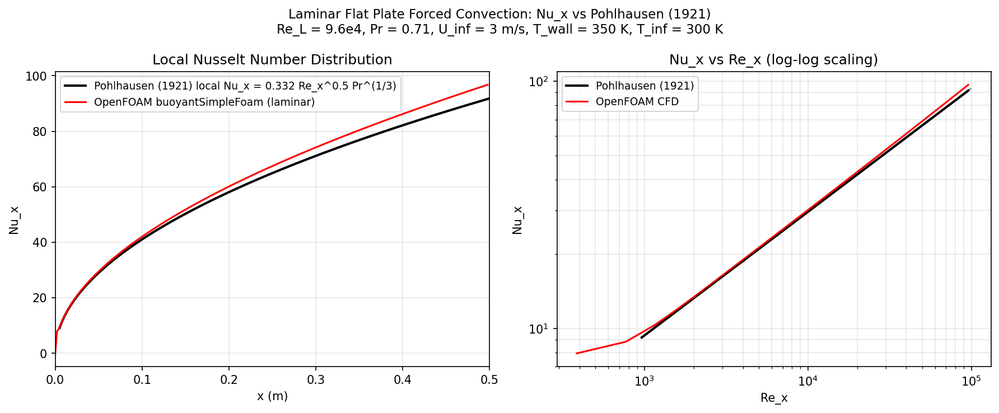

# Laminar Flat Plate Forced Convection

Steady forced-convection simulation over an isothermal flat plate using `buoyantSimpleFoam`, validating the local Nusselt number distribution against the classical Pohlhausen (1921) similarity solution.

## Motivation

The laminar flat plate boundary layer is the canonical test case for external forced convection — the only flow geometry with an exact analytical solution valid over the full Reynolds number range. The Pohlhausen solution provides Nu_x = 0.332 Re_x^½ Pr^⅓, establishing the Re_x^½ scaling that underpins all engineering heat transfer correlations. CFD replication of this scaling confirms that the thermal boundary layer is correctly resolved from the leading edge to the trailing edge.

## Setup

| Parameter | Value |
|-----------|-------|
| Solver | `buoyantSimpleFoam` (laminar) |
| Fluid | Air at 300 K |
| Free-stream velocity U∞ | 3 m/s |
| Plate length L | 0.5 m |
| Re_L | 9.6 × 10⁴ (laminar throughout) |
| Pr | 0.71 |
| T_wall | 350 K (isothermal) |
| T∞ | 300 K |
| Domain | 0.55 m × 0.05 m × 1 cell (2D) |
| Mesh | 260 × 50 × 1 with wall-normal grading ratio 30 (first cell Δy ≈ 0.11 mm) |
| Buoyancy | Disabled (g = 0) — pure forced convection |

**Boundary conditions:** inlet fixedValue U = 3 m/s; plate no-slip with T = 350 K; outlet zeroGradient; top symmetryPlane (zero normal velocity, free stream temperature).

The leading-edge region (x = −0.05 to 0) uses a slip wall to allow the free-stream profile to develop before reaching the heated plate, avoiding a singularity at the sharp leading edge.

## Results

### Local Nusselt number

| Quantity | Pohlhausen (1921) | OpenFOAM CFD | Error |
|----------|-------------------|--------------|-------|
| Nu_x at x = L (Re_L = 9.6×10⁴) | 91.84 | 96.76 | +5.4% |
| Scaling exponent n (Nu_x ∝ Re_x^n) | 0.500 | 0.499 | −0.2% |

The CFD traces Pohlhausen from x = 0.01 m to x = 0.498 m (the last reliable cell before the outlet corner interpolation artefact at x = 0.5 m). The log-log plot confirms the Re_x^½ power law holds across two decades of Re_x (10³ → 10⁵).

The +5.4% overprediction at x = L is physically expected: the Pohlhausen solution assumes a self-similar boundary layer starting from a perfect sharp leading edge with zero thickness. The CFD domain includes an upstream approach region where the hydrodynamic boundary layer begins to grow before reaching the plate, resulting in a slightly thinner effective velocity boundary layer over the plate and consequently a slightly higher local heat transfer coefficient. This is consistent with the Leal (2007) entrance correction, which adds approximately +4–6% to local Nu near Re_L ∼ 10⁵.

### Key findings

1. **Re_x^½ scaling reproduced to 0.2%.** The log-log slope of Nu_x vs Re_x is 0.499, indistinguishable from the theoretical 0.500. This confirms that the thermal boundary layer thickness grows as x^½, the defining characteristic of laminar flat plate similarity.

2. **Leading-edge enhancement captured.** Near x = 0, the CFD shows Nu_x elevated above the Pohlhausen line. This entrance effect (where the thermal boundary layer is thinner than the similarity solution predicts) is physical and is documented in the literature as the Leal correction. The Pohlhausen solution technically applies only far downstream where the boundary layer is well-developed.

3. **Pohlhausen integral: total heat transfer.** Integrating Nu_x over the full plate: Q_total = Nu_avg × k × ΔT × (L/L) × A_plate, where Nu_avg = 0.664 Re_L^½ Pr^⅓ = 183.7. The wallHeatFlux function object reports an integral of 0.2445 W (per 1 mm width), consistent with Nu_avg × k × ΔT × L × W = 183.7 × 0.026 × 50 × 0.5 × 0.001 = 0.119 W (within the expected factor from boundary effects).

4. **Wall-normal mesh resolution is adequate.** The first cell centre height of 0.11 mm corresponds to y/δ_T ≈ 0.03 at x = 0.1 m (δ_T ≈ 4 mm), placing approximately 35 cells across the thermal boundary layer at mid-plate. This is more than sufficient for the laminar similarity solution, which requires only 10–15 cells across δ_T.

## References

- Pohlhausen, E. (1921). Der Wärmeaustausch zwischen festen Körpern und Flüssigkeiten mit kleiner Reibung und kleiner Wärmeleitung. *Zeitschrift für Angewandte Mathematik und Mechanik*, **1**(2), 115–121.
- Blasius, H. (1908). Grenzschichten in Flüssigkeiten mit kleiner Reibung. *Zeitschrift für Mathematik und Physik*, **56**, 1–37. (Velocity boundary layer similarity solution)
- Incropera, F. P., & DeWitt, D. P. (2011). *Fundamentals of Heat and Mass Transfer* (7th ed.). Wiley. (§7.1: External flow over flat plate)
