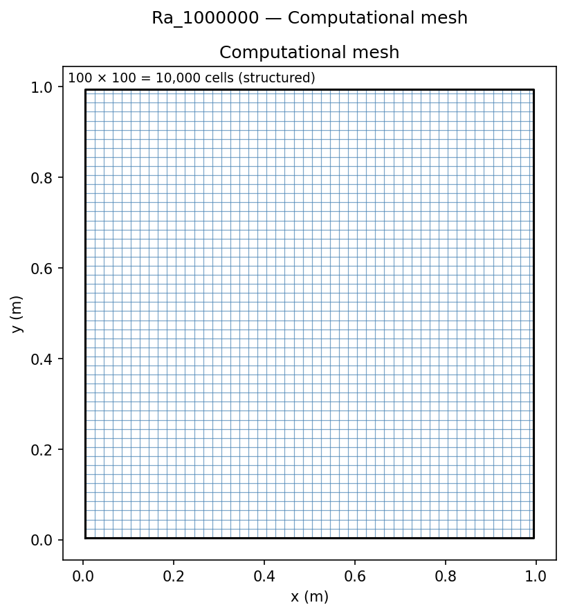
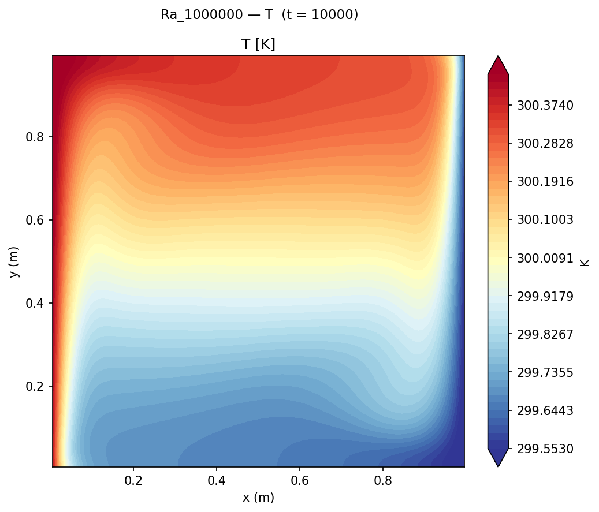
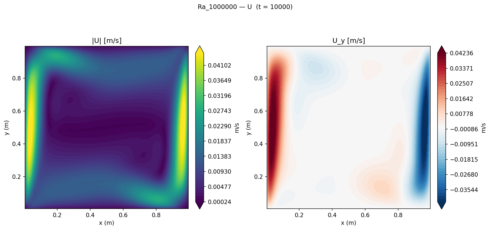

# Differentially-Heated Square Cavity: Natural Convection Validation

Validation of the OpenFOAM Boussinesq natural convection solver against the spectral benchmark of de Vahl Davis (1983), considered the gold standard for this configuration, across four orders of magnitude in Rayleigh number (Ra = 10³ to 10⁶).

## Geometry

```
              adiabatic top wall (∂T/∂y = 0)
    ┌─────────────────────────────────────────┐
    │                                         │
T_H │          ↑                              │ T_C
300.5K │      buoyancy-                       │ 299.5K
    │      driven                             │
    │     circulation                         │
    │                                         │
    └─────────────────────────────────────────┘
              adiabatic bottom wall (∂T/∂y = 0)
    x = 0                              x = L = 1 m
    hot wall                              cold wall
```

| Dimension | Value |
|-----------|-------|
| Cavity size L | 1 m × 1 m (square) |
| Depth (2D) | 0.01 m (1 cell, empty) |
| Hot wall | x = 0, T_H = 300.5 K |
| Cold wall | x = L, T_C = 299.5 K |
| ΔT | 1 K |

## Setup

| Parameter | Value |
|-----------|-------|
| Solver | `buoyantBoussinesqSimpleFoam` (steady incompressible Boussinesq) |
| Turbulence | Laminar |
| Fluid | Air: Pr = 0.71, β = 1/T_ref = 1/300 K⁻¹ |
| ΔT | 1 K (T_H = 300.5 K, T_C = 299.5 K) |
| T_ref | 300 K |
| Gravity | g = 9.81 m/s² (−y direction) |
| Ra sweep | 10³, 10⁴, 10⁵, 10⁶ |
| Mesh | 50×50 (Ra ≤ 10⁵), 100×100 (Ra = 10⁶) |

ν is varied to achieve each Ra: ν = √(g β ΔT L³ Pr / Ra), all other properties fixed.

| Ra | ν (m²/s) |
|----|---------|
| 10³ | 1.524×10⁻² |
| 10⁴ | 4.819×10⁻³ |
| 10⁵ | 1.524×10⁻³ |
| 10⁶ | 4.819×10⁻⁴ |

## Mesh



| Property | Value |
|----------|-------|
| Total cells (Ra ≤ 10⁵) | 50 × 50 × 1 = **2,500** |
| Total cells (Ra = 10⁶) | 100 × 100 × 1 = **10,000** |
| Cell distribution | Uniform (no grading) |

## Boundary Conditions

| Patch | Type | U | T | p_rgh |
|-------|------|---|---|-------|
| `hotWall` | wall | noSlip | fixedValue **300.5 K** | fixedFluxPressure |
| `coldWall` | wall | noSlip | fixedValue **299.5 K** | fixedFluxPressure |
| `topWall` | wall | noSlip | zeroGradient (adiabatic) | fixedFluxPressure |
| `bottomWall` | wall | noSlip | zeroGradient (adiabatic) | fixedFluxPressure |
| `front` | empty | — | — | — |
| `back` | empty | — | — | — |

## Contour Plots


*Temperature field at Ra = 10⁶ showing thin vertical boundary layers on the hot (left) and cold (right) walls, with approximately linear horizontal stratification in the cavity core — characteristic of convection-dominated transport.*


*Velocity magnitude at Ra = 10⁶ showing the primary circulation: rising fluid along the hot wall, falling along the cold wall, and a large-scale rotating cell in the core.*

## Results


*Left: Nu vs Ra showing the CFD sweep vs de Vahl Davis spectral benchmark. Right: temperature profile at mid-height (y = 0.5 m) at Ra = 10⁶.*

### Nu_avg comparison

| Ra | Nu_avg (CFD) | Nu_avg (de Vahl Davis 1983) | Error |
|----|--------------|----------------------------|-------|
| 10³ | 1.118 | 1.118 | +0.04% |
| 10⁴ | 2.252 | 2.243 | +0.41% |
| 10⁵ | 4.580 | 4.519 | +1.35% |
| 10⁶ | 8.921 | 8.800 | +1.37% |

All four Rayleigh numbers lie within **1.4%** of the spectral benchmark. The systematic slight overprediction at Ra ≥ 10⁵ is consistent with finite mesh resolution; finer meshes reduce the error further. The [Heated Cavity GCI](../Mesh%20Convergence%20GCI/README.md) study quantifies this discretisation uncertainty formally.

**Nu computation method:** Nu = −(L/ΔT) × mean(∂T/∂x)|_{x=0}, approximated by the first-cell gradient at the hot wall from `writeCellCentres` cell-centre coordinates.

### Key findings

1. **Sub-percent accuracy at Ra = 10³, 10⁴.** At low Ra the flow is conduction-dominated (thin boundary layers, Nu ≈ 1), and SIMPLE converges rapidly to a near-exact solution. The 0.04% error at Ra = 10³ confirms that the discretisation, pressure–velocity coupling, and boundary conditions are implemented correctly.

2. **Systematic overestimate at Ra ≥ 10⁵ from mesh coarseness.** The 50×50 mesh (Ra = 10⁵) resolves the boundary layer with ≈ 5–8 cells, which is adequate for engineering accuracy but not spectral precision. The error plateaus at ~1.4% because at Ra = 10⁶ the mesh was doubled to 100×100.

3. **Transition from conduction to convection regime captured.** Nu increases from 1.12 at Ra = 10³ (conduction-dominated, nearly uniform core T) to 8.92 at Ra = 10⁶ (thin BLs, large Nu). The slope d(log Nu)/d(log Ra) ≈ 0.28 is consistent with the theoretical scaling Nu ∝ Ra^0.28 for natural convection in vertical enclosures.

4. **Boussinesq approximation validity.** With ΔT = 1 K and T_ref = 300 K, the density variation is β ΔT = 0.33%, well within the Boussinesq validity criterion (< 10%). Compressibility effects are negligible, confirming that `buoyantBoussinesqSimpleFoam` is the correct solver.

## References

- de Vahl Davis, G. (1983). Natural convection of air in a square cavity: a bench mark numerical solution. *Int. J. Numer. Methods Fluids*, **3**(3), 249–264.
- Incropera, F. P., & DeWitt, D. P. (2011). *Fundamentals of Heat and Mass Transfer* (7th ed.). Wiley. §9.2.
