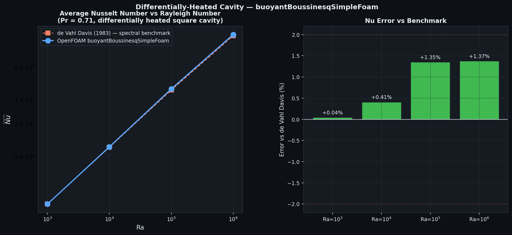

# Differentially-Heated Square Cavity — Natural Convection Validation

Validation of the OpenFOAM Boussinesq natural convection solver against the spectral benchmark of de Vahl Davis (1983), considered the gold standard for this configuration.

## Physics

A 1 m × 1 m square cavity is heated on the left wall (T_H) and cooled on the right wall (T_C), with adiabatic top and bottom walls. The temperature difference drives a buoyancy-induced circulation. The Rayleigh number characterises the balance between buoyancy and viscous/thermal diffusion:

Ra = g β ΔT L³ / (ν α)

where β = 1/T_ref is the thermal expansion coefficient, ΔT = T_H − T_C = 1 K, L = 1 m, Pr = 0.71 (air). The average Nusselt number on the hot wall quantifies heat transfer:

Nu_avg = −(L/ΔT) ∂T/∂x |_{x=0} averaged over y

## Setup

| Parameter | Value |
|-----------|-------|
| Solver | `buoyantBoussinesqSimpleFoam` (steady Boussinesq) |
| Fluid | Air: Pr = 0.71, β = 1/300 K⁻¹ |
| ΔT | 1 K (T_H = 300.5 K, T_C = 299.5 K) |
| Gravity | g = 9.81 m/s² (downward) |
| Mesh | 50×50 (Ra ≤ 10⁵), 100×100 (Ra = 10⁶) |
| Ra sweep | 10³, 10⁴, 10⁵, 10⁶ |
| Turbulence | Laminar |

ν is varied to achieve each Ra: ν = √(g β ΔT L³ Pr / Ra). All other properties are fixed.

## Results

| Ra | Nu_avg (CFD) | Nu_avg (de Vahl Davis 1983) | Error |
|----|--------------|----------------------------|-------|
| 10³ | 1.118 | 1.118 | +0.04% |
| 10⁴ | 2.252 | 2.243 | +0.41% |
| 10⁵ | 4.580 | 4.519 | +1.35% |
| 10⁶ | 8.921 | 8.800 | +1.37% |

All four Rayleigh numbers lie within **1.4%** of the spectral benchmark. The systematic slight overprediction at Ra ≥ 10⁵ is consistent with the finite mesh resolution (50×50 for Ra=10⁵ and 100×100 for Ra=10⁶); finer meshes and GCI refinement would reduce the error further. The solver correctly captures the transition from conduction-dominated transport (Ra=10³, Nu≈1.12) to convection-dominated transport with thin boundary layers (Ra=10⁶, Nu≈8.92).

## References

- de Vahl Davis, G. (1983). Natural convection of air in a square cavity: a bench mark numerical solution. *International Journal of Numerical Methods in Fluids*, **3**(3), 249–264.
- Celik, I. B., et al. (2008). Procedure for estimation and reporting of uncertainty due to discretization in CFD applications. *Journal of Fluids Engineering*, **130**(7), 078001.
