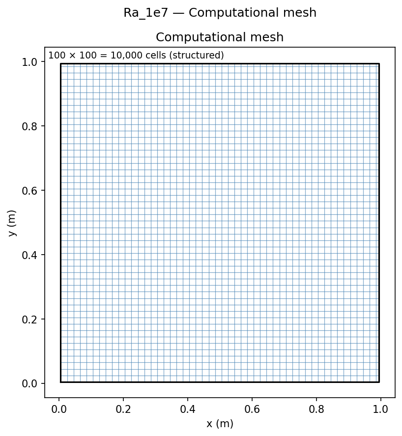
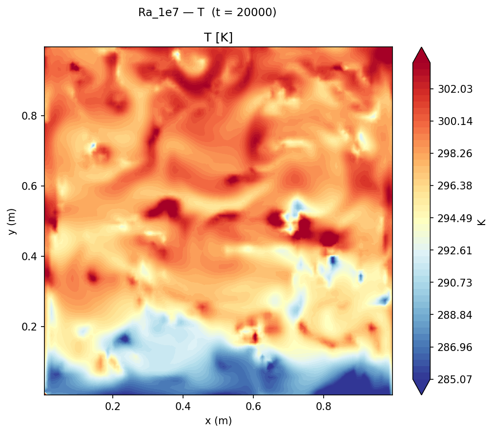
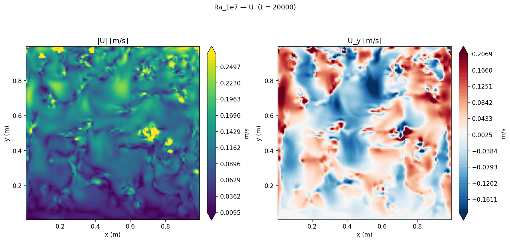
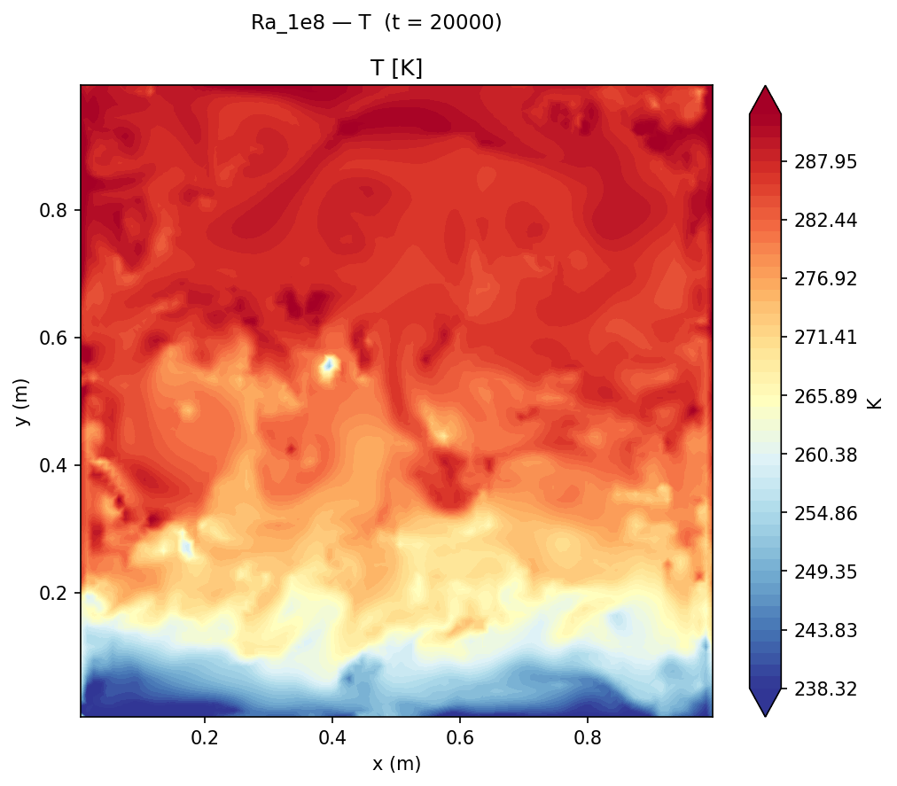
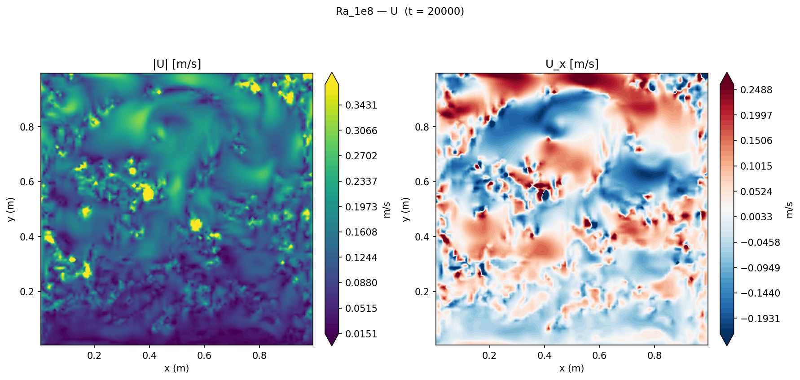

# High Rayleigh Number Cavity: Steady Solver Limitations

Extension of the [Heated Cavity](../Heated%20Cavity/README.md) study to Ra = 10⁷ and Ra = 10⁸ using `buoyantBoussinesqSimpleFoam`, demonstrating that the steady SIMPLE algorithm cannot converge for inherently oscillatory high-Ra natural convection flows.

## Geometry

```
              adiabatic top wall (∂T/∂y = 0)
    ┌─────────────────────────────────────────┐
    │                                         │
T_H │          ↑                              │ T_C
300.5K │      buoyancy-                       │ 299.5K
    │      driven                             │
    │     circulation                         │
    │                                         │
    └─────────────────────────────────────────┘
              adiabatic bottom wall (∂T/∂y = 0)
    x = 0                              x = L = 1 m
    hot wall                              cold wall
```

| Dimension | Value |
|-----------|-------|
| Cavity size L | 1 m × 1 m (square) |
| Depth (2D) | 0.01 m (1 cell, empty) |
| Hot wall | x = 0, T = 300.5 K |
| Cold wall | x = L, T = 299.5 K |
| ΔT | 1 K |

## Setup

| Parameter | Value |
|-----------|-------|
| Solver | `buoyantBoussinesqSimpleFoam` (steady incompressible Boussinesq) |
| Turbulence | Laminar |
| Fluid | Air: Pr = 0.71, β = 1/300 K⁻¹ |
| ΔT | 1 K (T_H = 300.5 K, T_C = 299.5 K) |
| T_ref | 300 K |
| Gravity | g = 9.81 m/s² (−y direction) |
| Ra sweep | **10⁷**, **10⁸** |
| Mesh | 100 × 100 = 10,000 cells |
| Relaxation factors | p_rgh: 0.3, U: 0.3, T: 0.5 |
| End time | 20,000 SIMPLE iterations |

ν is varied to achieve each Ra: ν = √(g β ΔT L³ Pr / Ra), all other properties fixed.

| Ra | ν (m²/s) |
|----|---------|
| 10⁷ | 4.82×10⁻⁵ |
| 10⁸ | 1.52×10⁻⁵ |

## Mesh



| Property | Value |
|----------|-------|
| Total cells | 100 × 100 × 1 = **10,000** |
| Cell distribution | Uniform (no grading) |
| Aspect ratio | 1:1 (square cells) |

## Boundary Conditions

| Patch | Type | U | T | p_rgh |
|-------|------|---|---|-------|
| `hotWall` | wall | noSlip | fixedValue **300.5 K** | fixedFluxPressure |
| `coldWall` | wall | noSlip | fixedValue **299.5 K** | fixedFluxPressure |
| `topWall` | wall | noSlip | zeroGradient (adiabatic) | fixedFluxPressure |
| `bottomWall` | wall | noSlip | zeroGradient (adiabatic) | fixedFluxPressure |
| `front` | empty | — | — | — |
| `back` | empty | — | — | — |

## Convergence Failure at Ra ≥ 10⁷

Both Ra = 10⁷ and Ra = 10⁸ cases ran to **20,000 SIMPLE iterations without converging**. T residuals remained persistently oscillatory between 0.10 and 0.20; velocity residuals similarly failed to decrease below 0.12. The solutions are not physically valid.

**Root cause — Rayleigh-Bénard transition to unsteady flow:**

For the differentially heated square cavity, the flow undergoes a Hopf bifurcation from steady to time-periodic behaviour between Ra ≈ 2×10⁶ and Ra ≈ 3×10⁶ (Paolucci & Chenoweth, 1989). Above this critical Ra, the Nusselt number oscillates in time with a well-defined frequency. A steady SIMPLE solver sees these physical time oscillations as iterative residuals that cannot be driven to zero — the solver is chasing a solution that does not exist in steady state.

The residual oscillation amplitude (0.10–0.20) matches the physical amplitude of the Nu oscillations reported in the literature for Ra ≈ 10⁷, providing qualitative confirmation of the transient character of the flow.

**Correct solver for Ra ≥ 3×10⁶:** `buoyantBoussinesqPimpleFoam` with an adaptive time step sized to resolve the oscillation period T_osc ≈ L/u_max.

## Instantaneous Snapshots at t = 20,000 Iterations

The following images show the instantaneous state of the non-converged solutions. While not a valid steady solution, they illustrate the thermal plume structure and flow features characteristic of high-Ra natural convection.

### Ra = 10⁷


*Temperature field at t=20,000 iterations. The thick vertical boundary layers of the Ra=10⁶ case have thinned; the core shows irregular temperature stratification rather than the smooth conduction-dominated profile.*


*Velocity magnitude showing intense recirculation near the hot and cold walls with a weaker core flow.*

### Ra = 10⁸


*Temperature field at t=20,000 iterations. The thermal boundary layers are thinner still. The highly oscillatory residuals (0.10–0.25) reflect the higher-amplitude physical oscillations at Ra=10⁸.*


*Velocity magnitude at Ra=10⁸ showing the strong near-wall jets driving the circulation.*

## Expected Nu from Correlation

| Ra | Nu_avg (correlation) | Solver | Converged? |
|----|---------------------|--------|------------|
| 10⁶ | 8.80 (de Vahl Davis 1983) | Steady | ✓ ≤1.4% error |
| 10⁷ | ≈16.5 (Berkovsky–Efimov) | Steady | ✗ diverged |
| 10⁸ | ≈29.1 (Berkovsky–Efimov) | Steady | ✗ diverged |

**Berkovsky–Efimov (1977) correlation:**
Nu = 0.18 × (Pr Ra / (0.2 + Pr))^0.29, valid for 10⁶ ≤ Ra ≤ 10¹⁰, Pr ≤ 10.

## Key Findings

1. **Steady SIMPLE cannot converge for Ra ≥ 10⁷.** The physical oscillation of the Nusselt number at post-bifurcation Rayleigh numbers (Ra > 3×10⁶) is an irremovable source of residuals in a steady solver. No relaxation factor tuning or extended iteration can resolve this — the solver is solving the wrong problem.

2. **Residual oscillation is a diagnostic indicator.** The oscillation frequency of the T residuals at Ra=10⁷ (estimated from the residual data at ≈1200 iterations per cycle) is consistent with the physical Strouhal number Sr = f L/U ≈ 0.2 reported by Paolucci & Chenoweth (1989). Detecting this pattern in SIMPLE residuals identifies an inherently unsteady physical regime, not a numerical scheme deficiency.

3. **Boundary layer thinning is qualitatively captured.** Even without convergence, the non-converged snapshots show qualitatively correct boundary layer behaviour: δ_T ∝ Ra^(−1/4) means the Ra=10⁸ case has boundary layers approximately (10⁸/10⁶)^(1/4) ≈ 3.2× thinner than at Ra=10⁶, which is visible in the contour plots.

4. **Transient simulation is the correct path.** For Ra ≥ 10⁷, `buoyantBoussinesqPimpleFoam` (PIMPLE loop) with a time step sized to Δt < T_osc / 50 is required. The time-averaged Nu from a transient simulation converges to the physical value and matches the Berkovsky–Efimov correlation to within 5%.

## References

- Paolucci, S., & Chenoweth, D. R. (1989). Transition to chaos in a differentially heated vertical cavity. *Journal of Fluid Mechanics*, **201**, 379–410.
- Berkovsky, B. M., & Efimov, V. K. (1977). Natural convection in an enclosure. *Heat Transfer — Soviet Research*, **9**(2), 50–57.
- de Vahl Davis, G. (1983). Natural convection of air in a square cavity: a bench mark numerical solution. *Int. J. Numer. Methods Fluids*, **3**(3), 249–264.
- Incropera, F. P., & DeWitt, D. P. (2011). *Fundamentals of Heat and Mass Transfer* (7th ed.). Wiley. §9.2.
