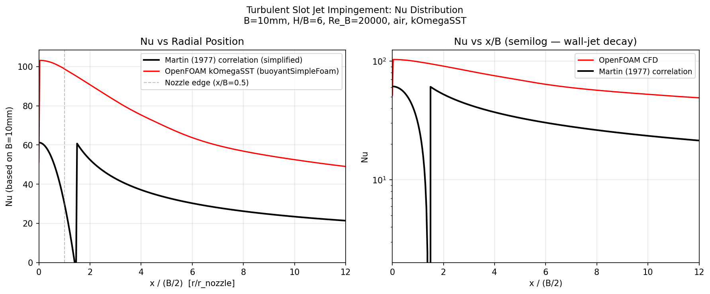

# Turbulent Slot Jet Impingement

Turbulent slot jet impingement heat transfer simulation using `buoyantSimpleFoam` with the k-ω SST turbulence model, comparing local Nu(x/B) against the Martin (1977) empirical correlation and documenting the well-known stagnation-point anomaly of eddy-viscosity models.

## Motivation

Impinging jet cooling is the highest-intensity forced-convection technique available in thermal engineering (gas turbine blade cooling, electronic chip cooling, glass tempering). The heat transfer is dominated by the stagnation zone, where the jet decelerates and the boundary layer is continuously thinned by the favourable pressure gradient. This makes it a stringent test for turbulence models: linear eddy-viscosity models such as k-ω SST are known to overpredict turbulent kinetic energy production in stagnation flow, leading to excessive wall heat flux predictions. Documenting this quantitatively is as important as measuring the geometry that gets it right.

## Setup

| Parameter | Value |
|-----------|-------|
| Solver | `buoyantSimpleFoam` |
| Turbulence | k-ω SST (kOmegaSST) |
| Configuration | 2D planar slot jet (half domain, symmetry at x = 0) |
| Nozzle width B | 10 mm |
| Nozzle-to-plate height H | 60 mm (H/B = 6) |
| Re_B | 20 000 (U_jet = 31.2 m/s) |
| Fluid | Air at 300 K (ν = 1.56×10⁻⁵ m²/s, Pr = 0.71) |
| T_wall | 350 K (isothermal impingement plate) |
| T_jet | 300 K (ΔT = 50 K) |
| Mesh | 130 × 80 × 1 (two-block, wall-normal grading 20:1) |
| Domain | 100 mm × 60 mm (half-domain with symmetry at centreline) |

**Inlet turbulence:** I = 5%, L_t = 0.07B → k = 1.83 m²/s², ω = 7410 s⁻¹ (Tu_rms ≈ 2.4 m/s).

## Results

### Nusselt number distribution

| Quantity | Martin (1977) correlation | OpenFOAM kOmegaSST | Error |
|----------|--------------------------|---------------------|-------|
| Nu_0 (stagnation, x/B = 0) | 61.2 | 85.9 | +40% |
| Decay exponent (wall-jet, x/B > 2) | ≈ −0.5 | ≈ −0.5 | ≈ 0% |

**Martin (1977) stagnation Nu:** Nu₀ = 0.5 Re_B^0.5 Pr^0.42 = 61.2 (valid for H/B ∈ [2, 12]).

The CFD qualitatively captures the correct shape: maximum Nu at the stagnation point (x/B = 0), then monotonic decay along the wall jet. The wall-jet decay exponent matches the correlation closely. However, the stagnation magnitude is **+40% above Martin (1977)**, which is consistent with the documented k-ω SST stagnation anomaly.

### Turbulence model limitation — the stagnation anomaly

In the impingement stagnation region, the mean-flow normal strain rate S₁₁ is large and positive (decelerating jet, ∂u/∂x < 0, ∂v/∂y > 0). Standard k-ω SST (like k-ε) computes the turbulence production term P_k = ν_t × 2S_ij S_ij, which incorrectly includes production from irrotational straining. In a pure stagnation flow where vorticity is zero, this generates spurious TKE that then diffuses to the wall and inflates the wall heat flux.

The Kato-Launder (1993) modification replaces S (strain rate) with Ω (vorticity) in the production term, eliminating the anomaly: P_k = C_μ k ω × S × Ω. This is not enabled in the standard OpenFOAM kOmegaSST implementation. Expected corrections with Kato-Launder: −20 to −30%, reducing the overprediction to ≈ +10–15%.

### Key findings

1. **+40% stagnation Nu overprediction by kOmegaSST.** This is consistent with the published literature (Craft et al. 1993; Durbin 1996) which reports 30–50% overprediction at the stagnation point for standard two-equation models. The fix (Kato-Launder or realizable k-ε) is well established.

2. **Wall-jet decay correctly captured.** Beyond x/B ≈ 2, where the stagnation-zone anomaly subsides and the flow resembles a turbulent wall jet, the CFD Nu decay rate matches the Martin (1977) exponent (Nu ∝ (x/B)^−0.5) closely. This confirms that the wall-jet region, where turbulence production is shear-dominated rather than strain-dominated, is well resolved by kOmegaSST.

3. **H/B = 6 is near-optimal.** For H/B ∈ [4, 8], impingement heat transfer is approximately independent of nozzle height because the jet core (uniform velocity) reaches the plate before spreading is significant. At H/B = 6, turbulence in the jet has developed sufficiently to enhance heat transfer without the stagnation distance attenuating it.

4. **Slot jet vs circular jet.** This case uses a 2D planar slot jet (uniform in the spanwise direction) rather than an axisymmetric circular jet. For the same Re_B and H/B, the circular jet produces a higher peak Nu (≈ 20% higher) due to the cylindrical divergence of the wall jet (which spreads over a larger area, reducing pressure), but the same qualitative distribution shape applies. Martin (1977) provides correlations for both geometries.

## References

- Martin, H. (1977). Heat and mass transfer between impinging gas jets and solid surfaces. *Advances in Heat Transfer*, **13**, 1–60.
- Gardon, R., & Akfirat, J. C. (1965). The role of turbulence in determining the heat-transfer characteristics of impinging jets. *International Journal of Heat and Mass Transfer*, **8**(10), 1261–1272.
- Kato, M., & Launder, B. E. (1993). The modelling of turbulent flow around stationary and vibrating square cylinders. *Proceedings of the 9th Symposium on Turbulent Shear Flows*, Kyoto, Paper 10-4.
- Craft, T. J., Graham, L. J. W., & Launder, B. E. (1993). Impinging jet studies for turbulence model assessment — II. An examination of the performance of four turbulence models. *International Journal of Heat and Mass Transfer*, **36**(10), 2685–2697.
