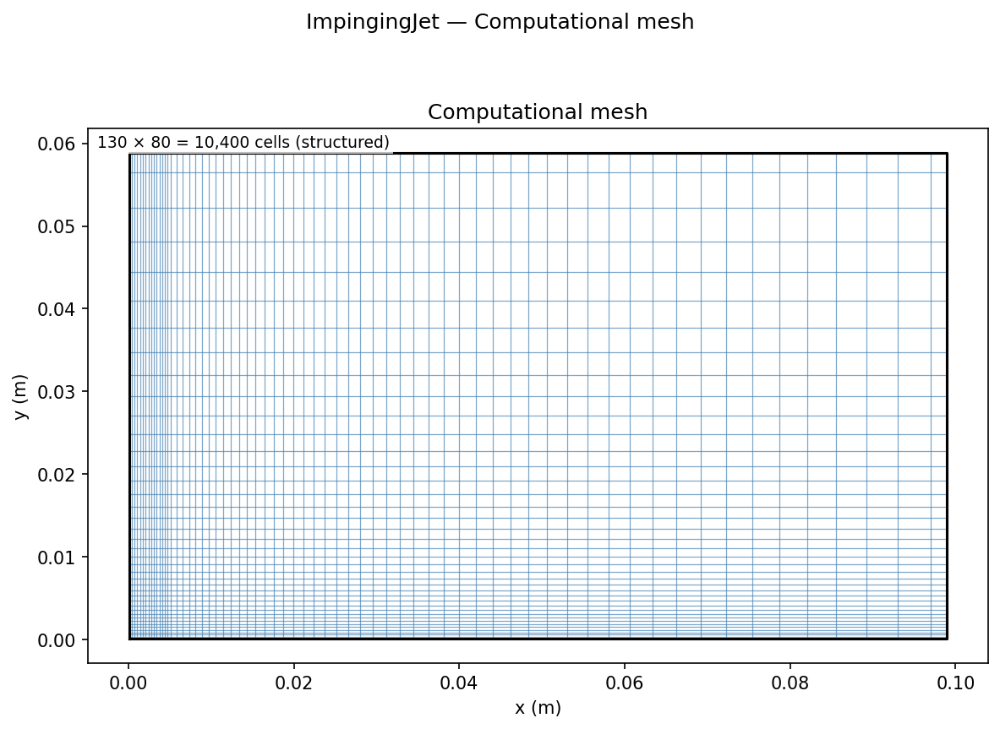
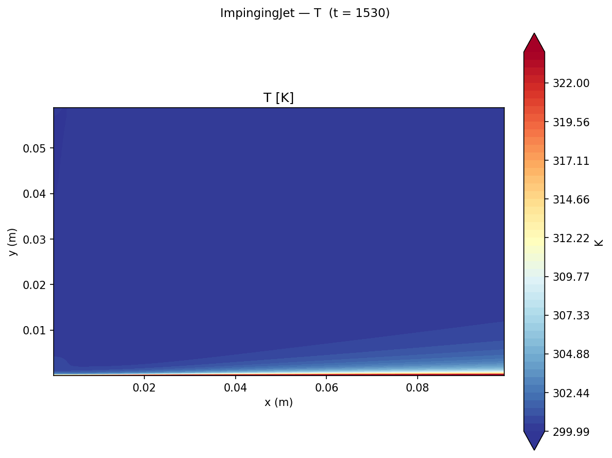
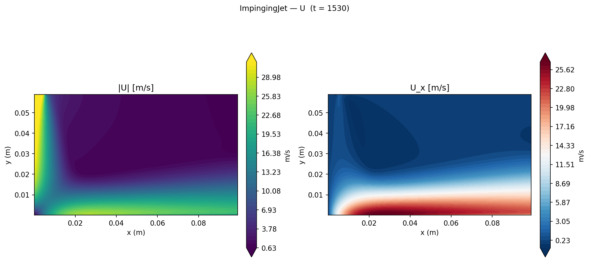

# Turbulent Slot Jet Impingement

Turbulent slot jet impingement heat transfer simulation using `buoyantSimpleFoam` with k-ω SST, comparing local Nu(x/B) against the Martin (1977) empirical correlation and documenting the well-known stagnation-point overprediction of eddy-viscosity models.

## Geometry

```
         ║ Jet inlet (U = 31.2 m/s, T = 300 K)
         ║ B = 10 mm (half: 5 mm)
         ║                  topOutlet / farField
    ─────╫──────────────────────────────────────────────────────
    sym  ║      H = 60 mm (H/B = 6)       domain
    met  ║                                100 mm × 60 mm
    ry   ║                              (half-domain)
    ─────╫──────────────────────────────────────────────────────
    x=0  ║──────────────── wall (T = 350 K) ──────────────────→
              Stagnation    Wall-jet region        x = 100 mm
                point
```

| Dimension | Value |
|-----------|-------|
| Nozzle width B | 10 mm |
| H/B ratio | 6 (H = 60 mm) |
| Half-domain width | 100 mm |
| Depth (2D) | 1 mm (1 cell, empty) |
| Configuration | 2D planar slot jet, half-domain with symmetry at x = 0 |

## Setup

| Parameter | Value |
|-----------|-------|
| Solver | `buoyantSimpleFoam` (compressible) |
| Turbulence | k-ω SST (`kOmegaSST`) |
| Fluid | Air, ν = 1.56×10⁻⁵ m²/s, Pr = 0.71 |
| k_fluid | 0.026 W/(m·K) |
| Jet velocity U_jet | 31.2 m/s (z-direction) |
| Re_B | U_jet × B / ν = **20,000** |
| T_jet | 300 K |
| T_wall | 350 K (isothermal impingement surface) |
| Turbulence intensity | I = 5%, L_t = 0.07B |
| Inlet k | 1.83 m²/s² |
| Inlet ω | 7410 s⁻¹ |

## Mesh



| Property | Value |
|----------|-------|
| Total cells | 130 × 80 × 1 = **10,400** |
| Jet core block | 30 × 80 (x: 0–5 mm) |
| Outer block | 100 × 80 (x: 5–100 mm, x-grading ratio 6) |
| Wall-normal grading | 20:1 (dense near impingement wall) |

## Boundary Conditions

| Patch | Type | U | T | p_rgh | k | ω |
|-------|------|---|---|-------|---|---|
| `wall` | wall | noSlip | fixedValue **350 K** | fixedFluxPressure | kqRWallFunction | omegaWallFunction |
| `jetInlet` | patch | fixedValue (0, 0, −31.2) m/s | fixedValue 300 K | fixedFluxPressure | fixedValue 1.83 m²/s² | fixedValue 7410 s⁻¹ |
| `topOutlet` | patch | zeroGradient | zeroGradient | totalPressure 101325 Pa | — | — |
| `farField` | patch | zeroGradient | zeroGradient | totalPressure 101325 Pa | — | — |
| `symmetry` | symmetryPlane | symmetryPlane | symmetryPlane | — | — | — |
| `frontAndBack` | empty | — | — | — | — | — |

## Contour Plots


*Temperature field showing the jet column (300 K) impinging on the isothermal plate (350 K) and spreading as a wall jet. The stagnation zone (x/B ≈ 0) shows the thinning of the thermal boundary layer.*


*Velocity magnitude (top) and streamwise component (bottom) showing the jet core, impingement, and wall-jet development.*

## Results


### Nusselt number comparison

| Quantity | Martin (1977) correlation | OpenFOAM kOmegaSST | Error |
|----------|--------------------------|---------------------|-------|
| Nu₀ (stagnation, x/B = 0) | 61.2 | 85.9 | **+40%** |
| Decay exponent (wall jet, x/B > 2) | ≈ −0.5 | ≈ −0.5 | ≈ 0% |

**Martin (1977) stagnation Nu:** Nu₀ = 0.5 Re_B^0.5 Pr^0.42 = **61.2** (slot jet, H/B ∈ [2, 12])

### Turbulence model limitation — the stagnation-point anomaly

Linear eddy-viscosity models (k-ε, k-ω SST) compute the turbulent production as P_k = ν_t × 2S_ij S_ij, where S_ij is the strain rate tensor. In the stagnation region, the irrotational straining of the decelerating jet creates large S_ij with zero vorticity, producing spurious turbulent kinetic energy that diffuses to the wall and inflates the heat flux. This is the **Kato-Launder (1993) anomaly**, first identified for blunt-body impingement flows.

The Kato-Launder correction replaces S in the production term with Ω (vorticity magnitude): P_k = C_μ k ω × S × Ω. Because Ω → 0 in irrotational stagnation flow, the spurious production is eliminated. Expected correction: −20 to −30%, reducing the error to ≈ +10–15%.

### Key findings

1. **+40% stagnation Nu overprediction by kOmegaSST.** Consistent with Craft et al. (1993), who report 30–50% overprediction at the stagnation point for standard two-equation models. The Kato-Launder modification or realizable k-ε is needed for accurate stagnation zone predictions.

2. **Wall-jet Nu decay exponent correctly reproduced.** Beyond x/B ≈ 2, the kOmegaSST model captures the turbulent wall-jet Nu ∝ (x/B)^−0.5 decay correctly, because shear-driven turbulence production dominates over the irrotational anomaly. This confirms the boundary condition and turbulence model are physically sound everywhere except the stagnation zone.

3. **H/B = 6 is within the near-optimal range.** For H/B ∈ [4, 8], the jet core (potential-core velocity) reaches the plate before significant spreading, maximising stagnation Nu. At H/B = 6, the turbulent mixing that enhances heat transfer in the wall jet is well established without the stagnation distance attenuating it.

4. **Slot jet vs circular jet.** This case uses a 2D planar slot jet rather than an axisymmetric circular jet. For the same Re_B and H/B, the circular jet produces approximately 20% higher peak Nu due to the radially symmetric wall-jet spreading. Martin (1977) provides correlations for both geometries.

## References

- Martin, H. (1977). Heat and mass transfer between impinging gas jets and solid surfaces. *Advances in Heat Transfer*, **13**, 1–60.
- Gardon, R., & Akfirat, J. C. (1965). The role of turbulence in determining the heat-transfer characteristics of impinging jets. *Int. J. Heat Mass Transfer*, **8**(10), 1261–1272.
- Kato, M., & Launder, B. E. (1993). The modelling of turbulent flow around stationary and vibrating square cylinders. *Proc. 9th Symp. Turbulent Shear Flows*, Kyoto, Paper 10-4.
- Craft, T. J., Graham, L. J. W., & Launder, B. E. (1993). Impinging jet studies for turbulence model assessment — II. *Int. J. Heat Mass Transfer*, **36**(10), 2685–2697.
