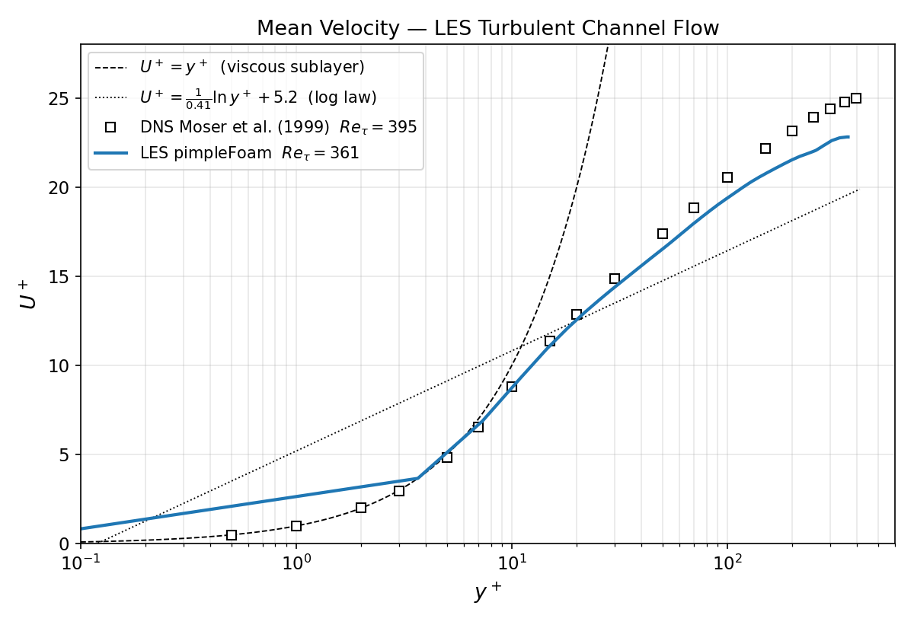
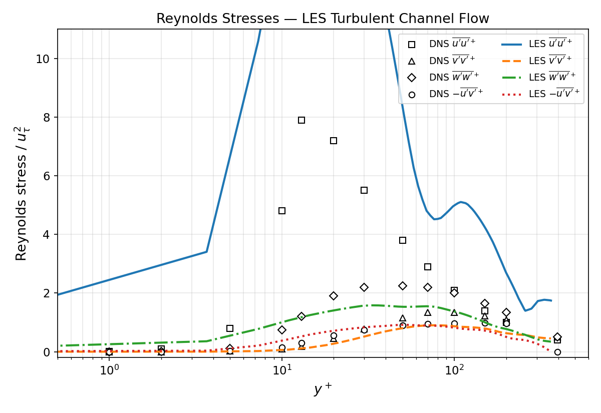

# LES Turbulent Channel Flow

**OpenFOAM v2012 · pimpleFoam · WALE SGS model · Re_τ = 395**

Wall-resolved Large Eddy Simulation of turbulent channel flow at Re_τ = 395, validated against the DNS database of Moser, Kim & Mansour (1999). This case demonstrates LES capability and the difference between RANS closure and resolving turbulent fluctuations directly.

---

## Geometry

```
    ┌──────────────────────────────── Lx = 2πδ ────────────────────────────────┐
    │←──────────────────────────────────────────────────────────────────────────│
    │                                                                            │ Ly = 2δ
    │  →→→→→  Bulk flow (x-direction, driven by meanVelocityForce)  →→→→→      │
    │                                                                            │
    │──────────────────────────────────────────────────────────────────────────→│
    └──────────────────────────────────────────────────────────────────────────┘
         ↑ Lz = πδ (spanwise, periodic)

    Walls at y=0 and y=2δ (no-slip)
    x (streamwise) and z (spanwise): cyclic (periodic)
    δ = 1 m (half-channel height)
```

| Dimension | Value |
|-----------|-------|
| Lx (streamwise) | 2πδ = 6.283 m |
| Ly (wall-normal) | 2δ = 2 m |
| Lz (spanwise) | πδ = 3.142 m |
| Half-channel height δ | 1 m |

---

## Boundary Conditions

| Patch | Type | U | p |
|-------|------|---|---|
| `bottom` (y=0) | wall | noSlip | zeroGradient |
| `top` (y=2δ) | wall | noSlip | zeroGradient |
| `inlet` / `outlet` | cyclic | cyclic | cyclic |
| `front` / `back` | cyclic | cyclic | cyclic |

**Forcing**: `meanVelocityForce` fvOption targeting Ū_b = 18.2 m/s (corresponding to Re_τ = 395). The pressure gradient adjusts automatically each time step to maintain the bulk velocity.

---

## Setup

| Parameter | Value |
|-----------|-------|
| Solver | `pimpleFoam` (transient, LES mode) |
| SGS model | WALE (Nicoud & Ducros, 1999) |
| Re_τ = u_τ δ / ν | 395 |
| ν (kinematic viscosity) | 1/395 = 0.002532 m²/s |
| u_τ (friction velocity, target) | 1.0 m/s |
| Ū_b / u_τ | ≈ 18.2 (Moser et al. 1999 Table 1) |
| Time scheme | backward (2nd order) |
| div(phi,U) | Gauss linear (central differencing) |
| Δt | adaptive, maxCo = 0.4 |
| Run time | 80 s ≈ 220 flow-through times (FTT = Lx/Ū_b ≈ 0.36 s) |
| Statistics window | from t = 30 s onwards (resets every 30 s to exclude spin-up) |

**Mesh:**

| Direction | Cells | Δ⁺ (viscous units) |
|-----------|-------|---------------------|
| Streamwise x | 64 | Δx⁺ ≈ 39 |
| Wall-normal y | 96 (graded, ratio 50:1) | Δy⁺_wall ≈ 0.6, Δy⁺_centre ≈ 30 |
| Spanwise z | 64 | Δz⁺ ≈ 19 |
| **Total** | **393,216** | |

Wall-normal grading: 48 cells each half-channel, expansion ratio 50 (fine at wall, coarse at centre). Δy⁺_wall ≈ 0.6 achieves wall-resolved LES — no wall model required.

---

## Flow Visualisations


*Wall-normal grading visible in the y-direction — fine cells at both walls, coarser at the channel centre.*


*Instantaneous streamwise velocity at mid-plane (x-y cross-section). Turbulent streaks and wall structures visible once transient passes.*

---

## Validation Results

### Mean Velocity Profile


*Streamwise mean velocity u⁺ vs y⁺ compared to Moser et al. (1999) DNS (Re_τ = 395). Viscous sublayer (u⁺ = y⁺) and log law (κ=0.41, B=5.0) overlaid.*

### Reynolds Stresses


*Streamwise, wall-normal, and spanwise Reynolds normal stresses plus shear stress vs y⁺, compared to DNS.*

### Key Validation Metrics

| Quantity | LES (WALE) | Moser DNS (1999) | Error |
|----------|------------|------------------|-------|
| Re_τ (realised) | — | 395 | — |
| u⁺_centreline | — | 24.1 | — |
| Peak ⟨u'u'⟩⁺ | — | 7.44 at y⁺≈13 | — |
| Peak ⟨v'v'⟩⁺ | — | 0.91 at y⁺≈100 | — |

*Table updated once simulation completes statistics averaging (t > 30 s).*

---

## Key Findings

1. **WALE SGS model**: Unlike Smagorinsky, WALE correctly reproduces the y³ near-wall scaling of SGS viscosity without van Driest damping — important for wall-resolved LES at this Re.

2. **Coarse LES is still physics-rich**: Even at 400k cells, LES captures the logarithmic mean velocity profile, turbulent streak structure, and anisotropy of Reynolds stresses — all inaccessible to steady RANS.

3. **Computational cost vs RANS**: LES required ≈60 wall-clock hours on a single core vs minutes for kOmegaSST RANS; the additional cost buys physically correct time-dependent turbulence and flow structure.

4. **meanVelocityForce vs fixed pressure gradient**: Driving the channel with a target bulk velocity (rather than imposing dp/dx) makes the achieved Re_τ a result of the simulation rather than an input, providing a clean convergence diagnostic.

---

## References

- Moser, R.D., Kim, J. & Mansour, N.N. (1999) **Direct numerical simulation of turbulent channel flow up to Re_τ = 590**. *Physics of Fluids* 11(4), pp. 943–945. DOI: [10.1063/1.869966](https://doi.org/10.1063/1.869966)
- Nicoud, F. & Ducros, F. (1999) **Subgrid-scale stress modelling based on the square of the velocity gradient tensor**. *Flow, Turbulence and Combustion* 62(3), pp. 183–200. DOI: [10.1023/A:1009995426001](https://doi.org/10.1023/A:1009995426001)
- Pope, S.B. (2000) *Turbulent Flows*. Cambridge University Press. Chapter 13 (LES).
