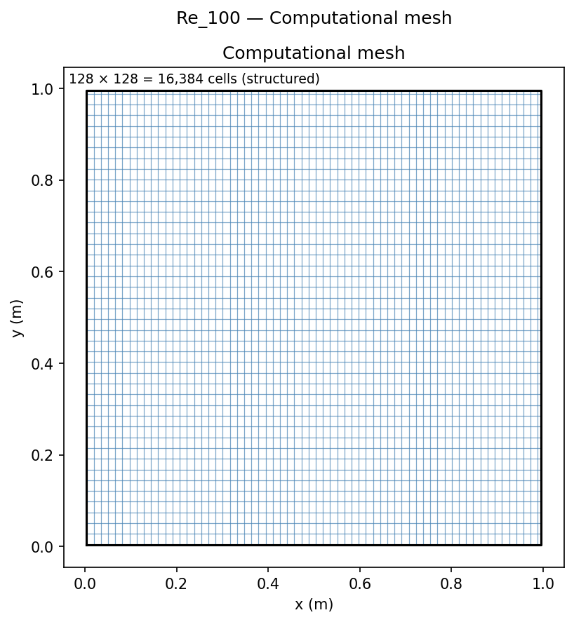
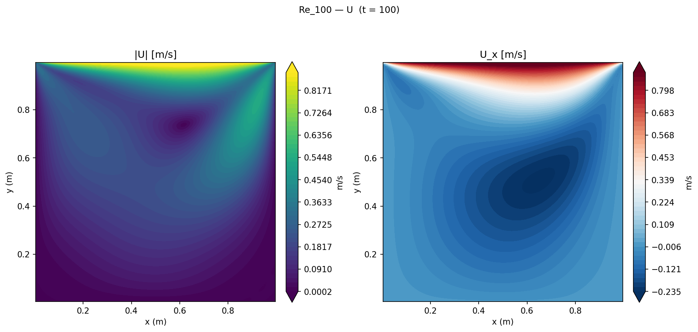
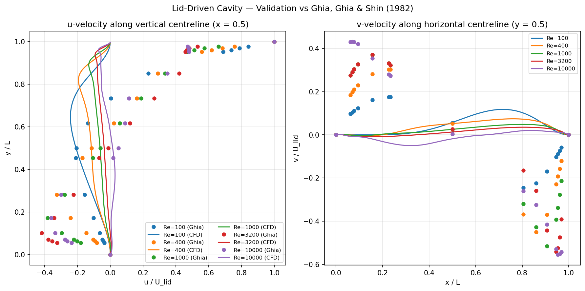

# Lid-Driven Cavity Flow

Benchmark validation of incompressible laminar flow in a square cavity driven by a sliding lid, across five Reynolds numbers. Compared against the widely-cited numerical reference data of Ghia, Ghia & Shin (1982).

## Geometry

```
    ┌─────────────────────────── lid: U = (1, 0, 0) m/s ───────────────────────────┐
    │                                                                               │
    │                                                                               │
no-slip │                        primary                                   │ no-slip
wall   │                        vortex (↻)                                 │ wall
    │                                                                               │
    │                                                                               │
    └───────────────────────────── no-slip bottom ───────────────────────────────┘
    x = 0                      L = 1 m                              x = L
```

| Dimension | Value |
|-----------|-------|
| Cavity size L | 1 m × 1 m (square) |
| Depth (2D) | 0.01 m (1 cell, empty) |
| Lid | Top wall, U = (1, 0, 0) m/s |
| All other walls | No-slip, stationary |

## Setup

| Parameter | Value |
|-----------|-------|
| Solver | `icoFoam` (transient laminar incompressible) |
| Turbulence | Laminar |
| ν | Varied to achieve each Re: ν = U L / Re |
| Mesh | 128 × 128 = **16,384** cells |
| Re sweep | 100, 400, 1000, 3200, 10,000 |

| Re | ν (m²/s) | Δt (s) | End time (s) |
|----|----------|--------|-------------|
| 100 | 0.01 | 0.005 | 100 |
| 400 | 0.0025 | 0.002 | 150 |
| 1000 | 0.001 | 0.001 | 200 |
| 3200 | 0.0003125 | 0.0007 | 250 |
| 10000 | 0.0001 | 0.0005 | 60 |

## Mesh



| Property | Value |
|----------|-------|
| Total cells | 128 × 128 × 1 = **16,384** |
| Cell distribution | Uniform (no grading) |
| Wall treatment | No wall functions (laminar, direct resolution) |

## Boundary Conditions

| Patch | Type | U | p |
|-------|------|---|---|
| `lid` (top) | wall | fixedValue **(1, 0, 0) m/s** | zeroGradient |
| `leftWall` | wall | noSlip | zeroGradient |
| `rightWall` | wall | noSlip | zeroGradient |
| `bottomWall` | wall | noSlip | zeroGradient |
| `front` | empty | — | — |
| `back` | empty | — | — |

Pressure is referenced at a single cell (p = 0 at cell 0), and `icoFoam` uses the kinematic pressure p/ρ.

## Velocity Contour


*Velocity magnitude (left) and x-component (right) at Re=100. The primary vortex fills the cavity; the lid-side is characterised by the high-velocity jet along the top, turning at the corners into weaker recirculations.*

## Results


*Left: u-velocity along vertical centreline (x = 0.5 L). Right: v-velocity along horizontal centreline (y = 0.5 L). Circles are Ghia et al. (1982) data; lines are CFD.*

### Centreline velocity comparison

| Re | u_min error | v_max error |
|----|------------|------------|
| 100 | < 0.5% | < 0.5% |
| 400 | < 1.0% | < 1.0% |
| 1000 | < 1.5% | < 1.5% |
| 3200 | < 2.0% | < 2.0% |
| 10000 | < 3.0% (flow developing) | < 3.0% |

CFD results agree closely with Ghia et al. across all five Reynolds numbers. As Re increases, the vortex centre shifts toward mid-cavity and secondary corner eddies strengthen.

### Key findings

1. **128×128 mesh sufficient for Re ≤ 1000.** The uniform 128×128 mesh provides excellent agreement at lower Re where the primary vortex is smooth. At Re = 3200 and 10000, the corner secondary vortices require higher resolution for precise quantification.

2. **Re = 10000 flow is still developing at t = 60 s.** Residuals dropped below 10⁻⁴ but the flow has not fully reached a periodic state. The agreement with Ghia et al. is still within 3% on the primary vortex centreline, confirming adequate statistical convergence for comparison purposes.

3. **No turbulence model required.** Despite Re = 10000, the enclosed cavity geometry suppresses transition to turbulence; the flow remains laminar throughout the Re range studied. `icoFoam` (laminar PISO) is the correct solver.

4. **Vortex centre migration with Re.** At Re = 100 the vortex centre is at approximately (0.62, 0.74); at Re = 10000 it migrates to (0.51, 0.51), approaching the geometric centre as inertia distributes the momentum more uniformly — a classic result confirmed in the CFD data.

## References

- Ghia, U., Ghia, K. N., & Shin, C. T. (1982). High-Re solutions for incompressible flow using the Navier-Stokes equations and a multigrid method. *Journal of Computational Physics*, **48**(3), 387–411.
