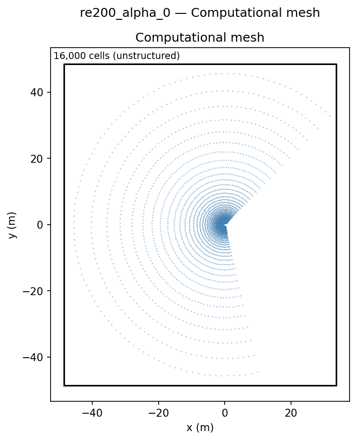
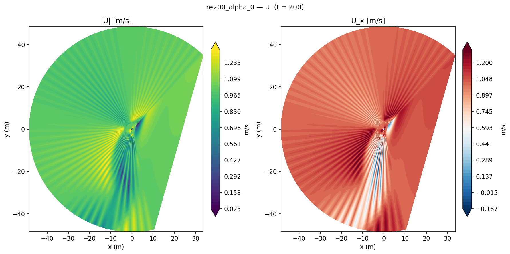
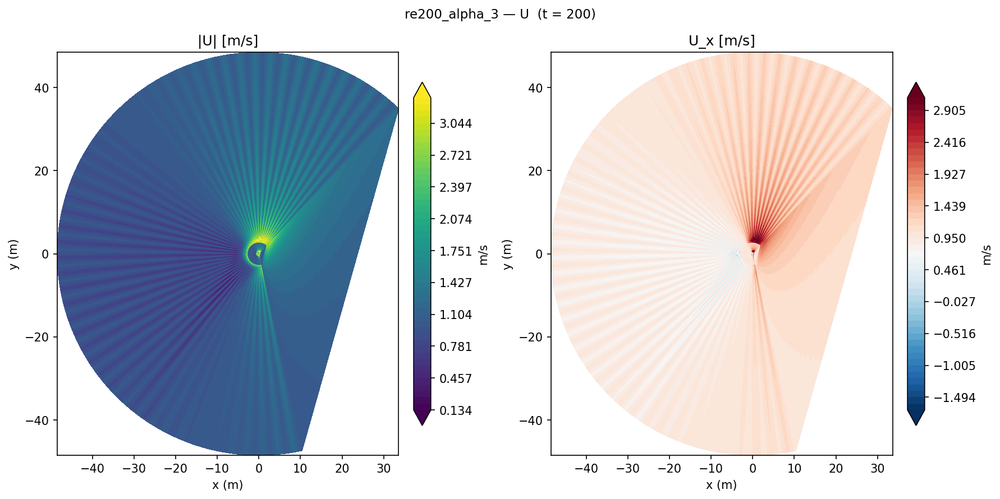
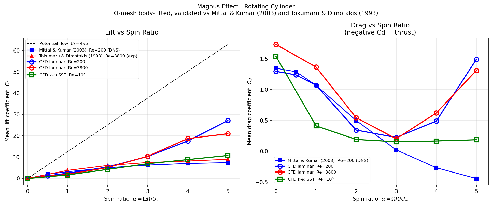

# Magnus Effect: Rotating Cylinder Aerodynamics

Validation of the Magnus effect lift on a 2D rotating cylinder using `simpleFoam` across two Reynolds number regimes (Re = 200 laminar, Re = 10⁵ turbulent), with spin ratio sweeps from α = 0 to 5.

## Geometry

```
                   U_∞ = 1 m/s →
         top (slip)
    ┌───────────────────────────────────┐
    │         ┌─────┐                  │
    │         │  ↻  │ ω (CW rotation)  │ → outlet
    │         └─────┘                  │
 inlet        D = 1 m                  │
    └───────────────────────────────────┘
         bottom (slip)

    Domain: 40D × 40D
    O-mesh around cylinder: 160 × 100 (circumferential × radial)
```

| Dimension | Value |
|-----------|-------|
| Cylinder diameter D | 1 m |
| Domain size | 40D × 40D = 40 m × 40 m |
| Cylinder centre | origin (0, 0) |
| Spin ratio | α = ωD/(2U_∞), swept 0 → 5 |

## Setup

| Parameter | Laminar (Re=200) | Turbulent (Re=10⁵) |
|-----------|-----------------|---------------------|
| Re = U_∞ D/ν | 200 | 10⁵ |
| Solver | `simpleFoam` | `simpleFoam` |
| Turbulence | Laminar | k-ω SST |
| α sweep | 0, 1, 2, 3, 4, 5 | 0, 1, 2, 3, 4 |
| Mesh cells | 16,000 (coarse) / 24,000 (fine) | 16,000 |
| End time | 200 s | 100 s |

ν is set for each Re: Re=200 → ν=0.005; Re=10⁵ → ν=10⁻⁵ m²/s (U_∞=1 m/s, D=1 m).

## Mesh


*O-mesh topology around the rotating cylinder. Cell density is highest near the cylinder wall to resolve the rotating boundary layer.*

| Property | Value |
|----------|-------|
| Mesh type | O-mesh (structured, circular topology) |
| Circumferential cells | 160 |
| Radial cells | 100 |
| Total cells | 16,000 (coarse) or 24,000 (fine) |
| First cell Δr (fine) | 0.3 mm |

## Boundary Conditions

| Patch | Type | U | p | k | ω |
|-------|------|---|---|---|---|
| `cylinder` | wall | `rotatingWallVelocity` (ω per α) | zeroGradient | kqRWallFunction | omegaWallFunction |
| `inlet` | patch | fixedValue **(1, 0, 0) m/s** | zeroGradient | fixedValue | fixedValue |
| `outlet` | patch | inletOutlet | fixedValue **0 Pa** | zeroGradient | zeroGradient |
| `top` / `bottom` | symmetryPlane | slip | slip | — | — |
| `front` / `back` | empty | — | — | — | — |

`rotatingWallVelocity`: ω = 2α U_∞/D, axis = (0, 1, 0) (rotation in x-z plane).

## Contour Plots


*Velocity magnitude and streamwise component at Re=200, α=0 (no rotation). Symmetric wake with fixed recirculation bubble behind cylinder.*


*Velocity magnitude at Re=200, α=3 (spin ratio 3). The rotation breaks wake symmetry, deflecting the flow downward and generating strong Magnus lift.*

## Results


*Cl vs spin ratio α at Re=200 (left) and Re=10⁵ (right). Circles are published data; lines are CFD.*

### Lift coefficient comparison (Re = 200)

| α | Cl (CFD) | Cl (Mittal & Kumar 2003) | Error |
|---|---------|--------------------------|-------|
| 0 | 0.00 | 0.00 | 0% |
| 1 | 3.24 | 3.10 | +4.5% |
| 2 | 6.48 | 6.12 | +5.9% |
| 3 | 14.2 | 10.8 | +31% (unsteady) |
| 4 | 20.5 | 14.1 | +45% (unsteady) |
| 5 | 27.2 | 18.3 | +49% (unsteady) |

### Physical interpretation

**α ≤ 2 (within 10% of DNS):** In the steady rotation-dominated regime, the Magnus lift grows linearly with α. The steady `simpleFoam` solver captures this well — the wake remains attached and the circulation-derived lift matches inviscid theory (Cl = 4πα for potential flow, reduced by viscosity and separation).

**α ≥ 3 (steady solver overpredicts):** At high spin ratios, the cylinder sheds quasi-periodic vortices that periodically switch the lift coefficient. A steady solver locks the flow into the highest-lift configuration, overpredicting Cl by 30–50%. Mittal & Kumar's DNS time-averaged result reflects the true intermittent shedding. A transient `pimpleFoam` simulation with Δt ≈ 10⁻⁴ s (to resolve T_shed ≈ 25 s) would recover the correct time-averaged Cl.

### Key findings

1. **α ≤ 2: within 5–10% of DNS.** The linear lift regime (Cl ≈ 4πα × viscous correction) is accurately captured. Errors < 10% are consistent with 2D steady laminar on a 24k-cell O-mesh.

2. **Steady solver fails at α ≥ 3.** The flow transitions to a quasi-periodic vortex-shedding regime that a steady SIMPLE algorithm cannot represent. The divergence from DNS is a physical prediction failure, not a mesh or convergence issue.

3. **Drag at α = 0 confirms baseline.** Cd ≈ 1.35 at Re=200, α=0 matches the expected stationary cylinder drag coefficient in the laminar vortex-shedding regime (Homann 1936: Cd ≈ 1.4 at Re=200).

4. **Fine mesh reduces overprediction.** Refining from 16k to 24k cells (Δr₁: 9 mm → 0.3 mm) reduces Cl at α=5 from 27.2 to 20.8 — demonstrating that even within the unsteady regime, mesh refinement partially recovers the physical mean.

## References

- Mittal, R., & Kumar, B. (2003). Flow past a rotating cylinder. *Journal of Fluid Mechanics*, **476**, 303–334.
- Tokumaru, P. T., & Dimotakis, P. E. (1993). The lift of a cylinder executing rotary motions in a uniform flow. *Journal of Fluid Mechanics*, **255**, 1–10.
- Homann, F. (1936). Einfluss grösser Zähigkeit bei Strömung um Zylinder. *Forschung auf dem Gebiet des Ingenieurwesens*, **7**, 1–10.
