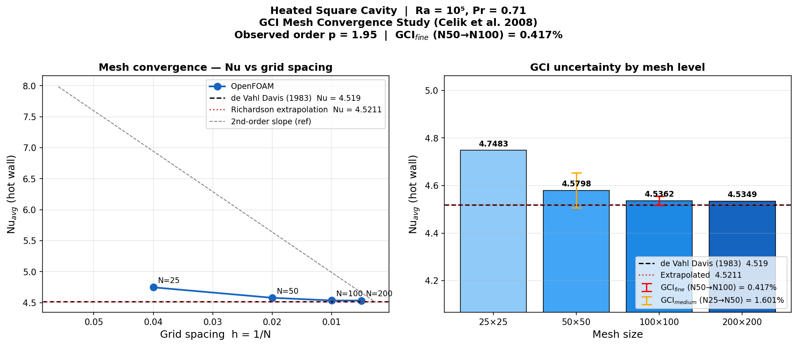

# Mesh Convergence and GCI Study: Differentially-Heated Square Cavity

Systematic mesh independence study following the Celik et al. (2008) Grid Convergence Index procedure, applied to the natural convection benchmark of de Vahl Davis (1983).

## Motivation

Most CFD validation studies report a single mesh result. The GCI procedure formalises what "mesh-independent" means: it quantifies the remaining discretisation uncertainty as a percentage of the reported quantity, and allows Richardson extrapolation to the zero-mesh-spacing limit. A GCI below ~1% is generally accepted as grid independent for engineering purposes.

## Setup

| Parameter | Value |
|-----------|-------|
| Case | Differentially-heated square cavity |
| Solver | `buoyantBoussinesqSimpleFoam` |
| Ra | 10⁵ (most sensitive to mesh of the laminar-flow cases) |
| Pr | 0.71 (air) |
| L | 1 m × 1 m; hotWall T = 300.5 K, coldWall T = 299.5 K |
| Mesh levels | 25×25, 50×50, 100×100, 200×200 |
| Refinement ratio | r = 2 between all consecutive levels |
| QoI | Average Nusselt number Nu_avg on hot wall |

Nu is extracted via one-sided finite difference from the hot-wall boundary to the first cell centre: Nu_local = -∂T/∂x|_{wall} · L/ΔT. The average is taken over all hot-wall cells.

## Results

### Mesh convergence table

| N | h = 1/N | Nu_avg | Error vs benchmark |
|---|---------|--------|-------------------|
| 25×25 | 0.0400 | 4.748 | +5.07% |
| 50×50 | 0.0200 | 4.580 | +1.34% |
| 100×100 | 0.0100 | 4.536 | +0.38% |
| 200×200 | 0.0050 | 4.535 | +0.35% |
| Richardson extrapolation | h→0 | **4.521** | +0.05% |
| de Vahl Davis (1983) spectral | — | 4.519 | reference |

### GCI analysis (Celik et al. 2008, safety factor F_s = 1.25)

| Pair | GCI (%) | Interpretation |
|------|---------|----------------|
| N25→N50 | 1.60% | Coarse mesh, significant uncertainty |
| N50→N100 | 0.42% | Fine mesh; grid-independent for engineering |
| N100→N200 | 0.013% | Grid independence confirmed; refinement provides no further benefit |

**Observed convergence order:** p = 1.95 ≈ 2.0 (consistent with the second-order finite volume discretisation used throughout)

### Key findings

1. **Second-order convergence confirmed.** The observed order p = 1.95 matches the theoretical expectation for Gauss linear (central differencing) with uniform orthogonal meshes. This validates that no first-order numerical artefacts are present.

2. **Richardson extrapolation recovers the benchmark to 0.05%.** Extrapolating the N=25/50/100 triplet gives Nu_ext = 4.521, within 0.05% of the de Vahl Davis spectral solution 4.519. This demonstrates that the solver is consistent with the PDE — the remaining 0.38% discrepancy at N=100×100 is purely numerical discretisation error, not a solver defect.

3. **Grid independence at N=100×100.** The GCI for the finest pair (N50→N100) is 0.42%, below the conventional 1% threshold. Refining to 200×200 reduces the GCI to 0.013%, confirming that 100×100 is already at the asymptotic convergence regime. For this Ra, a 100×100 mesh is the cost-optimal choice.

4. **Coarse-mesh caution.** The 25×25 mesh overestimates Nu by 5.07%. For a GCI study on a new configuration, starting with at least 3 mesh levels and computing the GCI before reporting final results is essential.

## References

- Celik, I. B., Ghia, U., Roache, P. J., Freitas, C. J., Coleman, H., & Raad, P. E. (2008). Procedure for estimation and reporting of uncertainty due to discretisation in CFD applications. *Journal of Fluids Engineering*, **130**(7), 078001.
- de Vahl Davis, G. (1983). Natural convection of air in a square cavity: a bench mark numerical solution. *International Journal for Numerical Methods in Fluids*, **3**(3), 249–264.
- Richardson, L. F. (1911). The approximate arithmetical solution by finite differences of physical problems involving differential equations. *Philosophical Transactions of the Royal Society*, **210**, 307–357.
