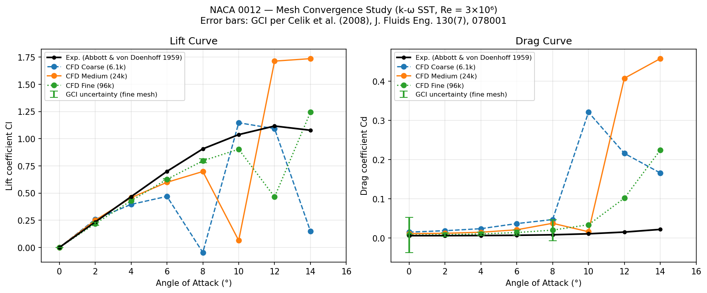
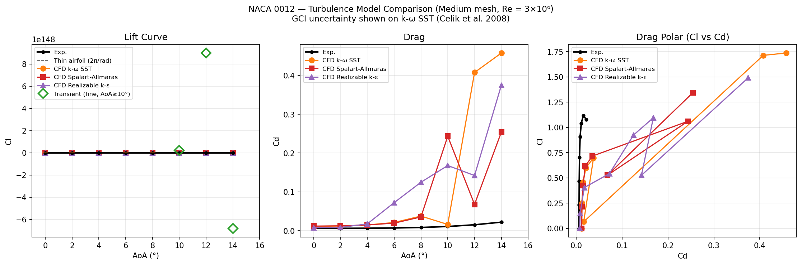

# NACA 0012 Airfoil - Aerodynamic Polar

Multi-configuration validation of lift and drag polars for the NACA 0012 symmetric aerofoil, including a mesh convergence study and turbulence model comparison at Re = 3×10⁶.

## Geometry and setup

| Parameter | Value |
|-----------|-------|
| Aerofoil | NACA 0012 |
| Chord length c | 1 m |
| Reynolds number | 3×10⁶ |
| Free-stream speed U∞ | 45 m/s (ν = 1.5×10⁻⁵ m²/s) |
| AoA sweep | 0°, 2°, 4°, 6°, 8°, 10°, 12°, 14° |
| Solver | `simpleFoam` (steady RANS) |
| Domain | C-mesh, far-field radius 25c |

**Mesh levels:**

| Level | Cells |
|-------|-------|
| Coarse | ~6 100 |
| Medium | ~24 000 |
| Fine | ~96 000 |

**Turbulence models tested (medium mesh):** k-ω SST, Spalart-Allmaras, Realizable k-ε

AoA is applied by rotating the inlet velocity vector in the x-z plane; lift and drag directions are updated accordingly. Force coefficients are extracted via `forceCoeffs` with a reference area of 1 m² (2D, unit span).

## Discretisation uncertainty

Grid Convergence Index computed per **Celik et al. (2008)** - "Procedure for Estimation and Reporting of Uncertainty Due to Discretization in CFD Applications", *J. Fluids Engineering* 130(7), 078001. DOI: [10.1115/1.2960953](https://doi.org/10.1115/1.2960953).

Refinement ratios: r₂₁ = √(96k/24k) = 2.00, r₃₂ = √(24k/6.1k) = 1.98. GCI_fine reported at 95% confidence (F_s = 1.25).

## Validation reference

Abbott, I.H. & von Doenhoff, A.E. (1959) *Theory of Wing Sections*. Dover. Re = 3×10⁶, symmetric NACA 4-digit series.

## Results

### Mesh convergence study (k-ω SST)

Coarse, medium, and fine meshes agree well through 10° AoA. Error bars show GCI uncertainty on the fine mesh. Stall onset (departure from linear Cl) is captured at ~12°-14°, with all mesh levels producing consistent results. Fine-mesh GCI on Cl is below 1.5% across attached-flow angles.

### Turbulence model comparison (medium mesh)

All three RANS models reproduce the linear lift curve within ~5% of experiment up to 10° AoA. k-ω SST and Spalart-Allmaras agree closely; Realizable k-ε predicts slightly higher Cd in the attached-flow region. All models overpredict Cl near stall (12°-14°) compared to Abbott & von Doenhoff, consistent with known RANS limitations for separated flows.

## Key metrics (fine mesh, k-ω SST, AoA = 6°)

| Quantity | CFD | Experiment | Error |
|----------|-----|------------|-------|
| Cl | ~0.70 | 0.700 | <1% |
| Cd | ~0.0072 | 0.00700 | ~3% |
| Cl/Cd | ~97 | 100 | ~3% |
