# Helpful Commands
cp controlDict ControlDict.foam
fluentMeshToFoam .msh_file
refineMesh -overwrite
nano system/controlDict
icoFoam
sonicFoam
foamToVTK
foamCleanTutorials (erase mesh and all folders except 0, constant, and systems)
blockMesh | tee log.blockMesh
checkMesh | tee log.checkMesh
icoFoam | tee log.icoFoam
paraview &
foamLog log.icoFoam
nano setFieldsDict (to set value of U, T, p fields in all cells)
setFields (to set field default values using setFieldsDict values, changes the values of U, T, and p within the 0 folder)
"setFields" command and returned error such as  "Foam Warning: (...) Field U not found", "Foam Warning: (...) Field  T not found", "Foam Warning: (...) Field  P not found", try changing the  "0.orig" to "0"
cp -r <old_dict> <new_dict_loc>
gnuplot3
postProcess -func magU
postProcess -func sample
nano system/sample to modify post processing sampling points
simpleFoam > log &
tail -f log

foamLog log
wmUnset
cd logs
gnuplot
plot 'UzFinalRes_0' with lines
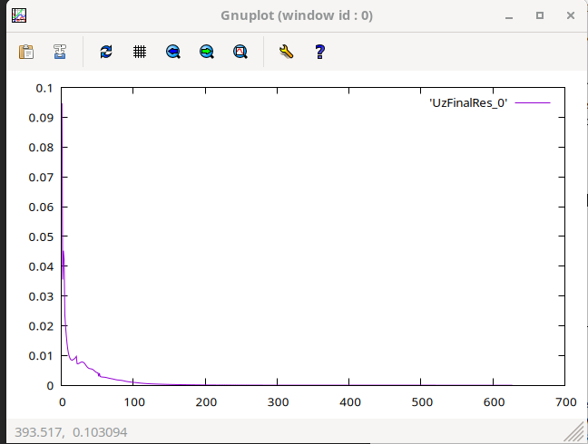

export WM_PROJECT_DIR=/opt/OpenFOAM/OpenFOAM-11

decomposePar to split domain into multiple parts per CPU core

. ~/OpenFOAM/OpenFOAM-v1812/etc/bashrc
$ decomposePar
$ mpirun -np 4 simpleFoam -parallel > log.parallel &
$ foamLog log.parallel
$ wmUnset
$ gnuplot
gnuplot> plot ’UzFinalRes_0’ with lines

# General Notes
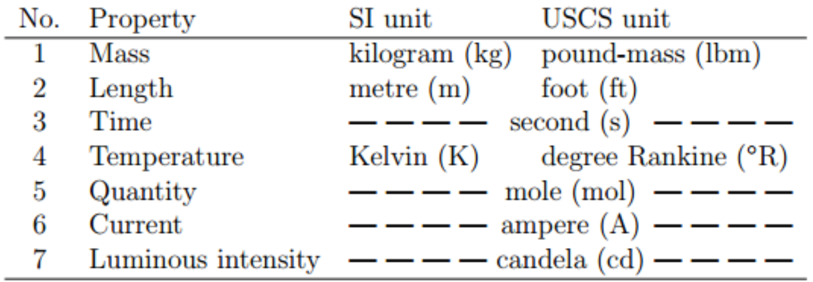
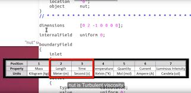
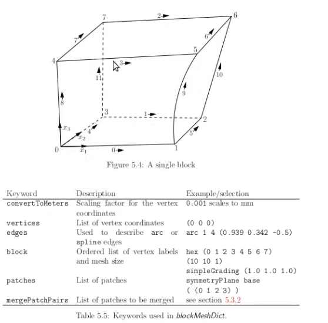
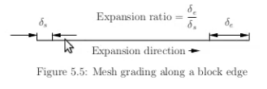
simpleGrading(0.5 1 1) will cause there to be smaller cells in the +x direction
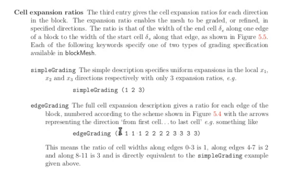

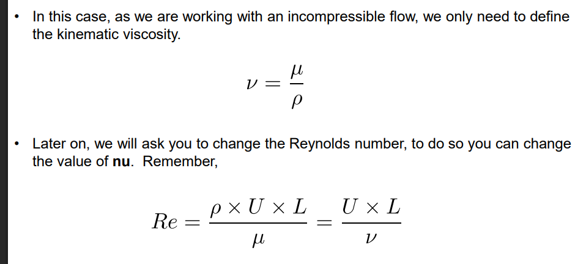
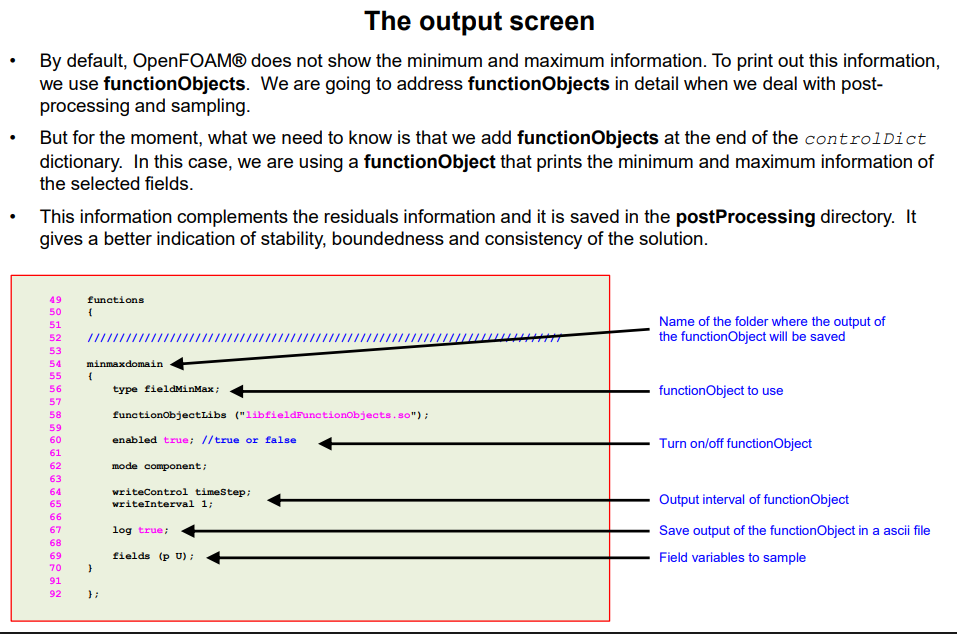
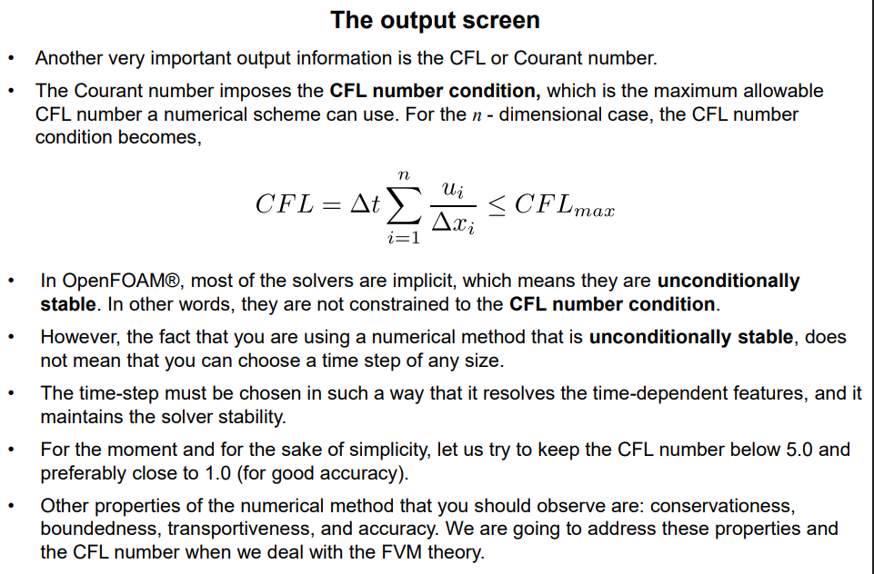
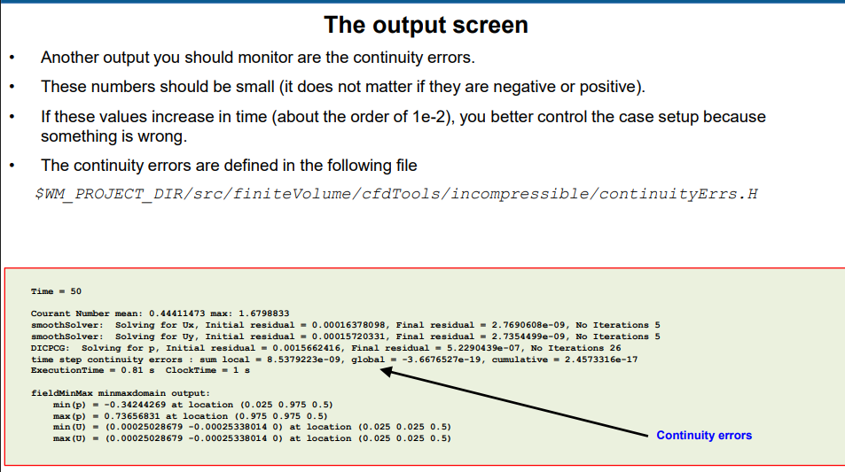
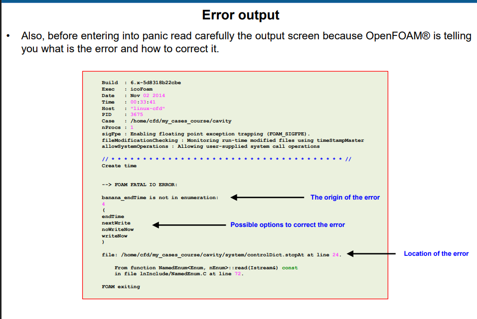

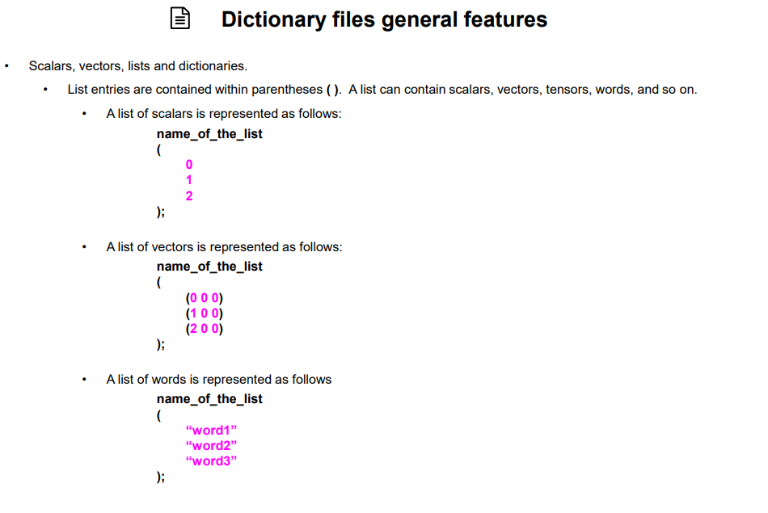
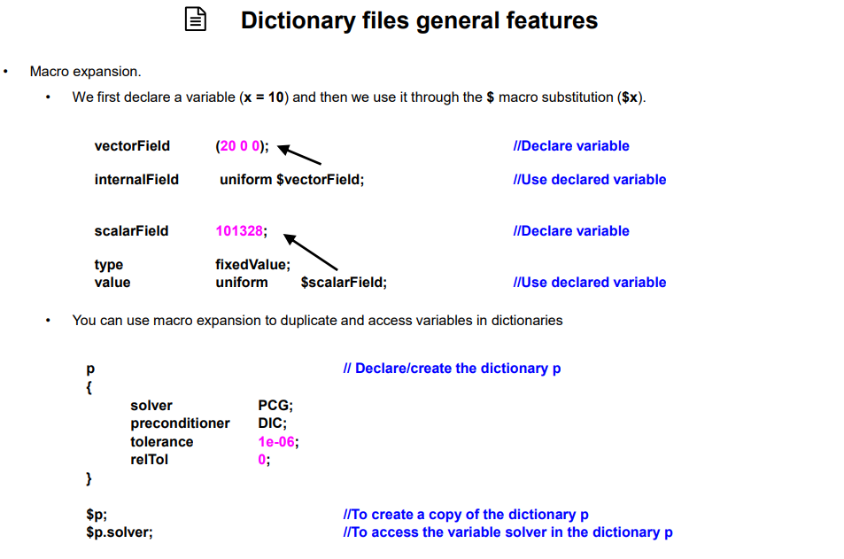
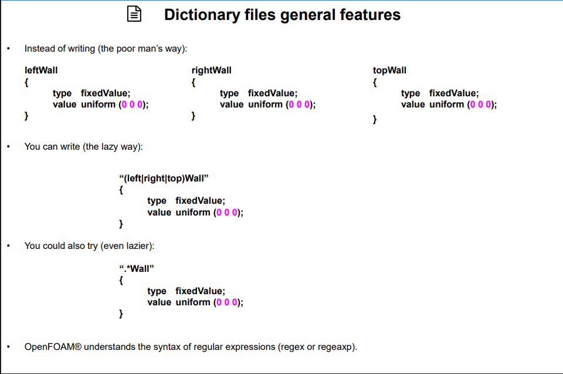
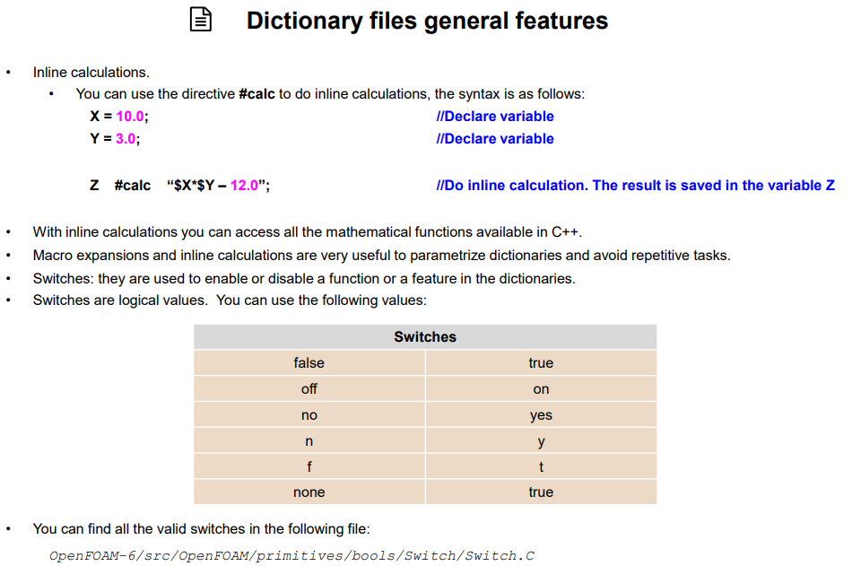
# How to create a grid with block mesh in OpenFOAM
within polyMesh/blockMeshDict.txt file, convertToMeters 1; is units in meter, convertToMeters 0.001; is units in millimeters
hex blocks are done counter clock wise with respect to the vertices. Ie, hex (0 1 3 2) if vertices are in 0 1 3 2 ccw order
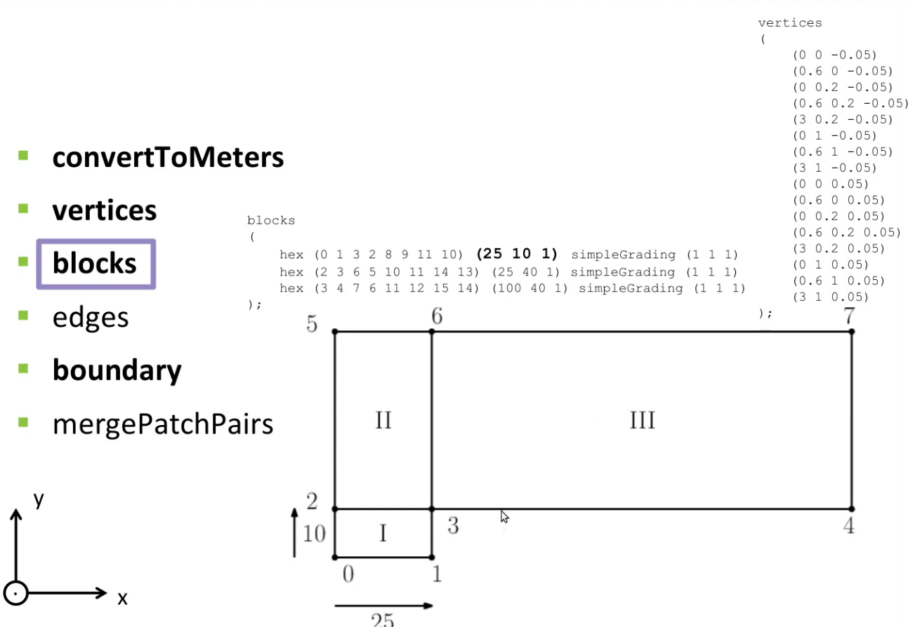
(25 10 1) = 25 cells in x, 10 in y, 1 in z
declare inlet/outlet faces using RHR to determine proper direction for vertices order:

Inlet AND outlet should point outward
Symmetry planes means geometry can be mirrored along planes

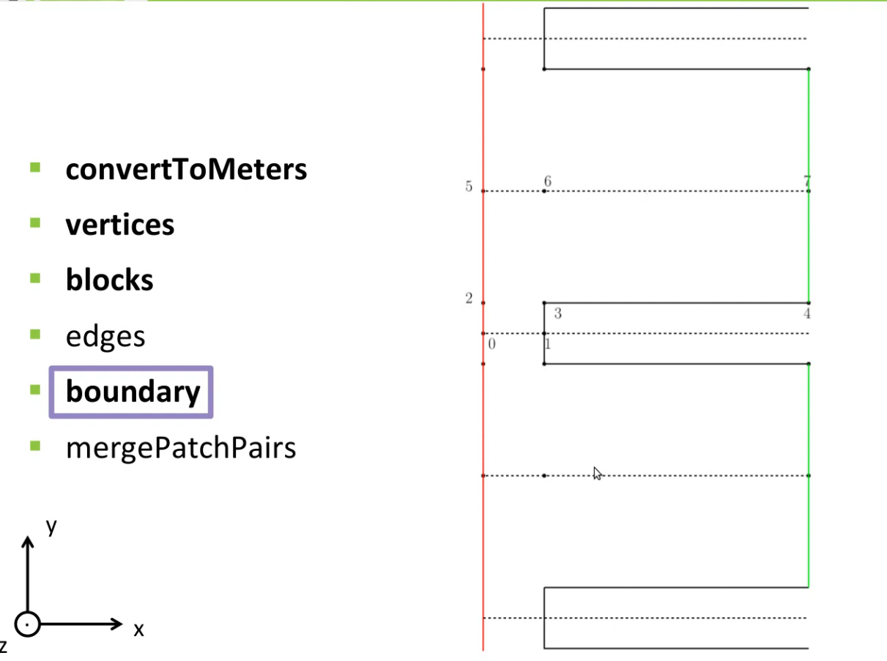

Unspecified faces are given type empty, such as the front and back most face of a 2D simulation (OpenFOAM treats it as 1 mesh in the z direction)
No slip BC:

# Divergence
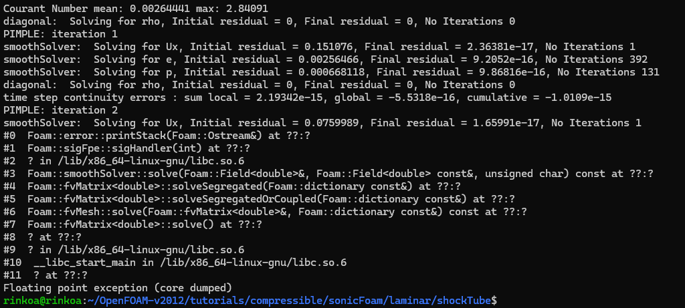
Simulation diverged due to high Courant number, reduce deltaT in the controlDict

# Transport Equations Video by Jozsef Nagy, scalarTransportFoam transport_baseCase_#

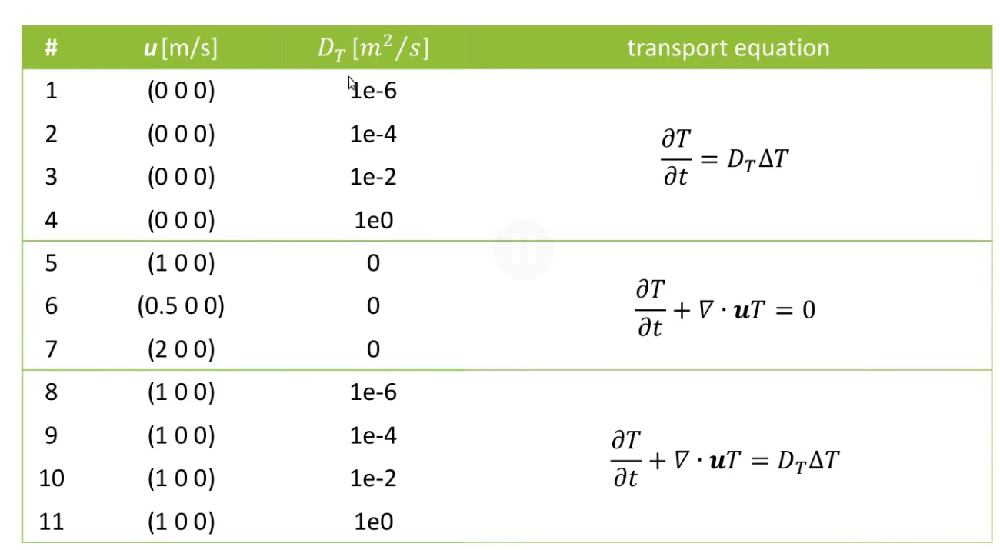
Even with diffusion at 0, numerical diffusion will occur that causes temperature to spread out such as in cases 5-7
