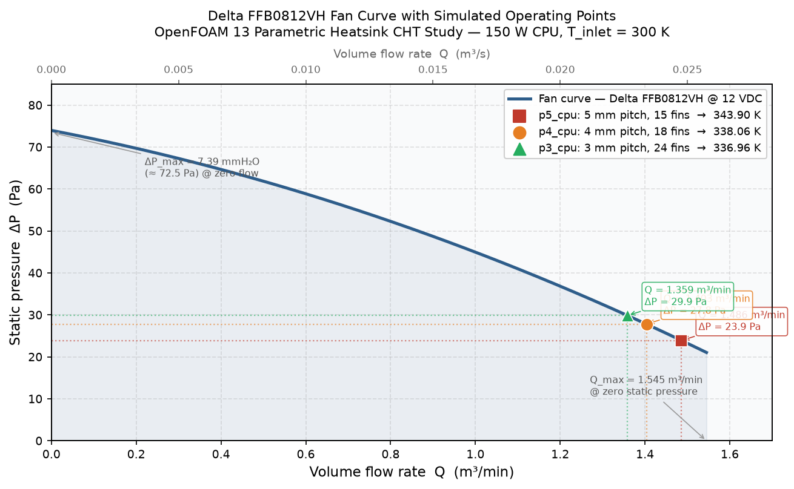

# Parametric Heatsink Conjugate Heat Transfer Study

**OpenFOAM 13 · foamMultiRun (buoyant, multi-region) · 3-Point Fin-Pitch Sweep · Parallel/Serial Verified**

A steady-state Conjugate Heat Transfer (CHT) simulation of a CPU + fin-array heatsink inside a fan-driven duct, built with a fully parametric Python mesh generator so fin pitch can be swept without rebuilding geometry by hand. A 3-point pitch sweep (3 mm / 4 mm / 5 mm) was completed to identify the thermal optimum for this fan/duct combination. Developed as part of an OpenFOAM CFD portfolio demonstrating industrial thermal simulation methodology.

---

## Key Results

| Parameter | Value |
|-----------|-------|
| Solver | `foamMultiRun` (buoyant, 3-region CHT) |
| Regions | `fluid` (air) + `solid` → `heatsink` (Al) + `cpu` (Si) cell zones |
| CPU heat dissipation | 150 W |
| Fan | Delta FFB0812VH (quadratic curve, `fanPressure` BC) |
| Fan outlet velocity (converged) | 3.87 m/s |
| Inlet air temperature | 300 K (27°C) |
| Verification | Serial run vs. 8-core parallel run agree to 0.001 K (5 mm baseline) |
| **Best CPU temperature** | **336.96 K (63.96°C) - 3 mm pitch, 24 fins** |

### Parametric Sweep Results

| Fin Pitch | Fin Count | Mesh Cells | T_max (K) | T_max (°C) | ΔT vs. ambient |
|-----------|-----------|------------|-----------|------------|----------------|
| 5 mm (baseline) | 15 | 649,200 | 343.90 | 70.90 | 43.90 K |
| 4 mm | 18 | ~695,520 | 338.06 | 64.06 | 38.06 K |
| **3 mm** | **24** | **~780,000** | **336.96** | **63.96** | **36.96 K** |

Tighter pitch yields lower CPU temperature, with strongly diminishing returns below 4 mm (4→3 mm saves only 1.1 K vs. 5→4 mm saving 5.8 K), indicating the fan operating point shifts to lower flow rates as channel resistance increases.

---

## Simulation Overview

### Geometry: Parametric, not hand-built
Geometry is generated directly as a `blockMeshDict` by [`gen_cases_v2.py`](Linux%20Files/gen_cases_v2.py): given a fin pitch and fin count, the script lays out alternating fin/channel/side-gap strips across the duct width, splits them against the CPU footprint, and emits a full hex-block mesh with fan, wall, and region-zone tagging baked in. This means a new pitch is a one-line parameter change, not a CAD rebuild. The parametric approach is the core point of the study rather than a single fixed design.

Fixed geometry (from `gen_cases_v2.py`):
- Fan/duct cross-section: 80 × 80 mm
- Fin thickness: 1.5 mm · Fin height: 35 mm · Base thickness: 5 mm
- CPU die: 40 × 40 × 4.5 mm, centered under the fin array
- Inlet/outlet plenum length: 105 mm each · Heatsink length: 80 mm (total duct length 290 mm)
- Baseline case: 5 mm pitch → 3.5 mm channel width, 15 fins, 4.25 mm side gaps

### Mesh
Block-structured hex mesh from `blockMesh`, split into regions with `splitMeshRegions -cellZones`.

| Region | Material | Cells |
|--------|----------|-------|
| `fluid` | Air (buoyant, k-ε) | 577,200 |
| `heatsink` | Aluminium (k = 205 W/m·K, ρ = 2700) | ~70,800 |
| `cpu` | Silicon (k = 150 W/m·K, ρ = 2329) | 1,200 |

### Solver Setup
- **Driver**: `foamMultiRun`, coupling one `fluid` region (buoyant, `p_rgh`/k-ε) to a `solid` super-region containing the `heatsink` and `cpu` cell zones
- **Region coupling**: `coupledTemperature` boundary condition at every `*_to_*` interface (fluid↔heatsink, fluid↔cpu, heatsink↔cpu)
- **Heat source**: `heatSource` fvModel, `cellZone allCpuCells`, `Q 150` (W), applied directly to the CPU silicon zone
- **Fan BC**: `fanPressure` at `fan1_half0`, driven by a tabulated `pressureVsQ.csv` curve fit from the Delta FFB0812VH fan curve `dP = 73.99 − 1164.25·Q − 34615·Q²` [Pa, Q in m³/s]
- **Turbulence**: k-ε
- **Run length**: 16,000 iterations to steady state (endTime tuned from 20,000 after the 5 mm baseline confirmed convergence plateau ~15,000 steps), monitored via `cpuTmax`/`solidTmax` `volFieldValue`/`surfaceFieldValue` function objects
- **Relaxation factors**: `p_rgh 0.4`, `U 0.6`, `h/k/ε 0.4`, dialled back from 0.7-0.8 defaults to maintain stability on finer-pitch meshes

### Verification
The baseline 5 mm case was run twice (once serial, once decomposed across 8 MPI ranks) to confirm the parallel decomposition does not change the converged solution. Both runs land on **T_max = 343.900 K**, agreeing to within 0.001 K, which is a standard parallel-vs-serial cross-check before trusting a decomposed run for larger sweeps.

---

## Results

### Convergence
CPU maximum temperature is monitored each iteration via the `cpuTmax` `volFieldValue` function object. All three cases plateau well before `endTime = 16,000`:
- **5 mm**: T_max settles to 343.90 K by ~15,000 steps; residuals below 1×10⁻⁶ at completion
- **4 mm**: T_max plateaus to 338.06 K; 16,000-step run (~22 h wall-clock on a single core)
- **3 mm**: T_max plateaus to 336.96 K; 16,000-step run (~21.8 h wall-clock on a single core)

### Thermal performance
All three cases dissipate 150 W from the CPU die with fan-curve-driven (not fixed-velocity) airflow. The 5 mm baseline reaches a converged fan exit velocity of 3.87 m/s. Tightening the fin pitch from 5 mm to 4 mm saves **5.84 K** (the dominant effect, substantially more fin surface area); going further to 3 mm saves an additional **1.10 K** (diminishing returns as channel restriction begins offsetting the surface area gain). The data suggest the thermal optimum for this fan/duct combination lies in the 3–4 mm range, with little benefit expected below 3 mm.

### Pitch Sweep Summary

| Fin Pitch | Fins | T_max (K) | T_max (°C) | ΔT vs. 5 mm |
|-----------|------|-----------|------------|-------------|
| 5 mm | 15 | 343.90 | 70.90 | baseline |
| 4 mm | 18 | 338.06 | 64.06 | −5.84 K |
| **3 mm** | **24** | **336.96** | **63.96** | **−6.94 K** |

### Fan Operating Points



As fin pitch decreases, channel flow resistance increases, shifting each case's operating point left along the fan curve (lower flow, higher static pressure). All three cases operate in the high-Q, low-ΔP region of the curve; the fan is lightly loaded, confirming the duct resistance is well below the fan's stall pressure.

| Case | Q (m³/min) | ΔP (Pa) | Fan outlet velocity |
|------|-----------|---------|-------------------|
| 5 mm | 1.486 | 23.9 | 3.87 m/s |
| 4 mm | 1.404 | 27.8 | 3.65 m/s |
| 3 mm | 1.359 | 29.9 | 3.54 m/s |

---

## Workflow

```
gen_cases_v2.py (parametric blockMeshDict generator: fin pitch + count as inputs)
        ↓
blockMesh (hex mesh, fin/channel/side-gap strips + fan/wall patches)
        ↓
splitMeshRegions -cellZones (fluid | heatsink | cpu)
        ↓
topoSet -region cpu (recreate allCpuCells cellZone for heatSource fvModel)
        ↓
foamMultiRun (buoyant fluid + conductive solid, coupled, 16,000 iterations)
        ↓
postProcessing (cpuTmax, solidTmax, fan patch flow/velocity)
        ↓
[repeat for each pitch: each case is a fresh blockMesh + splitMeshRegions]
```

---

## Status

All three cases of the fin-pitch sweep are complete:

| Case | Fin Pitch | Fins | Status | T_max |
|------|-----------|------|--------|-------|
| `p5_cpu` (serial) | 5 mm | 15 | ✅ Converged, 20,000 it. | 343.90 K |
| `p5_cpu` (8-core parallel verification) | 5 mm | 15 | ✅ Converged, 20,000 it. | 343.90 K |
| `p4_cpu` | 4 mm | 18 | ✅ Converged, 16,000 it. | 338.06 K |
| `p3_cpu` | 3 mm | 24 | ✅ Converged, 16,000 it. | 336.96 K |

The sweep confirms a clear trend: tighter pitch lowers CPU temperature, with strongly diminishing returns below 4 mm. The 3–4 mm range represents the practical thermal optimum for this fan/duct geometry.

---

## Software Stack

| Tool | Version | Purpose |
|------|---------|---------|
| OpenFOAM | 13 | CFD solver (`foamMultiRun`, buoyant multi-region CHT) |
| Python | 3.x | Parametric `blockMeshDict` generation |
| Ubuntu (WSL2) | 24.04 | OS |
| OpenMPI | n/a | 8-core parallel verification run |

---

## Repository

Part of the [OpenFOAM Portfolio](https://github.com/samuelsimmons99/OpenFOAM-Portfolio): a collection of CFD simulations demonstrating thermal and fluid simulation skills relevant to thermal engineering roles.
