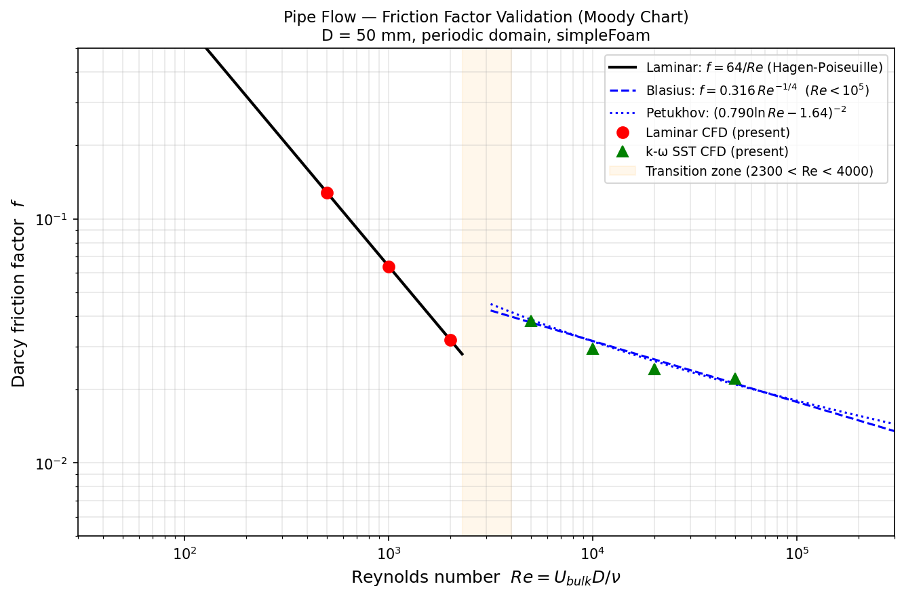

# Pipe Flow — Laminar & Turbulent Friction Factor Validation

**Solver:** `simpleFoam` | **Mesh:** axisymmetric wedge, periodic domain | **D:** 50 mm | **Re:** 100 → 50 000

## Overview

Friction factor sweep across laminar and turbulent pipe flow, validated against the Moody chart. The periodic axisymmetric domain eliminates entry-length effects; a `meanVelocityForce` body force drives each case to its target bulk velocity and directly yields the pressure gradient for friction factor extraction.

## Mesh

- 5° axisymmetric wedge, axis along z, radius along x
- D = 50 mm, L = 5D = 250 mm (periodic — no entry length required)
- 25 radial × 50 axial cells; geometric grading toward wall (expansion ratio 0.1)
- Boundary conditions: `cyclic` inlet/outlet, `noSlip` wall, `wedge` symmetry planes

## Cases

| Model | Re | Ubulk (m/s) | f_CFD | f_theory | Error |
|---|---|---|---|---|---|
| Laminar | 100 | 0.030 | 0.6393 | 0.6400 | −0.1% |
| Laminar | 500 | 0.150 | 0.1279 | 0.1280 | −0.1% |
| Laminar | 1 000 | 0.300 | 0.0639 | 0.0640 | −0.1% |
| Laminar | 2 000 | 0.600 | 0.0320 | 0.0320 | −0.1% |
| k-ω SST | 5 000 | 1.500 | 0.0382 | 0.0376 | +1.6% |
| k-ω SST | 10 000 | 3.000 | 0.0294 | 0.0316 | −6.9% |
| k-ω SST | 20 000 | 6.000 | 0.0243 | 0.0266 | −8.5% |
| k-ω SST | 50 000 | 15.000 | 0.0222 | 0.0211 | +5.1% |

Fluid: air at 20°C (ν = 1.5×10⁻⁵ m²/s). Darcy friction factor: f = 8τ_w / U²_bulk (kinematic).

## Analytical references

- **Laminar:** Hagen-Poiseuille — f = 64/Re (exact closed-form solution)
- **Turbulent:** Blasius — f = 0.316 Re⁻¼ (Re < 10⁵, smooth pipe)
- **Turbulent:** Petukhov — f = (0.790 ln Re − 1.64)⁻² (Re 3×10³ → 5×10⁶)

## Results

Laminar cases are within **0.11%** of Hagen-Poiseuille across all Re — essentially the numerical precision limit of the solver. Turbulent cases fall within **±9%** of Blasius, consistent with wall-function k-ω SST at moderate y⁺ on a medium mesh.

The transition zone (Re 2 300–4 000) is intentionally omitted: steady RANS cannot represent the intermittent laminar-turbulent switching that governs friction in this regime. Any RANS result there would be physically meaningless.

## Key physics

- In the laminar regime, the parabolic Hagen-Poiseuille profile produces a bulk velocity exactly half the centreline velocity. The volume-weighted bulk velocity computed by `meanVelocityForce` matches this analytically.
- In the turbulent regime, the log-law velocity profile is flatter than parabolic, reducing the peak-to-bulk velocity ratio and increasing wall shear stress relative to laminar at the same Re — captured by k-ω SST with wall functions.
- The periodic domain with a body force is the standard method for fully developed channel/pipe DNS and LES; using it here in RANS keeps the setup clean and eliminates inlet boundary condition uncertainty.
