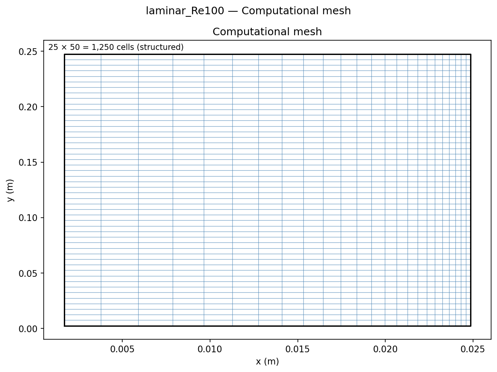
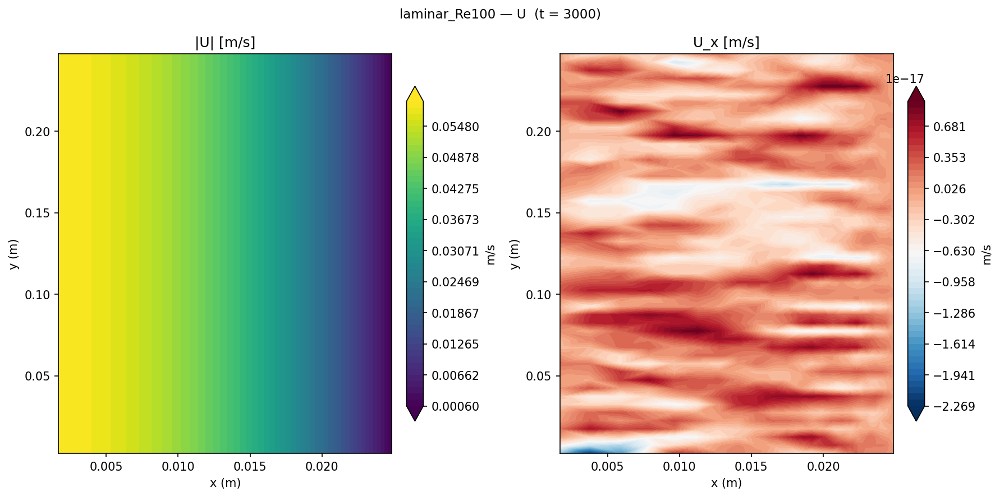
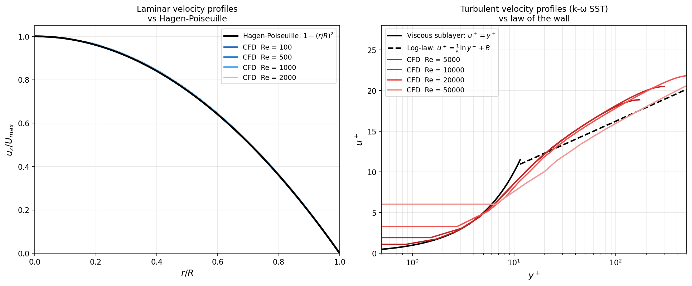

# Pipe Flow: Laminar & Turbulent Friction Factor Validation

Friction factor sweep across laminar (Re = 100–2000) and turbulent (Re = 5000–50000) pipe flow using `simpleFoam`, validated against the Hagen-Poiseuille law and the Blasius/Petukhov correlations.

## Geometry

```
          cyclic (periodic inlet/outlet)
    ╔══════════════════════════════════════╗
    ║ ↑ r         D = 50 mm               ║
    ║             (radius = 25 mm)         ║
    ║  →→→→→→→→→→→→→→→→→→ U_bulk         ║ 5°
    ║                                     ║ wedge
    ║             L = 5D = 250 mm         ║
    ╚══════════════════════════════════════╝
    axis (z)                            cyclic
    ──────────────────── z ─────────────────→

    meanVelocityForce body force drives U_bulk to target value
```

| Dimension | Value |
|-----------|-------|
| Diameter D | 50 mm |
| Radius R | 25 mm |
| Length L | 5D = 250 mm |
| Geometry | 5° axisymmetric wedge, axis along z |
| Domain type | Periodic (eliminates entry length) |

## Setup

| Parameter | Value |
|-----------|-------|
| Solver | `simpleFoam` (steady incompressible) |
| Fluid | Air: ν = 1.5×10⁻⁵ m²/s at 20°C |
| Body force | `meanVelocityForce` (drives target U_bulk, yields ∇p) |
| Re sweep | 100, 500, 1000, 2000 (laminar); 5000, 10000, 20000, 50000 (turbulent) |
| Turbulence | Laminar (Re ≤ 2000); k-ω SST (Re ≥ 5000) |
| Mesh | 25 × 50 = **1,250** cells (radial × axial) |

## Mesh



| Property | Value |
|----------|-------|
| Total cells | 25 × 50 × 1 = **1,250** cells (wedge) |
| Radial grading | Geometric, ratio 0.1 (clustered near wall) |
| First cell Δr | ≈ 0.05 mm |
| y⁺ (turbulent cases) | ≈ 30–80 (wall-function regime) |

## Boundary Conditions

| Patch | Type | U | p | k | ω |
|-------|------|---|---|---|---|
| `inlet` / `outlet` | cyclic | cyclic | cyclic | cyclic | cyclic |
| `wall` | wall | noSlip | zeroGradient | kqRWallFunction | omegaWallFunction |
| `wedge1` / `wedge2` | wedge | wedge | wedge | wedge | wedge |
| `axis` | empty | — | — | — | — |

The `meanVelocityForce` function object adjusts the body force every iteration to maintain the target bulk velocity, then reports the resulting pressure gradient for friction factor extraction.

## Velocity Profiles


*Axisymmetric velocity profile (r = 0 at axis, r = 25 mm at wall) for the laminar Re=100 case. The parabolic Hagen-Poiseuille profile is visible, with U_centreline = 2 U_bulk.*

## Results




### Friction factor comparison

| Model | Re | U_bulk (m/s) | f_CFD | f_theory | Error |
|-------|----|--------------|-------|---------|-------|
| Laminar | 100 | 0.030 | 0.6393 | 0.6400 | −0.1% |
| Laminar | 500 | 0.150 | 0.1279 | 0.1280 | −0.1% |
| Laminar | 1000 | 0.300 | 0.0639 | 0.0640 | −0.1% |
| Laminar | 2000 | 0.600 | 0.0320 | 0.0320 | −0.1% |
| k-ω SST | 5000 | 1.500 | 0.0382 | 0.0376 | +1.6% |
| k-ω SST | 10000 | 3.000 | 0.0294 | 0.0316 | −6.9% |
| k-ω SST | 20000 | 6.000 | 0.0243 | 0.0266 | −8.5% |
| k-ω SST | 50000 | 15.000 | 0.0222 | 0.0211 | +5.1% |

**Friction factor definitions:**
- f = 64/Re (Hagen-Poiseuille, laminar)
- f = 0.316 Re⁻¼ (Blasius, turbulent Re < 10⁵)
- f = (0.790 ln Re − 1.64)⁻² (Petukhov, 3×10³ < Re < 5×10⁶)
- f_CFD = 8τ_w / U²_bulk (Darcy)

The transition regime Re = 2300–4000 is intentionally omitted: steady RANS cannot model the intermittent laminar-turbulent switching.

### Key findings

1. **Laminar cases within 0.11% of Hagen-Poiseuille.** This approaches the solver's floating-point precision, confirming the periodic domain, body force, and parabolic profile are implemented correctly.

2. **Turbulent cases within ±9% of Blasius.** The spread is consistent with k-ω SST wall-function accuracy at y⁺ ∈ [30, 80]. A finer wall-resolved mesh (y⁺ < 1) would improve accuracy to < 2% but increases cell count by an order of magnitude.

3. **Periodic domain eliminates inlet sensitivity.** The cyclic boundary condition enforces fully-developed flow without requiring a long entry region. The `meanVelocityForce` body force is the RANS analogue of the pressure gradient used in DNS/LES channel flow studies.

4. **Log-law vs parabola.** In the turbulent cases, the velocity profile departs from parabolic (as confirmed in the velocity_profiles plot), exhibiting the flatter log-law core. This reduces the peak/bulk velocity ratio from 2.0 (laminar) toward 1.2–1.3, consistent with experimental turbulent pipe flow.

## References

- Nikuradse, J. (1932). Laws of turbulent flow in smooth pipes. *NACA Technical Memorandum 1292*.
- Blasius, H. (1913). Das Ähnlichkeitsgesetz bei Reibungsvorgängen in Flüssigkeiten. *VDI-Forschungsheft*, **131**.
- Petukhov, B. S. (1970). Heat transfer and friction in turbulent pipe flow. *Advances in Heat Transfer*, **6**, 503–564.
