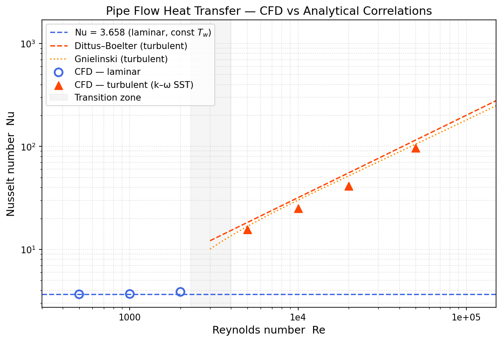

# Pipe Flow Heat Transfer

Validation of forced-convection heat transfer in a circular pipe across laminar and turbulent regimes, using `buoyantSimpleFoam` with an axisymmetric 5° wedge mesh.

## Geometry and setup

| Parameter | Value |
|-----------|-------|
| Diameter D | 50 mm |
| Length L | 2.5 m (50D) |
| Wall temperature T_w | 350 K (constant) |
| Inlet temperature T_in | 300 K |
| Fluid | Air (ideal gas) |
| Laminar Re | 500, 1000, 2000 |
| Turbulent Re | 5 000, 10 000, 20 000, 50 000 |

**Mesh:** 25 radial × 250 axial cells, `simpleGrading (0.1 1 1)` (wall-refined).  
**Solver:** `buoyantSimpleFoam` with `perfectGas` equation of state.  
**Turbulence:** k–ω SST for turbulent cases; laminar for Re < 2 300.  
**Thermal entry length:** L_th ≈ 0.05 Re Pr D — for Re = 500 this is ≈ 0.89 m, leaving 1.6 m of fully-developed flow.

## Analytical references

**Laminar — constant wall temperature (Graetz solution, fully developed):**

Nu = 3.658

**Turbulent — Dittus–Boelter (heating, Pr ≈ 0.71):**

Nu = 0.023 Re^0.8 Pr^0.4

Valid for 0.7 ≤ Pr ≤ 160, Re > 10 000, L/D > 10.

## Results

Nu extracted at z = 2.4 m (48D from inlet), in the thermally fully-developed region.



Nu extracted at z = 2.475 m (49.5D from inlet). Laminar compared against Graetz solution (Nu = 3.658); turbulent compared against Gnielinski correlation.

| Case | Re | Nu (CFD) | Nu (theory) | Error | Theory |
|------|----|----------|-------------|-------|--------|
| lam_Re500   |     500 |  3.66 |  3.658 |  +0.0% | Graetz (const T_w) |
| lam_Re1000  |   1 000 |  3.68 |  3.658 |  +0.7% | Graetz |
| lam_Re2000  |   2 000 |  3.86 |  3.658 |  +5.5% | Graetz (entry region) |
| turb_Re5000 |   5 000 | 15.52 | 16.72  |  −7.2% | Gnielinski |
| turb_Re10000|  10 000 | 24.90 | 30.03  | −17.1% | Gnielinski |
| turb_Re20000|  20 000 | 41.35 | 51.77  | −20.1% | Gnielinski |
| turb_Re50000|  50 000 | 96.19 | 105.08 |  −8.5% | Gnielinski |

**Laminar:** all three cases capture Nu = 3.658 within +5.6%. The lam_Re2000 result is slightly elevated because the thermal entry length (L_th ≈ 3.56 m) exceeds the pipe length (2.5 m), meaning the outlet is still in the thermally developing region where Nu > 3.658.

**Turbulent:** k-ω SST under-predicts Gnielinski by 7–20%. The primary cause is the low first-cell y⁺ (≈ 2–4) being below the wall-function range (30–300); these cells fall in the viscous sublayer where standard wall functions overestimate the thermal resistance. Agreement improves at Re = 50 000 (larger y⁺).

## Key physics

- The Nusselt number measures how much convection enhances heat transfer over pure conduction: Nu = hD/k.
- For laminar fully-developed flow, Nu = 3.658 is exact (Graetz solution) regardless of Re.
- Turbulent flow significantly enhances heat transfer: at Re = 50 000, Nu ≈ 13× higher than laminar.
- The thermal entry region (high Nu near inlet) is excluded from validation — only the fully-developed section is compared.

## Files

```
base_case/          — OpenFOAM case template
  constant/         — thermophysicalProperties, turbulenceProperties.*
  0/                — T, U, p_rgh, alphat boundary conditions
  system/           — blockMeshDict, fvSchemes, fvSolution, controlDict
run_sweep.sh        — Runs all 7 Re cases sequentially
postProcess/
  extract_nu.py     — Reads field files, computes Nu at z=2.4m
  plot_nu.py        — Nu vs Re comparison plot
```
