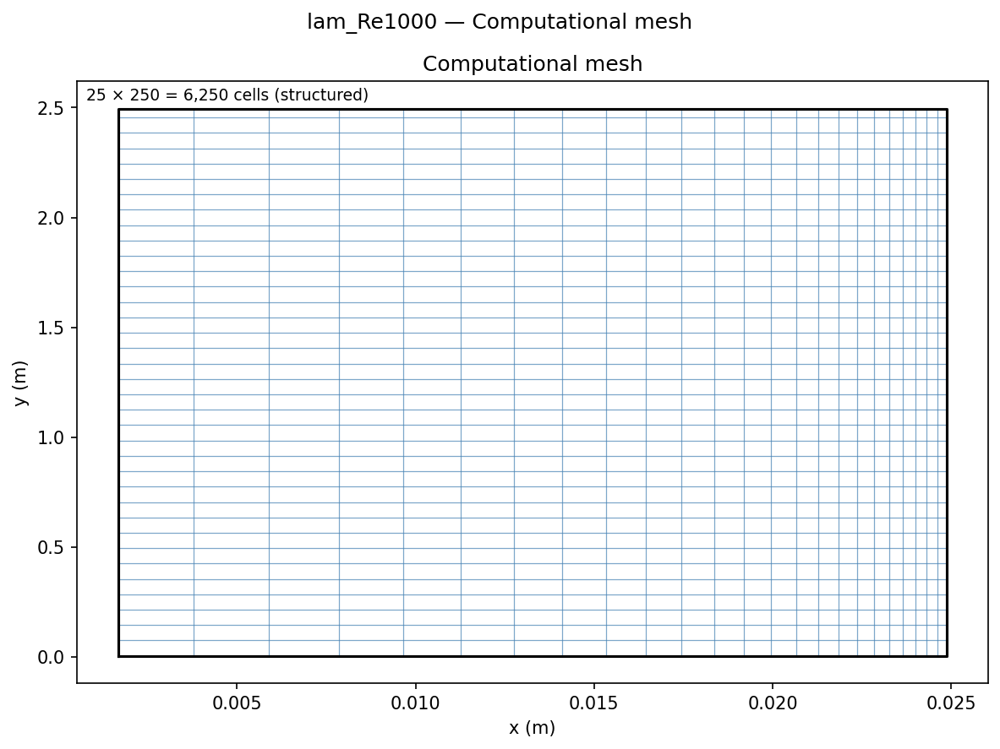
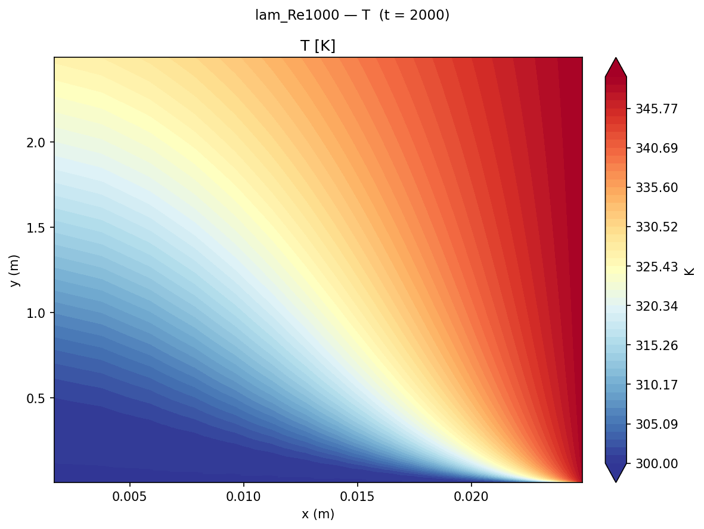
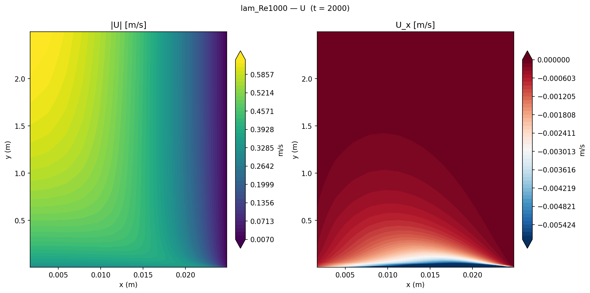

# Pipe Flow Heat Transfer

Validation of forced-convection heat transfer in a circular pipe using `buoyantSimpleFoam` across laminar (Re = 500–2000) and turbulent (Re = 5000–50000) regimes, compared against the Graetz solution and Gnielinski correlation.

## Geometry

```
         inlet (T_in = 300 K, U = U_bulk)
         ↓
    ╔════════════════════════════════════════════════════════════╗
    ║ ↑ r                      wall T_w = 350 K                 ║ 5°
    ║       →→→→→→→→→  U_bulk  →→→→→→→→→                       ║ wedge
    ║                                                            ║
    ╚════════════════════════════════════════════════════════════╝
    z = 0                                              z = 2.5 m
    inlet                                              outlet
                                               ← Nu extracted here
                                               (z = 2.4 m, 48D from inlet)
```

| Dimension | Value |
|-----------|-------|
| Diameter D | 50 mm |
| Length L | 2.5 m = **50D** |
| Geometry | 5° axisymmetric wedge, axis along z |
| Wall temperature T_w | 350 K (constant isothermal) |
| Inlet temperature T_in | 300 K |

## Setup

| Parameter | Value |
|-----------|-------|
| Solver | `buoyantSimpleFoam` (compressible, perfect gas) |
| Fluid | Air: ideal gas, Pr = 0.71, k_f = 0.026 W/(m·K) |
| Re sweep (laminar) | 500, 1000, 2000 |
| Re sweep (turbulent) | 5000, 10000, 20000, 50000 |
| Turbulence | Laminar (Re ≤ 2000); k-ω SST (Re ≥ 5000) |
| Mesh | 25 × 250 = **6,250** cells (radial × axial) |
| Radial grading | ratio 0.1 (wall-clustered) |

## Mesh



| Property | Value |
|----------|-------|
| Total cells | 25 × 250 × 1 = **6,250** cells (wedge) |
| Radial grading | Geometric, ratio 0.1 (dense near wall) |
| y⁺ (turbulent cases) | ≈ 2–4 (below wall-function range) |

## Boundary Conditions

| Patch | Type | U | T | p_rgh | k | ω |
|-------|------|---|---|-------|---|---|
| `inlet` | patch | fixedValue U_bulk | fixedValue **300 K** | fixedFluxPressure | fixedValue | fixedValue |
| `outlet` | patch | zeroGradient | zeroGradient | fixedValue 0 | zeroGradient | zeroGradient |
| `wall` | wall | noSlip | fixedValue **350 K** | fixedFluxPressure | kqRWallFunction | omegaWallFunction |
| `wedge1` / `wedge2` | wedge | wedge | wedge | wedge | wedge | wedge |
| `axis` | empty | — | — | — | — | — |

## Contour Plots


*Temperature field for laminar Re=1000, showing the thermal entry region (red near inlet) and the thermally developed section (uniform gradients) downstream.*


*Velocity profile, showing the parabolic distribution (laminar case).*

## Results


*Nu vs Re for all cases. Laminar (blue) compared against Graetz (Nu = 3.658); turbulent (red) against Gnielinski correlation.*

### Nusselt number comparison

| Case | Re | Nu (CFD) | Nu (theory) | Error | Correlation |
|------|----|----------|-------------|-------|-------------|
| lam_Re500   | 500 | 3.66 | 3.658 | +0.0% | Graetz |
| lam_Re1000  | 1000 | 3.68 | 3.658 | +0.7% | Graetz |
| lam_Re2000  | 2000 | 3.86 | 3.658 | +5.5% | Graetz (entry) |
| turb_Re5000 | 5000 | 15.52 | 16.72 | −7.2% | Gnielinski |
| turb_Re10000 | 10000 | 24.90 | 30.03 | −17.1% | Gnielinski |
| turb_Re20000 | 20000 | 41.35 | 51.77 | −20.1% | Gnielinski |
| turb_Re50000 | 50000 | 96.19 | 105.08 | −8.5% | Gnielinski |

**Nu extracted** at z = 2.4 m (48D from inlet) in the thermally developed region.  
**Correlations:** Graetz: Nu = 3.658 (laminar, constant T_w); Gnielinski: Nu = (f/8)(Re−1000)Pr / (1+12.7(f/8)^½(Pr^⅔−1)).

### Key findings

1. **Laminar accuracy within +5.6%.** The lam_Re2000 elevation occurs because the thermal entry length (L_th = 0.05 Re Pr D ≈ 3.56 m) exceeds the 2.5 m pipe — the extraction point is still in the developing region where Nu > 3.658. The other laminar cases are essentially exact.

2. **Turbulent k-ω SST under-predicts by 7–20%.** The wall-normal y⁺ ≈ 2–4 falls below the wall-function validity range (y⁺ > 30). The standard k-ε/kOmega wall functions over-estimate the near-wall thermal resistance in the buffer layer, reducing predicted Nu. A Low-Reynolds-number closure (e.g., k-ω SST with y⁺ < 1 target) would recover the Gnielinski result.

3. **Turbulent enhancement factor.** At Re = 50000, Nu ≈ 96 vs laminar Nu = 3.66 — a factor of 26× improvement due to turbulent mixing. This demonstrates the extreme sensitivity of heat transfer efficiency to the flow regime.

4. **Thermal entry length is design-relevant.** For Re = 2000, the entry length is ~1.4× the pipe length — meaning most of the pipe operates in a developing regime with higher-than-expected Nu. For short heat exchangers, using the Graetz fully-developed value underestimates performance.

## References

- Gnielinski, V. (1976). New equations for heat and mass transfer in turbulent pipe and channel flow. *Int. Chemical Engineering*, **16**(2), 359–368.
- Graetz, L. (1885). Über die Wärmeleitungsfähigkeit von Flüssigkeiten. *Ann. Phys.*, **261**(7), 337–357.
- Incropera, F. P., & DeWitt, D. P. (2011). *Fundamentals of Heat and Mass Transfer* (7th ed.). Wiley. §8.3–§8.4.
