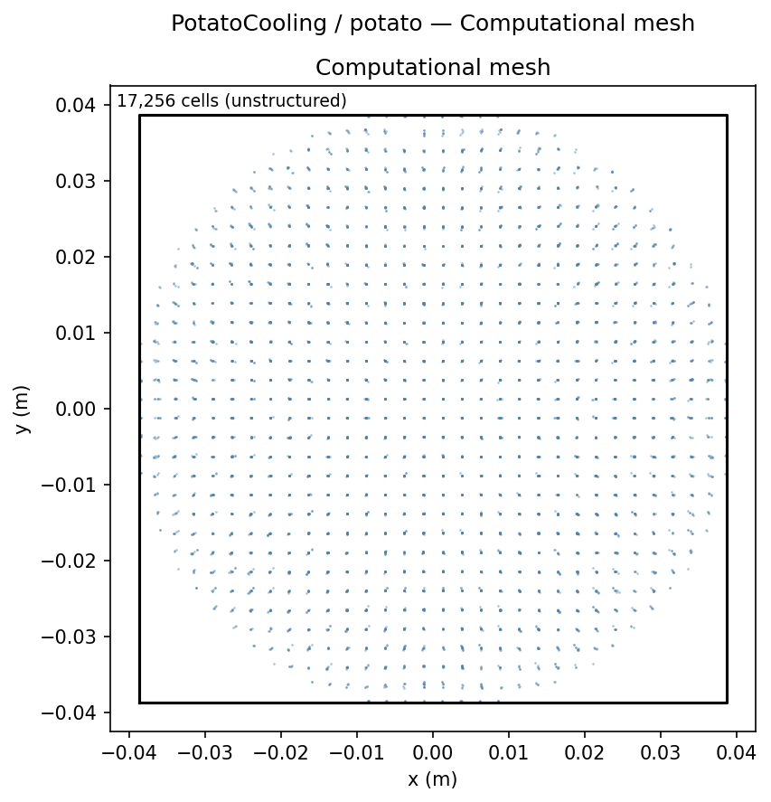
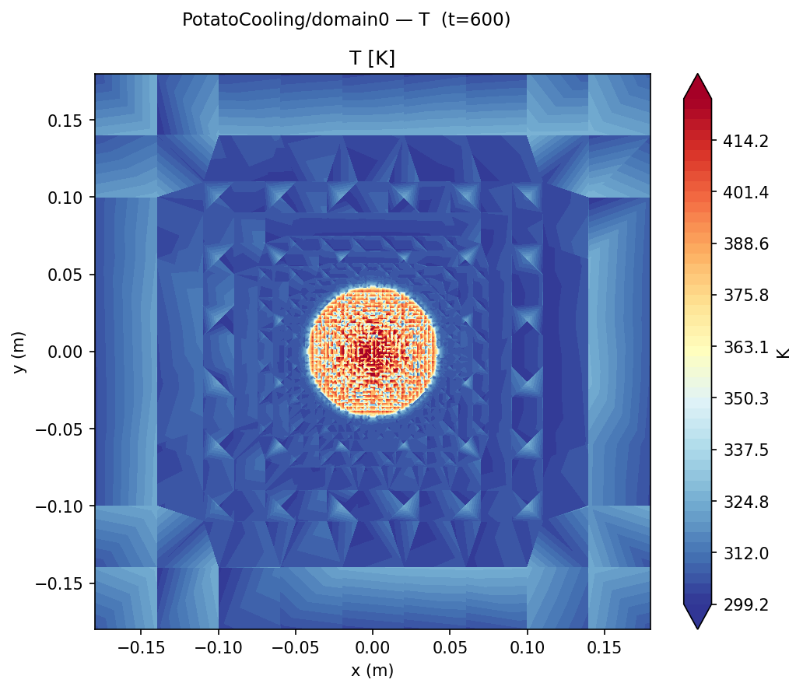
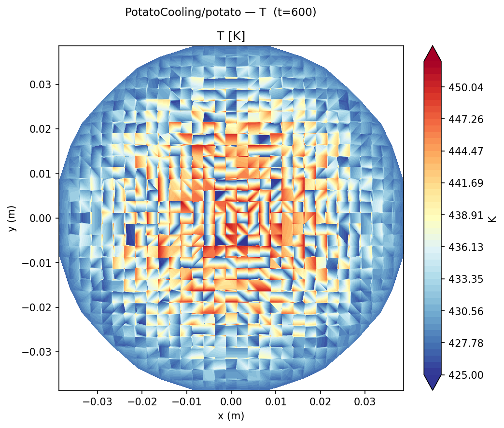
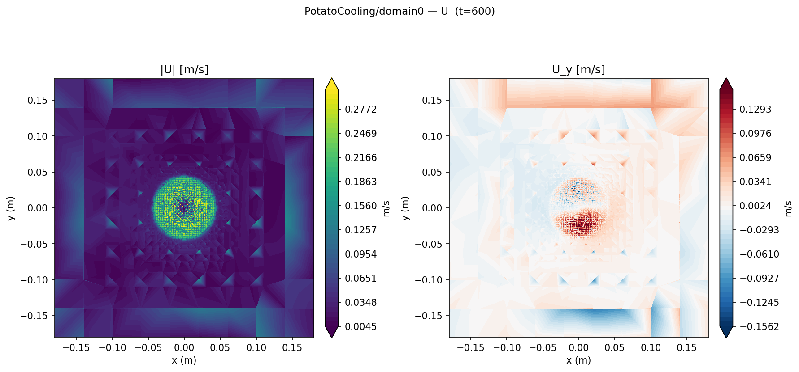
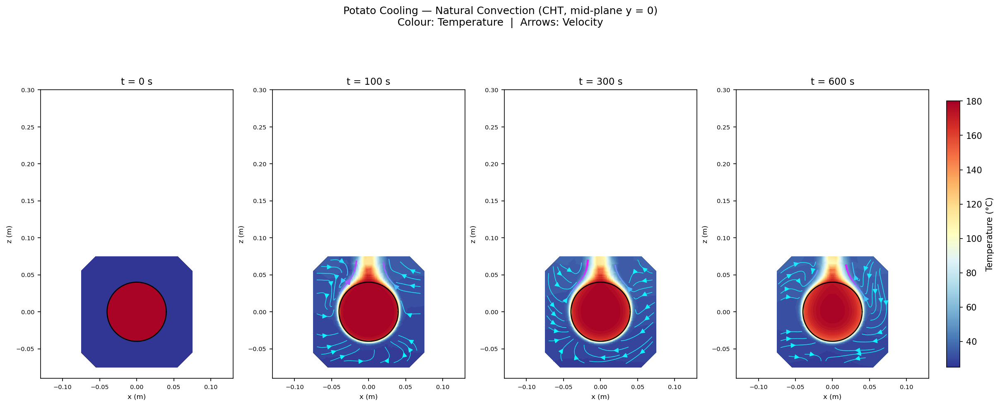
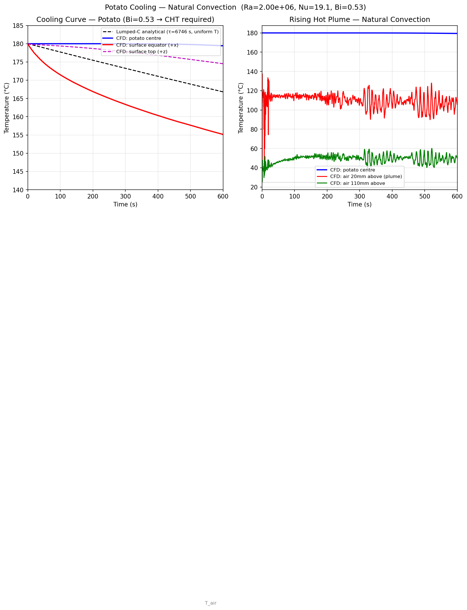

# Potato Cooling - Transient Natural Convection (chtMultiRegionFoam)

Transient simulation of an 80 mm diameter potato (T=180 °C) cooling in still air (T=25 °C) via natural convection. Two-region conjugate heat transfer captures the spatial temperature non-uniformity inside the potato - something lumped-capacitance analysis cannot.

## Geometry

```
    ┌─────────────────────────────────────────────────────────────────────┐ 600 mm
    │                                                                     │
    │                                                                     │
    │                       ╭─────╮                                       │
    │                      / potato \   D = 80 mm                        │ 400 mm
    │                      \ sphere /   T_init = 180°C                   │ (air box)
    │                       ╰─────╯                                       │
    │                                                                     │ 400 mm
    │              ↑↑↑  buoyancy plume  ↑↑↑                              │
    └─────────────────────────────────────────────────────────────────────┘
    
    Two regions: domain0 (air, 400×400×600 mm box) + potato (solid sphere, D=80 mm)
```

| Dimension | Value |
|-----------|-------|
| Potato diameter D | 80 mm |
| Air box | 400 × 400 × 600 mm |
| Mesh | `snappyHexMesh` (40,357 cells, 4,872 interface faces) |
| Regions | `domain0` (air fluid) + `potato` (solid) |

## Boundary Conditions

### domain0 (air)

| Patch | Type | U | T | p_rgh |
|-------|------|---|---|-------|
| `potato_to_domain0` | wall / CHT interface | noSlip | `turbulentTemperatureCoupledBaffleMixed` | fixedFluxPressure |
| `outer_walls` | wall | noSlip | fixedValue **25°C** | fixedFluxPressure |
| `top` / `bottom` / side walls | wall | noSlip | fixedValue 25°C | fixedFluxPressure |

### potato (solid)

| Patch | Type | T |
|-------|------|---|
| `potato_to_domain0` | CHT interface | `turbulentTemperatureCoupledBaffleMixed` |

Initial conditions: T_potato = 180°C (uniform), T_air = 25°C (uniform), U = 0 (rest).

## Contour Plots


*snappyHexMesh surface around the 80mm sphere. The boundary layer mesh resolves the near-wall thermal gradients.*


*Air temperature field showing the thermal plume rising from the top of the potato. The natural convection boundary layer wraps the sphere.*


*Potato interior temperature showing the spatial gradient — the surface cools first, the centre remains close to 180°C for hundreds of seconds.*


*Air velocity field showing the buoyancy-driven plume above the potato and the return flow drawing cool air from below.*

## Setup

| Parameter | Value |
|---|---|
| Solver | `chtMultiRegionFoam` |
| Regions | `domain0` (air, fluid) · `potato` (solid) |
| Geometry | D = 80 mm sphere in 400×400×600 mm box |
| Mesh | `snappyHexMesh` - 40 357 cells, 4 872 interface faces |
| T_init (potato) | 180 °C |
| T_air | 25 °C |
| Run time | 600 s real time |
| Time stepping | Adaptive (PIMPLE, maxCo=2) |
| Turbulence | Laminar (Ra ≈ 2×10⁶) |

**Potato properties:** ρ = 1050 kg/m³, cₚ = 3600 J/(kg·K), k = 0.56 W/(m·K)  
**Air properties at film temperature:** μ = 1.85×10⁻⁵ Pa·s, Pr = 0.713, k = 0.031 W/(m·K)

## Why CHT? - Biot Number

$$\text{Bi} = \frac{h R}{k_\text{potato}} = \frac{7.47 \times 0.040}{0.56} = 0.53$$

Bi > 0.1 means internal conduction resistance is significant - the potato interior and surface are at **different temperatures**. Lumped-capacitance (which assumes uniform T) is invalid here. CHT resolves both the solid conduction and fluid convection simultaneously.

## Analytical Reference - Churchill-Bernstein Sphere

$$\text{Nu} = 2 + \frac{0.589\, \text{Ra}^{1/4}}{\left[1 + (0.469/\text{Pr})^{9/16}\right]^{4/9}}$$

| Quantity | Value |
|---|---|
| Ra | 2.0 × 10⁶ |
| Nu (Churchill-Bernstein) | 19.1 |
| h | 7.47 W/(m²·K) |
| Lumped τ = mcₚ/(hA) | 6 746 s |

The lumped time constant is 6 746 s, so only ~13 °C of total cooling occurs in 600 s - the interesting result is the **spatial gradient**, not the bulk average.

## Results

### Natural convection flow field



Mid-plane temperature (colour) and velocity streamlines at four time steps. At t=0 the fluid is quiescent; by t=100 s a buoyancy-driven plume has formed at the apex, with counter-rotating circulation cells drawing cool air in from below. Stream colour indicates speed - magenta near the fast-rising plume, blue in the slower recirculation zones. The thin thermal boundary layer around the potato is clearly resolved by the CHT mesh.

### Cooling curves



| t (s) | T_centre (°C) | T_surface equator (°C) | T_surface top (°C) | ΔT centre-equator (°C) | T_lumped (°C) |
|---|---|---|---|---|---|
| 0 | 180.0 | 180.0 | 180.0 | 0.0 | 180.0 |
| 60 | 180.0 | 174.0 | 179.6 | 6.0 | 178.6 |
| 120 | 180.0 | 170.4 | 179.3 | 9.6 | 177.3 |
| 300 | 180.0 | 163.4 | 177.8 | 16.6 | 173.3 |
| 600 | 179.4 | 155.2 | 174.5 | 24.3 | 166.8 |

### Key observations

- **Centre barely cooled** (179.4 °C at t=600 s): conduction through the potato is the bottleneck, not convection at the surface.
- **Equator surface cooled fastest** (155 °C): the boundary layer is thinnest at the equator where the flow accelerates around the sphere - highest local h.
- **Top surface warmer than equator** (174.5 °C): the boundary layer thickens as it rises, reducing local h at the top.
- **24 °C centre-to-surface gradient** at t=600 s confirms lumped capacitance would overestimate surface temperature and underestimate the surface heat flux.
- **Plume**: air 20 mm above the potato reached 105 °C, confirming the rising thermal plume driven by buoyancy.

## Skills demonstrated

- Conjugate heat transfer with `chtMultiRegionFoam`
- `snappyHexMesh` sphere carving and automatic region splitting (`splitMeshRegions`)
- Biot number analysis to justify CHT over lumped capacitance
- Comparison to Churchill-Bernstein analytical Nu for sphere natural convection
- Interpretation of spatial temperature non-uniformity in a real food object
