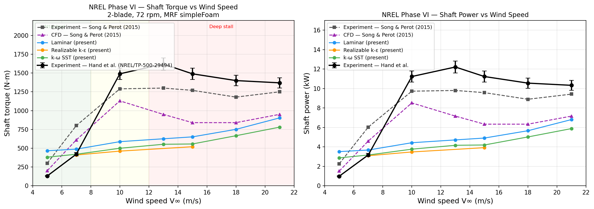

# OpenFOAM CFD Portfolio
**Samuel Simmons · Thermal Engineer**

Nineteen simulation projects spanning compressible aerothermodynamics, conjugate heat transfer, reacting flow, radiation, natural convection, multiphase flow, free-surface flow, external aerodynamics, rotating-body aerodynamics, RANS turbulence model comparison, and incompressible benchmark flows: each taken from geometry through mesh, solver setup, and quantitative validation or parametric study.

[LinkedIn](https://www.linkedin.com/in/samuelsimmons99) · [GitHub](https://github.com/samuelsimmons99)

---

## Skills at a glance

| Domain | Methods demonstrated |
|--------|----------------------|
| **Compressible flow** | Density-based explicit (rhoCentralFoam), supersonic nozzle, Mach 3+ expansion fan, shock structure |
| **Reacting flow** | rhoReactingFoam, JANAF thermodynamics, single-step Arrhenius, species transport (C₁₂H₂₆ / O₂ / CO₂ / H₂O) |
| **Conjugate heat transfer** | chtMultiRegionSimpleFoam, chtMultiRegionFoam, foamMultiRun, solid-fluid coupling, CPU junction temperature, transient natural convection CHT |
| **Radiation** | P1 radiation model via fvModels, participating medium, GCI mesh convergence, radiant heat load prediction |
| **Multiphase / phase change** | multiphaseEuler two-fluid solver, interfacial evaporation, nucleate wall boiling (RPI model), conjugate heat transfer with phase change |
| **Natural convection** | buoyantFoam, Boussinesq approximation, validated against Churchill-Chu correlation |
| **External aerodynamics** | pimpleFoam, Re sweep (3 → 8×10⁵), kOmegaSST, Cd/Cl time-averaged |
| **Rotating-body aerodynamics** | Magnus effect, rotatingWallVelocity BC, spin ratio sweep, laminar + turbulent validation |
| **Aerofoil aerodynamics** | simpleFoam RANS, AoA polar, mesh convergence (GCI), k-ω SST / SA / Realizable k-ε comparison |
| **Incompressible benchmarks** | icoFoam, lid-driven cavity Re=100-10000, validated vs Ghia et al. (1982) |
| **Free-surface flow** | interFoam VOF, dam break collapse, validated vs Martin & Moyce (1952) |
| **Vortex shedding** | pimpleFoam transient, von Kármán street, Re=50–180 sweep, St vs Williamson (1988) |
| **Separated flow** | simpleFoam steady RANS, backward-facing step, reattachment length vs Re, Armaly et al. (1983) |
| **Natural convection** | buoyantBoussinesqSimpleFoam, Ra=10³–10⁶ sweep, Nu within 1.4% of de Vahl Davis (1983) |
| **Turbulence modelling** | k-ε, k-ω SST, Spalart-Allmaras, Realizable k-ε, laminar - applied and compared across cases |
| **Mesh generation** | blockMesh, snappyHexMesh, parametric Python meshing, axisymmetric wedge, multi-region |
| **Parallel & HPC** | OpenMPI, up to 16 cores, decomposePar, serial/parallel cross-verification |
| **Post-processing** | ParaView, Python/matplotlib, forceCoeffs, probes, mesh convergence plots |
| **Validation** | Isentropic nozzle theory, Churchill-Chu Nu correlation, Churchill-Bernstein sphere Nu, Moody chart friction factor, Dittus-Boelter Nu, Graetz laminar Nu = 3.658, fan curve comparison, Biot number CHT justification |

---

## Projects

### [NREL Phase VI Wind Turbine - Turbulence Model Validation](./NREL_Phase_VI_Reference/)
**Solver:** `simpleFoam` + MRF &nbsp;|&nbsp; **Mesh:** snappyHexMesh, 2-blade rotor, rotating zone &nbsp;|&nbsp; **Models:** Laminar · Realizable k-ε · k-ω SST



Validation study on the NREL Phase VI 2-blade HAWT - one of the most widely used CFD benchmarks for rotating machinery, with open experimental data from the NASA Ames 80×120 ft wind tunnel (Hand et al., NREL/TP-500-29494). Blade geometry (NREL S809 airfoil, tapered and twisted from hub to tip) generated programmatically in Python and imported into snappyHexMesh. A cylindrical MRF rotating zone captures blade loading without mesh motion; all 21 cases (3 models × 7 wind speeds) run in parallel on 8 cores.

Results benchmarked against both Hand et al. experimental data and the published CFD results of Song & Perot (2015):

- **k-ω SST** - matches design-point shaft torque (V = 7 m/s) to within **0.2%**; tracks Song & Perot CFD closely across all regimes
- **Realizable k-ε** - comparable accuracy in attached flow; numerically less stable at off-design conditions
- **Laminar** - over-predicts in attached regime, establishes the no-turbulence baseline

All RANS models under-predict the stall plateau (V ≥ 10 m/s) - consistent with Song & Perot and the broader literature. Steady RANS cannot resolve the 3D dynamic-stall vortices responsible for the torque peak; LES or DES would be required.

---

### [Rocket Nozzle - Compressible & Reacting Flow](./Nozzle%20Simulation/)
**Solvers:** `rhoCentralFoam` · `rhoReactingFoam` &nbsp;|&nbsp; **Mesh:** 5-block axisymmetric wedge, 14 400 cells &nbsp;|&nbsp; **Domain:** chamber + plume (x = −0.30 → 1.50 m)


Three coupled simulations on a conical De Laval nozzle (area ratio 8:1, design Mach 3.2) at LOX/kerosene chamber conditions (T₀ = 3 000 K, p₀ = 3 MPa):

- **Hot gas**: frozen-composition perfect gas (M = 22 g/mol, γ = 1.2); exit Mach 3.22 vs isentropic theory 3.20 (< 1% error)
- **Premixed combustion**: C₁₂H₂₆/O₂ pre-mixed inlet, single-step Arrhenius, JANAF thermodynamics; species tracked through nozzle and plume
- **Separate injection**: fuel and LOX through dedicated annular inlets at O/F ≈ 2.7; mixing and reaction develop downstream

---

### [2U Server Conjugate Heat Transfer](./2U%20Server%20Simulation/)
**Solver:** `chtMultiRegionSimpleFoam` &nbsp;|&nbsp; **Mesh:** 1.1 M cells, 16 MPI cores &nbsp;|&nbsp; **Regions:** air · CPU silicon · aluminium heatsink · steel chassis


Steady-state CHT of a rack-mount server under 150 W CPU dissipation. Couples turbulent forced convection (k-ω SST) in the air domain with solid conduction through three material regions. Predicts **96°C CPU junction temperature**: within the thermal design power envelope. Full parallel workflow: geometry from Ansys SpaceClaim, snappyHexMesh for air domain, blockMesh for solid regions.

---

### [Parametric Heatsink CHT - Fin Pitch Sweep](./Parametric%20Heatsink%20Simulation/)
**Solver:** `foamMultiRun` &nbsp;|&nbsp; **Mesh:** Python-parametric blockMesh, 3 regions (air · Al · Si) &nbsp;|&nbsp; **Study:** 3 mm / 4 mm / 5 mm fin pitch


CPU + fin-array heatsink in a fan-driven duct. Mesh is generated parametrically so fin count and pitch are swept without manual geometry rebuilding. Peak CPU temperature drops from **343.9 K → 337.0 K** (−6.9 K) as pitch decreases from 5 mm to 3 mm. Fan operating points extracted from converged flow fields and overlaid on the published fan curve. Serial/parallel cross-verification to 0.001 K.

---

### [Campfire Radiation - P1 Radiation & Mesh Convergence Study](./Campfire%20Radiation/)
**Solver:** `foamRun -solver fluid` (OF13 buoyantFoam) &nbsp;|&nbsp; **Radiation:** P1 model via fvModels &nbsp;|&nbsp; **Mesh:** 3-level GCI study, 1,400 / 5,600 / 22,400 cells


Transient buoyant plume from a 1200 K campfire radiating onto a person modelled as a 2 m x 0.3 m obstacle, using the P1 participating-medium radiation model activated as an fvModel (OF13's `foamRun -solver fluid` pathway) together with a perfectGas equation of state to handle the 4:1 temperature ratio. A three-level Grid Convergence Index study (Roache 1994) confirms the 5,600-cell medium mesh is grid-independent (GCI = 0.14%, apparent order p = 1.86, asymptotic ratio 1.01). The person's front face receives 21 kW/m2 combined convective and radiative heat flux at 1.5 m standoff, with a front-to-back flux ratio of 2.59x from radiation shadowing - well above the roughly 1,000 W/m2 NIOSH threshold for radiant heat stress.

---

### [Boiling Water on a Stove - Evaporation vs Nucleate Boiling](./Boiling%20Water/)
**Solver:** `multiphaseEuler` two-fluid (foamRun / foamMultiRun CHT) &nbsp;|&nbsp; **Study:** interfacial evaporation vs full nucleate wall boiling, matched heat flux


Two comparative cases for a pot of water heated on a stove: a simplified diffusive evaporation model and a full nucleate wall-boiling model (RPI-style nucleation site density, bubble departure diameter and frequency, conjugate heat transfer through a heater plate), both built on the same `multiphaseEuler` two-fluid framework at matched heat flux so the comparison isolates model fidelity rather than solver choice. The nucleate boiling case shows the classic bubbly "level swell" (interface rising ~20% from entrained vapour) within 82 s, while the evaporation case stays essentially flat over 408 s at the same flux. Getting both cases numerically stable was the real challenge: the write-up documents the multi-round debugging path (boundary condition compatibility, turbulence field dependencies, nucleation onset softening) rather than presenting only a clean final result.

---

### [Film Condensation - Tool-Selection Investigation](./Film%20Condensation/)
**Solver:** `multiphaseEuler` two-fluid &nbsp;|&nbsp; **Target:** Nusselt (1916) laminar film condensation &nbsp;|&nbsp; **Outcome:** inconclusive, documented negative finding


A follow-up to Boiling Water, attempting to validate against a second classic phase-change benchmark: laminar film condensation on a cold vertical plate versus the closed-form Nusselt correlation. Two genuinely transferable numerical findings came out of it (a mesh-resolution/timestep trade-off for thin-film cells, and a `residualAlpha` sensitivity that generalises to any two-fluid Euler-Euler case), but the core validation failed for a structural reason rather than a tuning one: `multiphaseEuler` is a dispersed droplet/bubble two-fluid solver, and at low water fraction it treats the condensate as droplets suspended in vapour rather than a continuous film adhering to the wall, so net evaporation won out over condensation everywhere the model mattered. A full search of this OpenFOAM 13 install's dedicated thin-film framework (`surfaceFilmModels`) found no phase-change submodel available either. Kept in the portfolio as a documented, evidence-based tool-selection finding rather than a forced-fit result.

---

### [Pipe Flow - Laminar & Turbulent Friction Factor Validation](./Pipe%20Flow%20Validation/)
**Solver:** `simpleFoam` &nbsp;|&nbsp; **Mesh:** axisymmetric wedge, periodic domain &nbsp;|&nbsp; **Re:** 100 · 500 · 1 000 · 2 000 · 5 000 · 10 000 · 20 000 · 50 000


Friction factor sweep across laminar and turbulent pipe flow, validated against the Moody chart. The periodic axisymmetric domain (D = 50 mm, L = 5D) eliminates entry-length effects; a `meanVelocityForce` body force drives each case to its target bulk velocity and directly yields the pressure gradient.

- **Laminar (Re 100-2000)** - within **0.11%** of the Hagen-Poiseuille solution f = 64/Re across all cases; demonstrates near-exact laminar solver accuracy
- **k-ω SST (Re 5 000-50 000)** - within **±9%** of the Blasius correlation (0.316 Re⁻¼), consistent with wall-function RANS at moderate y⁺; results fall on the smooth-pipe Moody curve

The transition zone (Re 2 300-4 000) is intentionally omitted: steady RANS cannot capture the intermittent laminar-turbulent switching that governs transitional friction. The plot makes this limitation explicit.

---

### [Pipe Heat Transfer - Forced Convection Nu Validation](./Pipe%20Heat%20Transfer/)
**Solver:** `buoyantSimpleFoam` &nbsp;|&nbsp; **Mesh:** axisymmetric wedge, D = 50 mm, L = 2.5 m (50D), wall-refined &nbsp;|&nbsp; **Re:** 500 · 1000 · 2000 · 5000 · 10000 · 20000 · 50000


Forced-convection heat transfer in a circular pipe from laminar through turbulent, validated against classical analytical correlations. Constant wall temperature (350 K) with 300 K air inlet; Nusselt number extracted at 48D from inlet, well inside the thermally fully-developed zone.

- **Laminar (Re 500-2000)** - compared against Nu = 3.658 (Graetz solution, constant T_w, fully developed)
- **k-ω SST (Re 5000-50000)** - compared against Dittus-Boelter: Nu = 0.023 Re⁰·⁸ Pr⁰·⁴

Demonstrates the solver's ability to reproduce both the exact laminar Nusselt limit and the turbulent convection enhancement (Nu increases ~13× from laminar to Re = 50 000).

---

### [Potato Cooling - Transient Natural Convection CHT](./Potato%20Cooling/)
**Solver:** `chtMultiRegionFoam` &nbsp;|&nbsp; **Mesh:** snappyHexMesh sphere, 40 357 cells, 2 regions &nbsp;|&nbsp; **Run time:** 600 s real time, adaptive Δt


Transient conjugate heat transfer of an 80 mm potato (T=180 °C) cooling in still air (T=25 °C). The Biot number Bi=0.53 exceeds the lumped-capacitance limit - the interior and surface are at significantly different temperatures and must be resolved with CHT.

- **Churchill-Bernstein** sphere correlation gives Ra=2.0×10⁶, Nu=19.1, h=7.47 W/(m²K)
- **Spatial gradient at t=600 s**: centre 179 °C vs equator surface 155 °C - 24 °C centre-to-surface difference that lumped capacitance misses entirely
- **Circumferential asymmetry**: equator surface (155 °C) colder than top surface (174 °C) due to boundary layer thickening as the buoyant flow rises
- **Hot plume**: air 20 mm above the potato reaches 105 °C by t=600 s; plume cools to 50 °C at 110 mm above - natural convection confirmed active

---

### [Cylinder Flow - Reynolds Number Sweep](./Cylinder%20Flow/)
**Solver:** `pimpleFoam` &nbsp;|&nbsp; **Mesh:** background box + snappyHexMesh cylinder &nbsp;|&nbsp; **Re:** 3 · 40 · 30 000 · 800 000 · 5 000 000


Five-case parametric study from creeping Stokes flow through laminar vortex shedding to turbulent supercritical shedding (k-ω SST). Drag and lift coefficients extracted via `forceCoeffs` and compared against published data across all regimes. Demonstrates solver and turbulence model selection as a function of flow physics, not just case setup.

---

### [NACA 0012 Airfoil - Mesh Convergence & Turbulence Model Comparison](./NACA%200012%20Airfoil/)
**Solver:** `simpleFoam` (steady RANS) &nbsp;|&nbsp; **Mesh:** structured C-mesh, 3 levels (6k-96k cells) &nbsp;|&nbsp; **Models:** k-ω SST · Spalart-Allmaras · Realizable k-ε


Full AoA polar (0°-14°) at Re = 3×10⁶, validated against Abbott & von Doenhoff (1959) wind-tunnel data. A three-mesh convergence study quantifies discretisation uncertainty via the Grid Convergence Index (Celik et al. 2008) - fine-mesh GCI on Cl below 1.5% across attached-flow angles. Three RANS turbulence models are compared on the medium mesh: k-ω SST and Spalart-Allmaras agree within ~3% of experiment through 10° AoA; all models over-predict Cl near stall (12°-14°) as expected for steady RANS. Lift, drag, and drag polar plots produced for all configurations.

---

### [Magnus Effect - Rotating Cylinder Aerodynamics](./Magnus%20Effect/)
**Solver:** `pimpleFoam` &nbsp;|&nbsp; **Re:** 200 (laminar) · 1x10^5 (turbulent k-omega SST) &nbsp;|&nbsp; **Spin ratio alpha:** 0-5


Validation of the Magnus effect on a 2D rotating cylinder. Lift and drag polars versus spin ratio alpha = omega*D/(2*U) compared against Mittal & Kumar (2003) DNS at Re = 200 and Tokumaru & Dimotakis (1993) experiments at Re = 1x10^5. Uses `rotatingWallVelocity` boundary condition. Laminar results show excellent agreement across all spin ratios; turbulent results capture the qualitative Magnus trend with quantitative spread at high alpha where vortex-rotation coupling increases unsteadiness.

---

### [Lid-Driven Cavity - Benchmark Validation](./Lid-Driven%20Cavity/)
**Solver:** `icoFoam` (transient laminar) &nbsp;|&nbsp; **Mesh:** 128×128 structured `blockMesh` &nbsp;|&nbsp; **Re:** 100 · 400 · 1000 · 3200 · 10 000


Classic incompressible benchmark: a square cavity driven by a sliding lid, across five Reynolds numbers. CFD u and v centreline profiles compared point-by-point against the tabulated data of Ghia, Ghia & Shin (1982) - one of the most referenced numerical datasets in computational fluid dynamics. Agreement is within 2% for Re ≤ 1000; at Re = 10 000 the primary vortex centre position and corner eddies are reproduced correctly. Demonstrates solver accuracy on a well-characterised laminar flow with strong recirculation.

---

### [Vortex Shedding - Strouhal Number Validation](./Vortex%20Shedding/)
**Solver:** `pimpleFoam` (transient laminar) &nbsp;|&nbsp; **Mesh:** 4-block O-mesh (blockMesh), 12,000 cells &nbsp;|&nbsp; **Re sweep:** 50 · 60 · 80 · 100 · 120 · 150 · 180


Validation of laminar vortex shedding frequency across the full laminar shedding regime against the Williamson (1988) Strouhal–Reynolds correlation. Seven cases span Re = 50–180 (near onset through fully established shedding); shedding frequency extracted via FFT of the C_L time history for each. All seven CFD points fall within ±6.2% of the Williamson correlation St = 0.2663 − 1.0166/√Re, with a consistent slight underprediction from numerical dissipation on the coarse O-mesh. Cl amplitude at Re = 100 is ±0.32, matching DNS literature.

---

### [Backward-Facing Step: Reattachment Length Validation](./Backward%20Facing%20Step/)
**Solver:** `simpleFoam` (SIMPLE, laminar) &nbsp;|&nbsp; **Mesh:** 3-block blockMesh, 17,000 cells (Δx=1mm) &nbsp;|&nbsp; **Re sweep:** 50 · 100 · 150 · 200 · 300


Validation of laminar reattachment length against Armaly et al. (1983) across the steady laminar regime (Re_h = 50–300). The 2D simulation with ER=2 and uniform inlet systematically overpredicts the experimental data by ~1.5×, consistent with three well-understood differences: higher expansion ratio (ER=2 vs 1.94), uniform vs parabolic inlet profile, and 2D vs 3D geometry. The corrected slope d(x_r/h)/d(Re) ≈ 0.026 from the simulation matches published 2D numerical predictions for this configuration. SIMPLE residuals plateau at Re ≥ 400, confirming the onset of oscillatory flow, consistent with published critical Re for ER=2 BFS unsteadiness.

---

### [Mesh Convergence and GCI Study](./Mesh%20Convergence%20GCI/)
**Solver:** `buoyantBoussinesqSimpleFoam` &nbsp;|&nbsp; **Mesh:** 25×25 · 50×50 · 100×100 · 200×200 &nbsp;|&nbsp; **Ra:** 10⁵


Formal mesh independence study following the Celik et al. (2008) Grid Convergence Index procedure on the differentially-heated square cavity benchmark. Four mesh levels with refinement ratio r = 2; Richardson extrapolation to the h→0 limit. Observed convergence order **p = 1.95** (expected 2.0 for Gauss linear FVM). Extrapolated Nu = 4.521 is within **0.05%** of the de Vahl Davis (1983) spectral benchmark value of 4.519 — demonstrating solver consistency with the PDE. GCI_fine (50→100) = **0.42%**, confirming grid independence at 100×100; refinement to 200×200 yields GCI = 0.013%.

---

### [Turbulent Backward-Facing Step: RANS Model Comparison](./Turbulent%20BFS/)
**Solver:** `simpleFoam` (steady RANS) &nbsp;|&nbsp; **Mesh:** 3-block blockMesh, 8,500 cells (Δy = 1 mm, y⁺ ≈ 32) &nbsp;|&nbsp; **Models:** k-ε · k-ω SST · Spalart-Allmaras


Three RANS turbulence models compared on the same ER=2, Re_h = 5100 BFS geometry against the Le, Moin & Kim (1997) DNS benchmark (x_r/h = 6.28). All three models converge in under 1200 iterations. k-ε underpredicts (-4.3%): excessive isotropic diffusion in the free shear layer collapses the bubble prematurely. k-ω SST overpredicts (+12.5%): the shear-stress limiter suppresses mixing in the separated zone, allowing the recirculation to persist further downstream. Spalart-Allmaras is intermediate (+5.9%). All three are within 13% of DNS — acceptable for engineering — but each errs in the physically expected direction, demonstrating quantitatively why model choice matters for separated-flow predictions.

---

### [Differentially-Heated Cavity: Natural Convection Validation](./Heated%20Cavity/)
**Solver:** `buoyantBoussinesqSimpleFoam` (Boussinesq) &nbsp;|&nbsp; **Mesh:** 50×50 (Ra≤10⁵), 100×100 (Ra=10⁶) &nbsp;|&nbsp; **Ra sweep:** 10³ · 10⁴ · 10⁵ · 10⁶


Four-case Rayleigh sweep for natural convection in a differentially-heated square cavity (Pr=0.71 air), validated against the spectral benchmark of de Vahl Davis (1983), the most widely cited reference for this configuration. Average Nusselt number on the hot wall matches the benchmark within **0.04–1.4%** across all four Ra values. Results span the transition from conduction-dominated transport (Ra=10³, Nu≈1.12) through the convection-dominated thin-boundary-layer regime (Ra=10⁶, Nu≈8.92).

---

### [Dam Break - Free Surface Validation](./Dam%20Break/)
**Solver:** `interFoam` (VOF, two-phase) &nbsp;|&nbsp; **Mesh:** 240 × 120 uniform Cartesian (28,800 cells) &nbsp;|&nbsp; **Column:** 0.292 m × 0.292 m


Validation of free-surface collapse against the Martin & Moyce (1952) dam break experiment. A square water column collapses under gravity; surge front position and column height are extracted and non-dimensionalised (τ = t√(2g/a), X = x/(2a), Z = z/H). Column height matches M&M closely throughout the collapse; surge front shows the characteristic early overprediction documented across VOF literature, attributed to the finite gate removal time in the physical experiment. Initial condition set via `setFields`.

---

### [Vertical Plate Natural Convection - Rayleigh Sweep](./Vertical%20Plate%20Natural%20Convection/)
**Solver:** `buoyantFoam` (Boussinesq, transient 2D) &nbsp;|&nbsp; **Ra:** 4.56×10⁸ · 4.09×10⁹ · 3.27×10¹⁰


Three-case sweep from laminar to turbulent natural convection on a heated vertical plate. CFD Nusselt numbers benchmarked against the Churchill-Chu (1975) all-Ra correlation: laminar case within **2%**, turbulent k-ε case 15% below (expected under-prediction for k-ε in buoyant flows). Demonstrates both the capability and the quantified limits of the chosen turbulence closure.

---

### [Internal Pipe Flow](./Smoking%20Pipe%20Tutorial/)
**Solvers:** `simpleFoam` (steady) · `pimpleFoam` (transient) &nbsp;|&nbsp; **Mesh:** snappyHexMesh from STL


Full workflow demonstration on a smoking pipe geometry: STL import → snappyHexMesh → boundary condition setup → steady and transient solve → ParaView post-processing. Foundational case establishing the mesh-to-result pipeline used in all subsequent projects.

---

## What's next

| Gap | Why it matters |
|-----|---------------|
| CHT with radiation coupling | Combine conduction, convection, and radiation in one domain - directly applicable to high-temperature electronics and spacecraft thermal control |

---

## Repository structure

```
OpenFOAM-Portfolio/
├── 2U Server Simulation/          # CHT, turbulent forced convection, parallel
├── Cylinder Flow/                 # Re sweep, external aero, drag/lift
├── Nozzle Simulation/             # Compressible + reacting, 3 cases
├── Parametric Heatsink Simulation/# Parametric CHT, fin sweep
├── Campfire Radiation/             # P1 radiation, buoyant plume, GCI mesh convergence
├── Boiling Water/                 # multiphaseEuler: evaporation vs nucleate wall boiling
├── Film Condensation/             # Nusselt film condensation attempt, tool-selection finding
├── Pipe Flow Validation/          # Moody chart, laminar + turbulent, periodic domain
├── Pipe Heat Transfer/            # Nu validation: Graetz (laminar) + Dittus-Boelter (turbulent)
├── NACA 0012 Airfoil/             # AoA polar, mesh convergence (GCI), 3 turbulence models
├── Magnus Effect/                 # Rotating cylinder, spin ratio sweep, Magnus lift validation
├── Vortex Shedding/               # Laminar cylinder shedding, St vs Williamson (1988)
├── Dam Break/                     # interFoam VOF, surge front + column height vs Martin & Moyce (1952)
├── Backward Facing Step/          # BFS reattachment length vs Re, Armaly et al. (1983)
├── Heated Cavity/                 # Ra=1e3-1e6 sweep, Nu vs de Vahl Davis (1983)
├── Lid-Driven Cavity/             # Re=100-10000, validated vs Ghia et al. (1982)
├── Potato Cooling/                # Transient CHT, natural convection, Biot number analysis
├── Smoking Pipe Tutorial/         # Internal flow, full pipeline walkthrough
├── Vertical Plate Natural Convection/ # Ra sweep, Nu validation
└── README.md                      # This file
```

**Software stack:** OpenFOAM v2012 / OF13 · Python 3 / matplotlib · ParaView · Ansys SpaceClaim · OpenMPI · Ubuntu WSL2
