# Smoking Pipe CFD Simulation
**OpenFOAM v2012 · Salome · ParaView**

Three progressively complex CFD simulations of airflow through a smoking pipe geometry, built entirely with open-source tools.

> 📖 **Full workflow documented here:**
> [Smoking Pipe Tutorial](https://github.com/samuelsimmons99/OpenFOAM-Portfolio/tree/main/Smoking%20Pipe%20Tutorial)

---

## Tools
| Stage | Tool |
|---|---|
| Geometry simplification | SpaceClaim |
| Surface meshing & groups | Salome (NETGEN 2D) |
| Volume meshing | OpenFOAM `blockMesh` + `snappyHexMesh` |
| Steady-state solver | OpenFOAM `simpleFoam` |
| Transient solver | OpenFOAM `pimpleFoam` |
| Post-processing | ParaView |

---

## Mesh (shared across all simulations)

| Metric | Value |
|---|---|
| Total cells | 807,523 |
| Hexahedra | 739,338 (92%) |
| Max non-orthogonality | 53.4° |
| Max skewness | 2.32 |
| Mesh checks failed | 0 ✓ |

---

## Simulation 1 — Steady-State Flow (`simpleFoam`)

Fixed inlet velocity, no-slip walls, pressure outlet. Laminar Stokes model. Converged in **51 iterations**.

| Patch | U | p |
|---|---|---|
| Inlet | `fixedValue (0 0 -0.5)` | `zeroGradient` |
| Outlet | `inletOutlet` | `fixedValue 0` |
| Walls / PipeHandle | `noSlip` | `zeroGradient` |

### Results

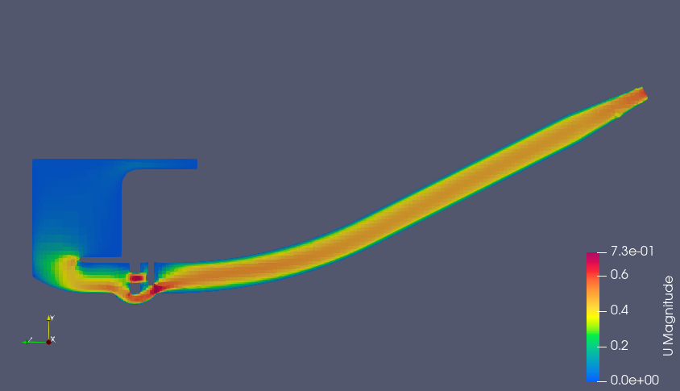
*Velocity magnitude — centreline slice*

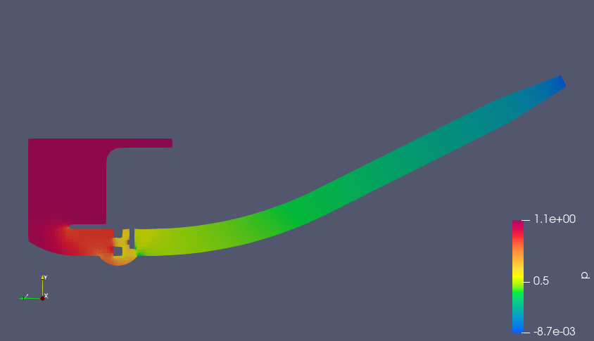
*Pressure distribution — high at inlet bowl, low at mouthpiece*

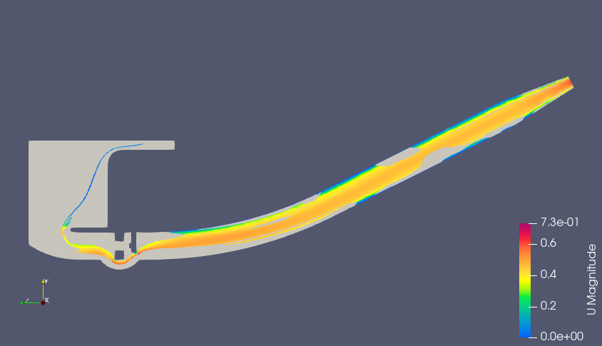
*Streamlines coloured by U magnitude*

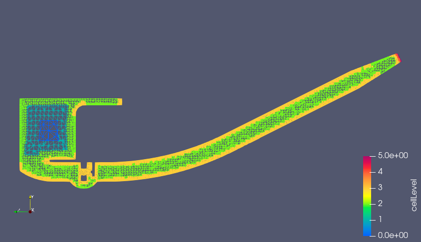
*Mesh refinement levels from snappyHexMesh*

---

## Simulation 2 — Transient Impulsive Start (`pimpleFoam`)

Same geometry and boundary conditions as steady-state but started from rest. Adaptive Co-based timestepping (maxCo=0.5). Flow reached steady state by **t=0.25s**.

| Parameter | Value |
|---|---|
| Solver | pimpleFoam |
| nOuterCorrectors | 2 |
| nCorrectors | 2 |
| nNonOrthogonalCorrectors | 3 |
| maxCo | 0.5 |
| Simulation time | 0.5s |

### Results

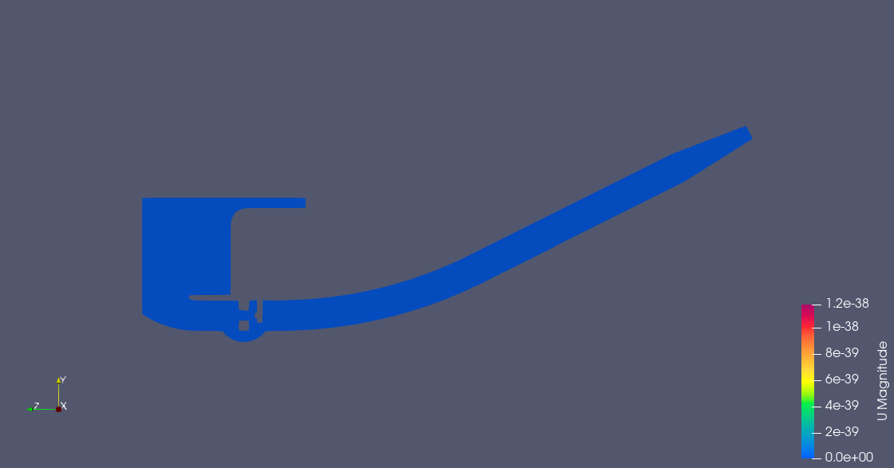
*t=0s — zero velocity, flow at rest*

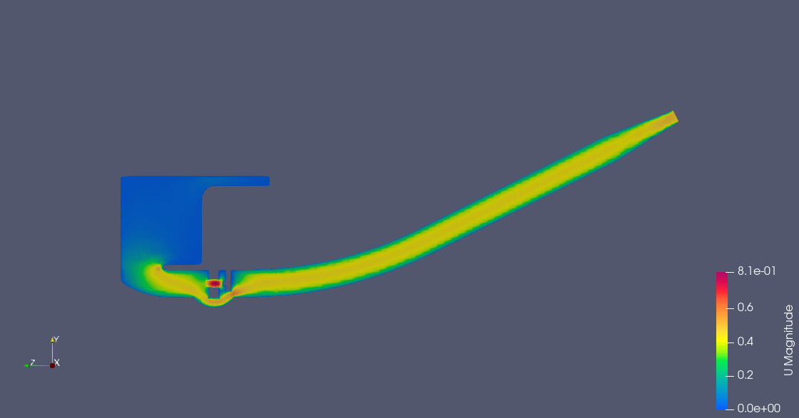
*t=0.01s — impulsive start, jet forming at bowl-stem junction*

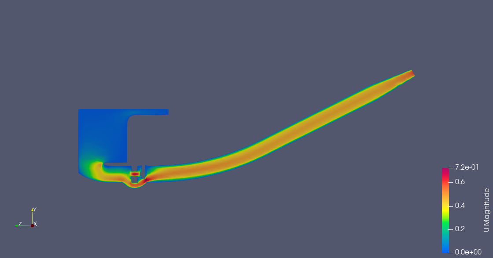
*t=0.1s — approaching steady state*

---

## Simulation 3 — Physiological Breathing Cycle (`pimpleFoam`)

Time-varying suction boundary condition at the mouthpiece using OpenFOAM's `codedFixedValue` to simulate realistic breathing. Flow is driven by suction rather than a fixed inlet velocity. Simulation ran for **8 seconds** capturing two complete breath cycles.

**Breathing parameters:**
```
breathingStart = 0.1s    // first breath begins
tB             = 1.5s    // breath duration
nextBreath     = 5.0s    // pause between breaths
dotVBreath     = 1.33e-3 m³/s  // volumetric flow rate (2L / 1.5s)
```

**Breathing cycle timeline:**

| Time | Phase | Flow |
|---|---|---|
| 0.0 → 0.1s | Pre-breath | No flow |
| 0.1 → 1.6s | First breath | Suction active — flow drawn through pipe |
| 1.6 → 6.6s | Pause | Flow decays — pipe clears |
| 6.6 → 8.1s | Second breath | Suction resumes |

### Results

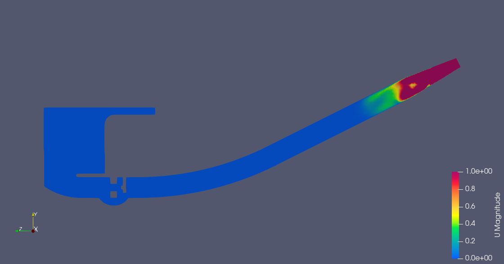
*t=1s — active breath, suction jet at mouthpiece (max 1.0 m/s)*

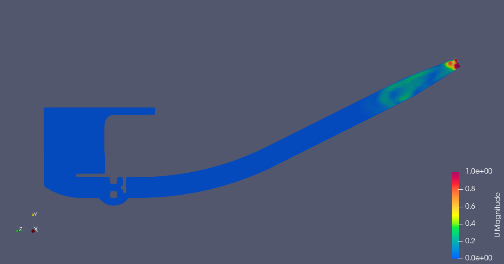
*t=2s — end of first breath, flow decelerating*

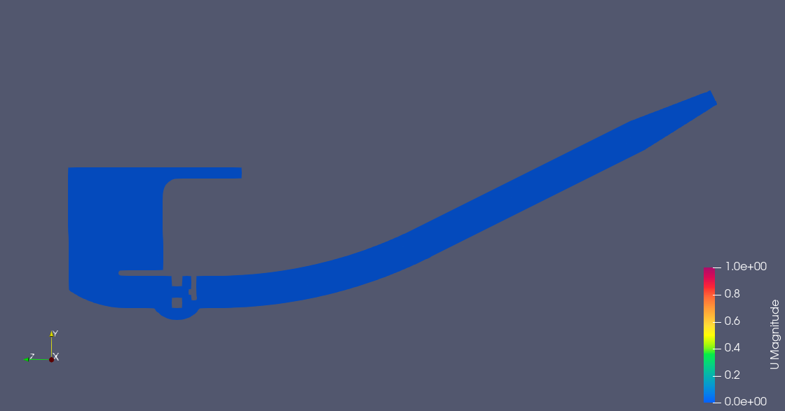
*t=4s — pause phase, near-zero flow throughout*

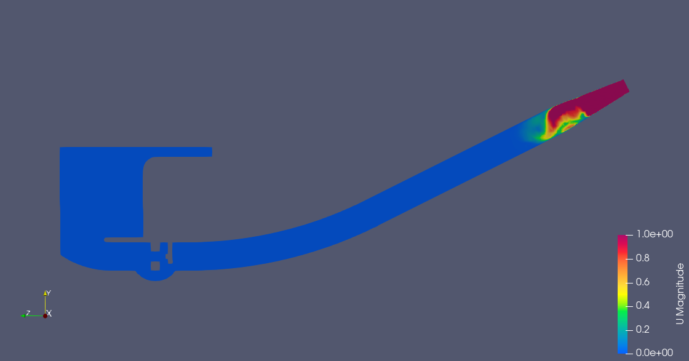
*t=7s — second breath, suction jet re-established*

---

## Key Challenges

**Tetrahedral background mesh** — snappyHexMesh requires hex cells. Rebuilt using Salome hex algorithm and `ideasUnvToFoam`.

**Open STL edges** — 136 open edges at the outlet caused snappyHexMesh to hang. Fixed by re-sewing geometry in Salome and re-exporting as a closed manifold surface.

**Persistent bad mesh face** — single 161° non-orthogonal face located by face index lookup at `(-0.009, 0.017, -0.020)`. Eliminated using a `searchableSphere` refinement region targeting that cell.

**Adaptive timestep collapse** — deltaT collapsed to ~1e-62 due to bad face producing spurious Courant number spike. Fixed by `minDeltaT` and switching `writeControl` to `timeStep`.

**codedFixedValue timing** — breathing condition used absolute simulation time, requiring `breathingStart` offset when restarting from non-zero time.

---

## Repository Structure
```
Smoking Pipe Tutorial/
├── smoking_pipe_steady_state/
│   ├── 0/              # U, p boundary conditions
│   ├── system/         # controlDict, fvSchemes, fvSolution, snappyHexMeshDict
│   ├── constant/       # transportProperties, triSurface/combined.stl
│   ├── U_mag_contour.png
│   ├── p_mag_contour.png
│   ├── streamlines_U.png
│   └── cell_Levels.png
├── smoking_pipe_transient/
│   ├── 0/              # U, p (internalField uniform (0 0 0))
│   ├── U_mag_0.png
│   ├── U_mag_0.01.png
│   └── U_mag_0.1.png
├── smoking_pipe_codedFixedValue/
│   ├── 0/U             # codedFixedValue breathing condition
│   ├── U_mag_1s.png
│   ├── U_mag_2s.png
│   ├── U_mag_4s.png
│   └── U_mag_7s.png
└── README.md
```

---

## Running the Cases

```bash
# 1. Generate background mesh
blockMesh

# 2. Extract surface features
surfaceFeatureExtract

# 3. Mesh with snappyHexMesh
snappyHexMesh -overwrite
checkMesh

# 4. Steady-state
simpleFoam

# 5. Transient (start from rest)
# Set internalField uniform (0 0 0) in 0/U
pimpleFoam

# 6. Breathing cycle
# Set codedFixedValue on Outlet in 0/U
pimpleFoam
```

---

## References
- [Smoking Pipe Tutorial (full workflow)](https://github.com/samuelsimmons99/OpenFOAM-Portfolio/tree/main/Smoking%20Pipe%20Tutorial)
- [OpenFOAM snappyHexMesh Video Series (YouTube)](https://www.youtube.com/watch?v=xPVqii3jjzA&list=PLZDUQMOoipL6imsL2HLeLWb6OZaMOHiST&index=4)
- [OpenFOAM v2012 Documentation](https://www.openfoam.com/documentation)
- [snappyHexMesh User Guide](https://www.openfoam.com/documentation/guides/latest/doc/guide-meshing-snappyhexmesh.html)
