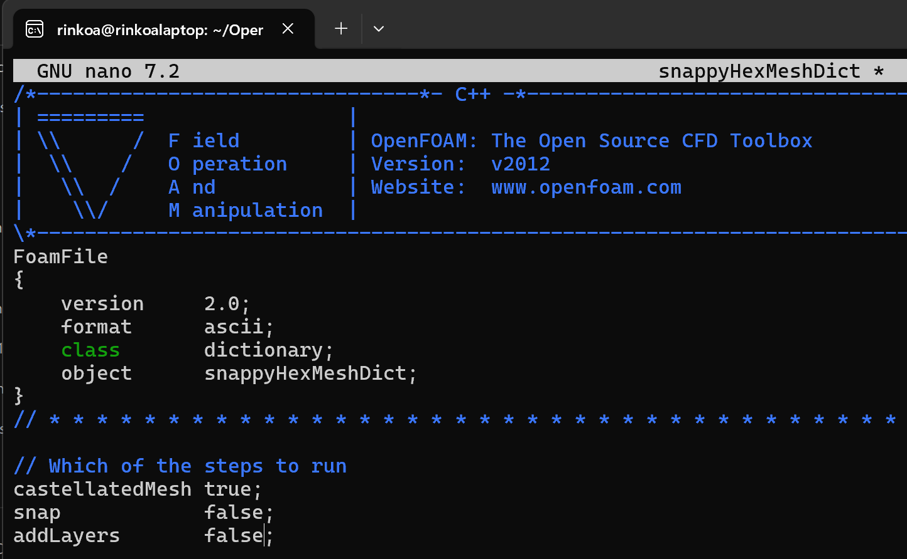
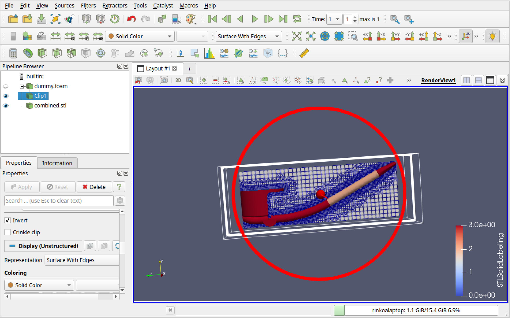
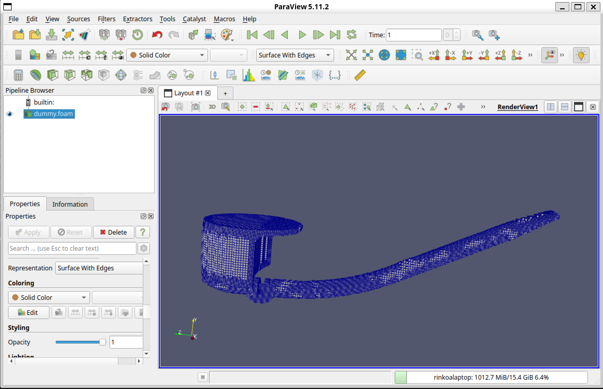
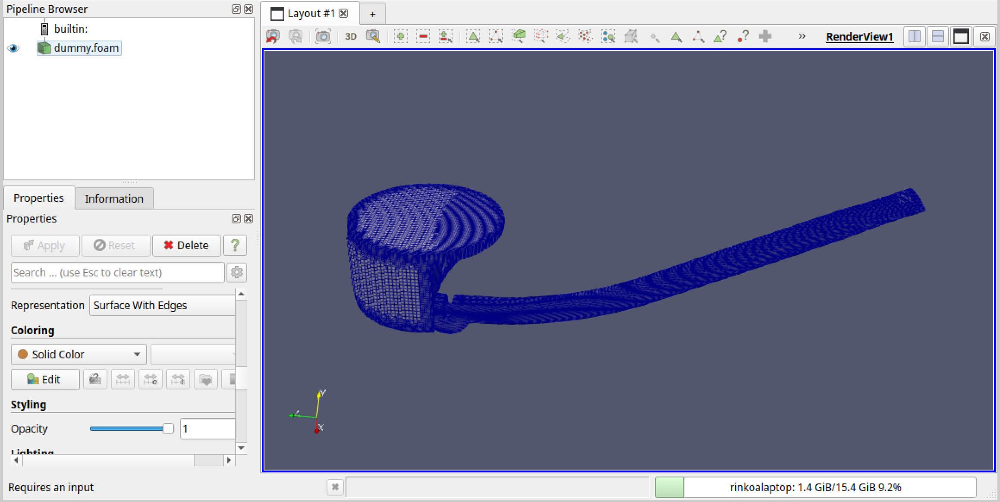
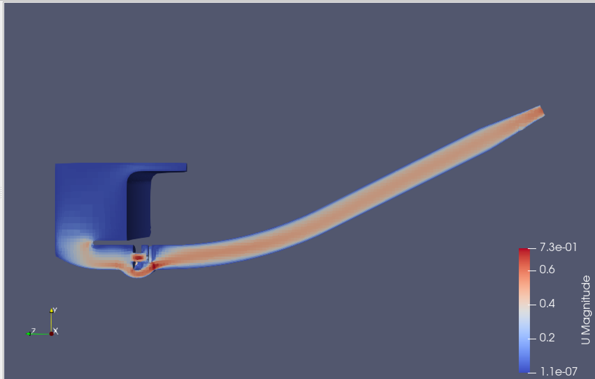
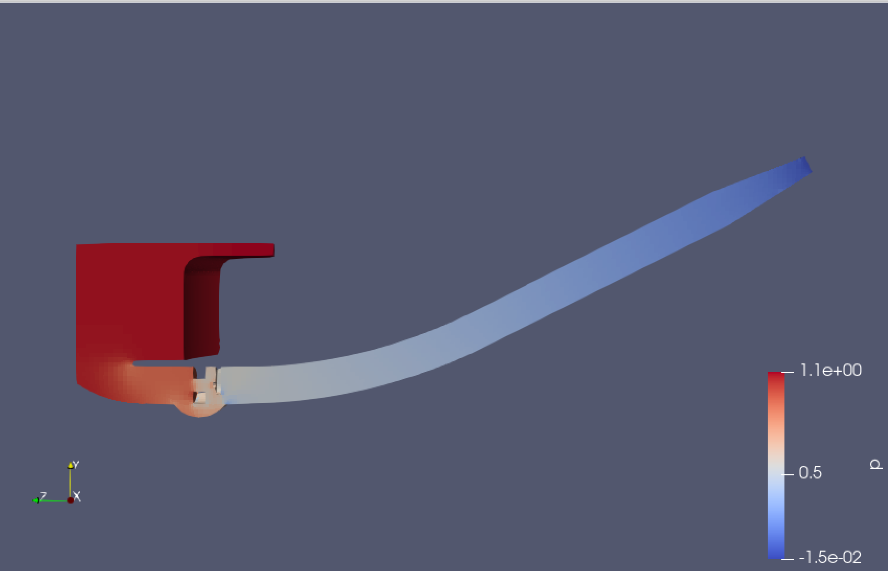
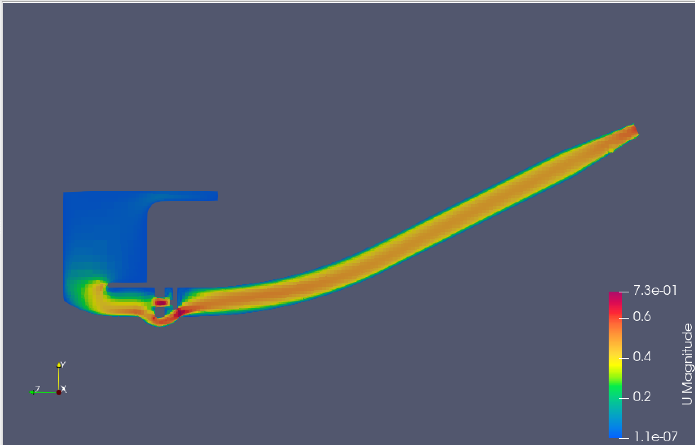
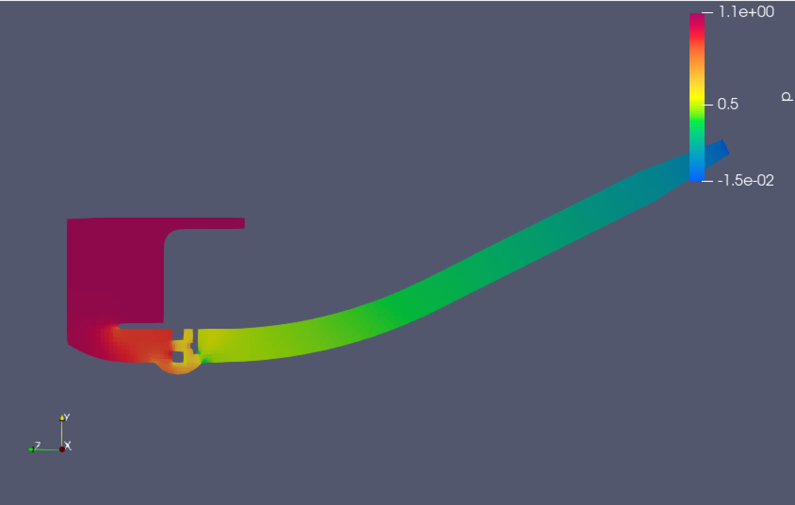

# 
STL files will throw meshing errors since the geometry gets broken up on conversion to this file format

Workflow
1. Simplify geometry in SpaceClaim
2. Export STEP file from SpaceClaim
3. Create groups in Salome for inlet, outlet, wall, etc. Doing step 1 in Salome is far too laggy to be usable
4. Mesh in Salome (NETGEN 2D or 2D-1D, may need submeshes for futher refinement)
5. Export mesh for each group as STL
6. Use cat to combine STL files cat * > regionSTL.stl
7. Return to Salome, create a boundary box, a center of mass, and scale the boundary box up to 1.01. Needs to be slightly larger than geometry in case boundary box and geometry coincide with same normal vector (flat shape). 
8. Mesh the bounding box, hexahedron i,j,k. All default except 1D local length wire discretization. NETGEN 2D as well.
9. Export background mesh as .UNV file.
10. ideasUnvToFoam filename.unv (this will fail without a controlDict and the other usual OpenFOAM files
11. mkdir system. touch system/controlDict. Better way: cp tutorials/incompressible/simpleFoam/pitzDaily/system/controlDict to system/controlDict
cp ../../tutorials/incompressible/simpleFoam/pitzDaily/system/controlDict system/controlDict
12. rerun ideasUnvToFoam, polymesh folder gets generated.
13. generate dummy file dummy.foam for paraview &
14. snappyHexMesh will need fvSchemes file, fvSolution, snappyHexMeshDict, meshQualityDict
cp ../../tutorials/incompressible/simpleFoam/pitzDaily/system/fvSchemes system/fvSchemes
cp ../../tutorials/incompressible/simpleFoam/pitzDaily/system/fvSolution system/fvSolution
cp ../../tutorials/mesh/snappyHexMesh/motorBike/system/snappyHexMeshDict system/
cp ../../tutorials/mesh/snappyHexMesh/motorBike/system/meshQualityDict system/
fvSchemes and fvSolution needed but could be empty dictionaries
15. mkdir constant/triSurface and copy combined STL file in, not the background mesh. 
cp Surface_STL/combined.stl constant/triSurface/
snappy hex mesh needs combined stl file in triSurface folder
16. background mesh is needed for snappyHexMesh to generate initial mesh from 
17. snappyHexMesh is 3 parts: castellatedMesh, snap, addLayers

18. level max must be > than min for resolveFeatureAngle to work
19. checkMesh -> set locationInMesh to origin -> run snappyHexMesh
--> FOAM FATAL ERROR: (openfoam-2012)
Point (0 0 0) is not inside the mesh or on a face or edge.
Bounding box of the mesh:(-0.012827 -0.00427598 -0.0983375) (0.012827 0.0296867 -0.00303984)

    From static Foam::labelList Foam::refinementParameters::findCells(bool, const Foam::polyMesh&, const pointField&)
    in file snappyHexMeshDriver/refinementParameters/refinementParameters.C at line 242.
    This throws an error, must change locationInMesh to be inside the pipe (0 0 -0.08) works
19. Error found when meshing:
Surface refinement iteration 0
------------------------------

Marked for refinement due to surface intersection          : 1863 cells.
Determined cells to refine in = 0.01 s
Selected for refinement : 1863 cells (out of 33112)
hexRef8 : Dumping cell as obj to "/home/rinkoa/OpenFOAM-v2012/sims/smoking_pipe/cell_0.obj"

--> FOAM FATAL ERROR: (openfoam-2012)
cell 0 of level 0 does not seem to have 8 points of equal or lower level
cellPoints:4(6666 3369 3290 3313)
pointLevels:4{0}

    From Foam::labelListList Foam::hexRef8::setRefinement(const labelList&, Foam::polyTopoChange&)
    in file polyTopoChange/polyTopoChange/hexRef8/hexRef8.C at line 3678.
Meaning: mesh is too fine. Make a coarser mesh in salome before passing it into snappyHexMesh
Rerun meshing step and make a hex mesh
20. For new background mesh to apply, run this:
ideasUnvToFoam backgroundMesh.unv
21. Open mesh in paraview: open dummy.foam file created earlier + combined stl with the clip through the dummy foam to show this:

22. The mesh above is actually in the wrong part, create a point source in paraview to check what location is inside the pipe, then update the snappyHexMeshDict with the correct location (0 0 -0.01)
23. Opening paraview for dummy.foam will now show the mesh of the pipe

24. Needs refinement, lower refinment angle, increase max number of refinements.

25. Need named region for further refinement of other parts of geometry. 
26. rinkoa@rinkoalaptop://home/rinkoa/OpenFOAM-v2012/sims/smoking_pipe$ surfaceCheck constant/triSurface/combined.stl
/*---------------------------------------------------------------------------*\
| =========                 |                                                 |
| \\      /  F ield         | OpenFOAM: The Open Source CFD Toolbox           |
|  \\    /   O peration     | Version:  v2012                                 |
|   \\  /    A nd           | Website:  www.openfoam.com                      |
|    \\/     M anipulation  |                                                 |
\*---------------------------------------------------------------------------*/
Build  : _7bdb509494-20201222 OPENFOAM=2012
Arch   : "LSB;label=32;scalar=64"
Exec   : surfaceCheck constant/triSurface/combined.stl
Date   : Jun 19 2026
Time   : 22:03:00
Host   : rinkoalaptop
PID    : 4776
I/O    : uncollated
Case   : //home/rinkoa/OpenFOAM-v2012/sims/smoking_pipe
nProcs : 1
trapFpe: Floating point exception trapping enabled (FOAM_SIGFPE).
fileModificationChecking : Monitoring run-time modified files using timeStampMaster (fileModificationSkew 5, maxFileModificationPolls 20)
allowSystemOperations : Allowing user-supplied system call operations

// * * * * * * * * * * * * * * * * * * * * * * * * * * * * * * * * * * * * * //
Reading surface from "constant/triSurface/combined.stl" ...

Statistics:
Triangles    : 40858 in 4 region(s)
Vertices     : 20497
Bounding Box : (-0.0127 -0.00412734 -0.097998) (0.0127 0.0294986 -0.003175)

Region  Size
------  ----
Inlet   6004
Outlet  374
PipeHandle      4759
Walls   29721

Surface has no illegal triangles.

Triangle quality (equilateral=1, collapsed=0):
    0 .. 0.05  : 0
    0.05 .. 0.1  : 0
    0.1 .. 0.15  : 0
    0.15 .. 0.2  : 4.895e-05
    0.2 .. 0.25  : 7.3425e-05
    0.25 .. 0.3  : 4.895e-05
    0.3 .. 0.35  : 2.4475e-05
    0.35 .. 0.4  : 0
    0.4 .. 0.45  : 2.4475e-05
    0.45 .. 0.5  : 2.4475e-05
    0.5 .. 0.55  : 2.4475e-05
    0.55 .. 0.6  : 0.000122375
    0.6 .. 0.65  : 0.000318175
    0.65 .. 0.7  : 0.00105243
    0.7 .. 0.75  : 0.00222723
    0.75 .. 0.8  : 0.00741593
    0.8 .. 0.85  : 0.0158843
    0.85 .. 0.9  : 0.046478
    0.9 .. 0.95  : 0.121886
    0.95 .. 1  : 0.804347

    min 0.17782 for triangle 16783
    max 1 for triangle 35269

Edges:
    min 4.72288e-05 for edge 25099 points (-0.0023622 -0.000524562 -0.014956)(-0.00231526 -0.000529733 -0.0149566)
    max 0.000792799 for edge 51585 points (-0.00617095 0.0120611 -0.00477503)(-0.00684704 0.0119695 -0.00517883)

Checking for points less than 1e-6 of bounding box ((0.0254 0.0336259 0.094823) metre) apart.
Found 0 nearby points.

Surface is not closed since not all edges (61355) connected to two faces:
    connected to one face : 136
    connected to >2 faces : 0
Conflicting face labels:136

Number of unconnected parts : 2
Splitting surface into parts ...

Wrote zoning to "constant/triSurface/combined.vtp"

writing part 0 size 40484 to "constant/triSurface/combined_0.obj"
writing part 1 size 374 to "constant/triSurface/combined_1.obj"

Number of zones (connected area with consistent normal) : 2
More than one normal orientation.
Wrote zoning to "constant/triSurface/combined.vtp"

writing part 0 size 40484 to "constant/triSurface/combined_normal_0.obj"
writing part 1 size 374 to "constant/triSurface/combined_normal_1.obj"

End
27.  Snapping: process of putting castellated cells generated in meshing onto the surfaces.
28. Layering: addition of layered mesh near the surfaces for purpose of easing transition into internal mesh away from surface.
29. Copy over p and U files:
cp ../../tutorials/incompressible/pimpleFoam/RAS/pitzDaily/0/* 0/
Note: this comes with more files than needed, find another without extras
30. Setup conditions no slip, zerogradient, etc.
31. Copy over fvSchemes and fvSolutions
rinkoa@rinkoalaptop://home/rinkoa/OpenFOAM-v2012/sims/smoking_pipe$ cp ../../tutorials/incompressible/simpleFoam/pitzDaily/system/fvSolution system/
rinkoa@rinkoalaptop://home/rinkoa/OpenFOAM-v2012/sims/smoking_pipe$ cp ../../tutorials/incompressible/simpleFoam/pitzDaily/system/fvSchemes system
32. Copy over transport properties
rinkoa@rinkoalaptop://home/rinkoa/OpenFOAM-v2012/sims/smoking_pipe$ cp ../../tutorials/incompressible/simpleFoam/pitzDaily/constant/transportProperties constant/
and turbulence properties
rinkoa@rinkoalaptop://home/rinkoa/OpenFOAM-v2012/sims/smoking_pipe$ cp ../../tuto
rials/incompressible/simpleFoam/pitzDaily/constant/turbulenceProperties constant/
33. Solution failed to solve in simpleFoam:
checked:
refineMesh -overwrite
checkMesh
34. Results of solver:

