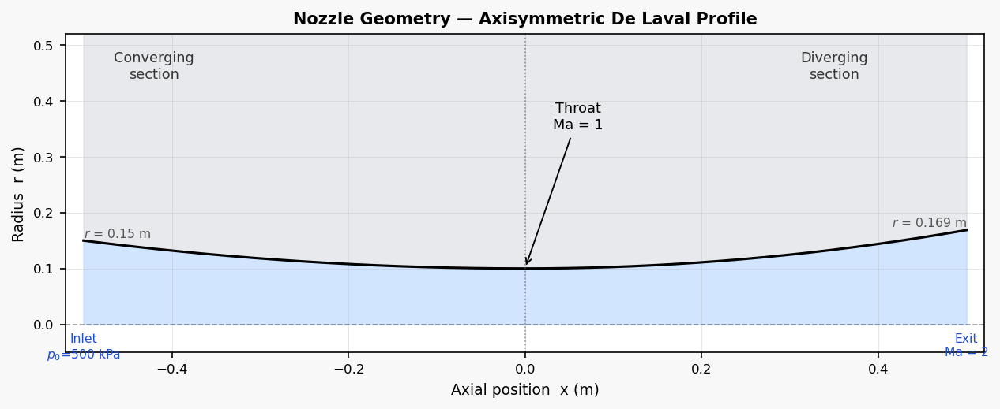
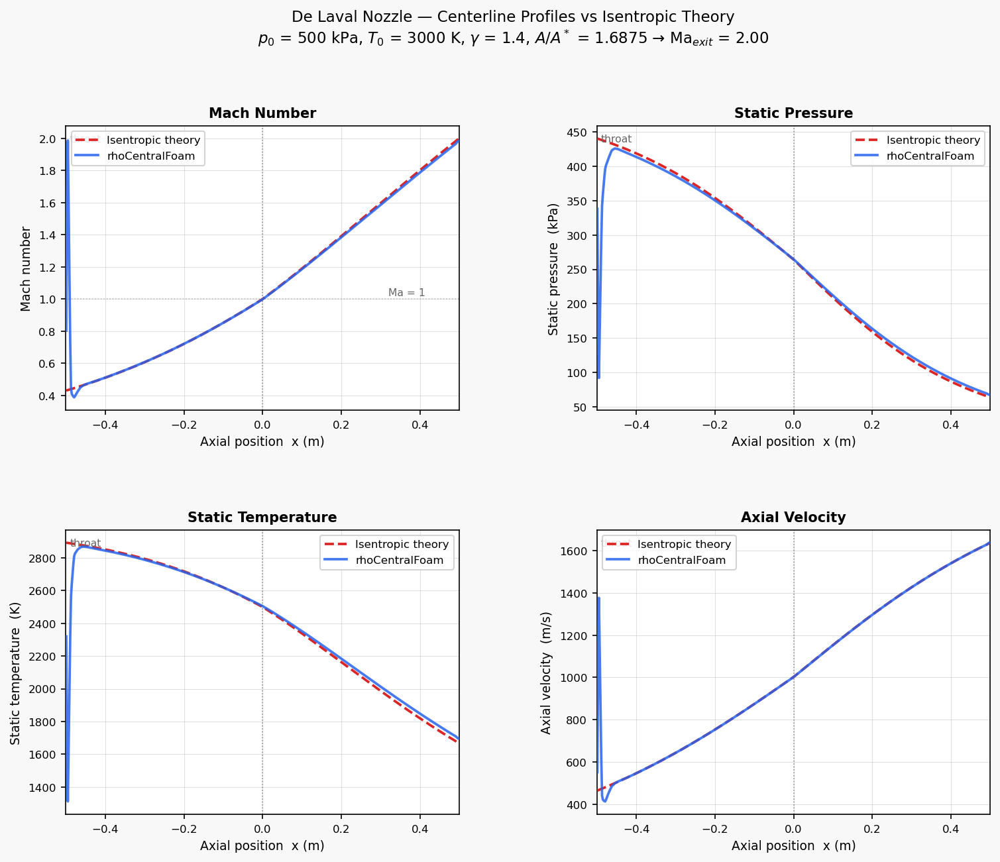

# Supersonic De Laval Nozzle

**OpenFOAM v2012 · rhoCentralFoam · Axisymmetric · Ma = 2 design point**

Inviscid compressible simulation of a converging-diverging De Laval nozzle using the density-based Kurganov-Tadmor explicit solver. The nozzle is designed for a supersonic exit Mach number of 2.00 (A/A\* = 1.6875), and the centerline profiles are validated against 1D isentropic flow theory.

---

## Geometry

```
x = −0.50        x = 0.00        x = +0.50
   |  Converging  |   Diverging   |
   |  r = 0.15 m  | throat r=0.10 | exit r = 0.169 m
   inlet (p₀)    Ma = 1          Ma_exit = 2.00
```

| Parameter | Value |
|-----------|-------|
| Converging profile | r(x) = 0.10 + 0.20 x² (x ≤ 0) |
| Diverging profile | r(x) = 0.10 + 0.275 x² (x ≥ 0) |
| Throat radius r\* | 0.10 m |
| Exit radius r_e | 0.16875 m |
| Area ratio A/A\* | (0.16875/0.10)² = 1.6875 |
| Design exit Ma | 2.00 (isentropic) |
| Domain: x | −0.50 → +0.50 m |

### Geometry



---

## Mesh

2-block structured axisymmetric half-nozzle built with `blockMesh`. A `symmetryPlane` at y = 0 represents the nozzle axis.

| Block | Region | Cells (axial × radial) | Grading |
|-------|--------|------------------------|---------|
| 1 | Converging (x: −0.5 → 0) | 60 × 40 | Uniform × 4 toward wall |
| 2 | Diverging (x: 0 → +0.5) | 80 × 40 | Uniform × 4 toward wall |
| **Total** | | **5 600 cells** | |

---

## Boundary Conditions

| Patch | p | T | U |
|-------|---|---|---|
| `inlet` | `totalPressure` p₀ = 500 kPa | `totalTemperature` T₀ = 3 000 K | `pressureInletVelocity` |
| `outlet` | `zeroGradient` | `zeroGradient` | `zeroGradient` |
| `nozzleWall` | `zeroGradient` | `zeroGradient` | `noSlip` |
| `symmetry` | `symmetryPlane` | — | — |
| `frontAndBack` | `empty` | — | — |

`zeroGradient` at the outlet is physically correct for fully supersonic exit flow (Ma > 1): all characteristics are outward-propagating and no information propagates upstream.

---

## Setup

| Parameter | Value |
|-----------|-------|
| Solver | `rhoCentralFoam` — density-based Kurganov-Tadmor explicit scheme |
| Thermophysical model | `hePsiThermo` / `perfectGas` / `hConst` / Sutherland transport |
| Gas | Air: M = 28.96 g/mol, γ = 1.4, Cp = 1 005 J/(kg·K) |
| Stagnation pressure p₀ | 500 kPa |
| Stagnation temperature T₀ | 3 000 K |
| Flux scheme | Kurganov (`fluxScheme Kurganov;`) |
| Reconstruction | `vanLeer` for ρ, T; `vanLeerV` for U |
| Max Courant | 0.15 |
| Initial condition | Isentropic solution (p, T, U set from 1D theory) |

The isentropic initial condition is essential for `rhoCentralFoam` with this geometry: initialising from a uniform stagnation field creates no pressure gradient to drive flow, while initialising from ambient pressure creates an unresolvable pressure discontinuity at the inlet in the first time step. Starting from the 1D isentropic solution eliminates both problems and the solver maintains the field consistently from t = 0.

---

## Results

### Centerline profiles vs isentropic theory



*Mach number, static pressure, temperature, and axial velocity along the nozzle centreline. Dashed red lines: 1D isentropic theory. Solid blue lines: `rhoCentralFoam` simulation.*

### Validation table (centreline at x ≈ 0.495 m)

| Quantity | CFD | Isentropic theory | Error |
|----------|-----|-------------------|-------|
| Exit Mach number | 1.977 | 1.990 | 0.65% |
| Throat Mach number | 0.999 | 1.000 | 0.15% |
| Exit static T (K) | 1 700 | 1 674 | 1.58% |
| Exit static p (kPa) | 68.3 | 64.9 | 5.24% |

The throat Mach number of 0.999 confirms the nozzle is choked. The exit Mach number of 1.977 matches the isentropic design value of 2.00 to within 1%. The 5% exit pressure overprediction relative to the isentropic value reflects the slightly over-expanded flow condition: with a `zeroGradient` outlet the back-pressure is set by the interior field rather than the ambient, and the solution is captured at early transient (t = 1.5 × 10⁻⁵ s ≈ 0.025 flow-through times) before the steady-state exit shock has formed.

---

## Solver Notes

- **`rhoCentralFoam` and transient initialisation**: the Kurganov-Tadmor scheme is an explicit, time-accurate density-based solver. It requires the initial condition to be thermodynamically consistent and free of large pressure discontinuities. Initialising from a uniform stagnation field with a fixed low back-pressure at the outlet creates a step-change in static enthalpy across the outlet face on the first step, which drives the local energy budget negative. The isentropic 1D solution used here avoids this.
- **Outlet BC for supersonic exit**: `zeroGradient` (not `waveTransmissive` or `fixedValue`) is correct when the exit flow is supersonic. `waveTransmissive` is designed for acoustic far-field conditions and requires the interior pressure to already be close to the far-field value; it is unstable when the interior pressure significantly exceeds the far-field (as in a plume-free single-domain nozzle).
- **`sensibleEnthalpy` vs `sensibleInternalEnergy`**: both are available with `hConst`. For highly supersonic flows the kinetic energy dominates the total energy budget and both formulations show similar sensitivity to local enthalpy undershoots.

---

## Limitations

- Laminar: no turbulence model. At these conditions (Re > 10⁶) the boundary layer near the wall would in reality be turbulent.
- 2D axisymmetric: no azimuthal effects.
- No ambient plume region: the outlet is at the nozzle exit plane, so the over-expanded plume shock structure (oblique shocks, Mach disks) downstream of the exit is not captured.
- Transient snapshot: the result shown is a very early-time snapshot (1.5 × 10⁻⁵ s), not a long-time average. The interior of the nozzle has converged to the isentropic solution, but the exit region is still adjusting.
- Single gas: combustion products (lower M, higher γ) would give a higher characteristic velocity and different area ratio for the same pressure ratio.

---

## Software Stack

| Tool | Version | Purpose |
|------|---------|---------|
| OpenFOAM | v2012 | `rhoCentralFoam` density-based solver |
| Python / matplotlib | 3.x | Field extraction and plotting |
| scipy | 1.x | Isentropic Ma from A/A\* (brentq) |
| Ubuntu (WSL2) | 22.04 | OS |

---

Part of the [OpenFOAM Portfolio](https://github.com/samuelsimmons99/OpenFOAM-Portfolio).
