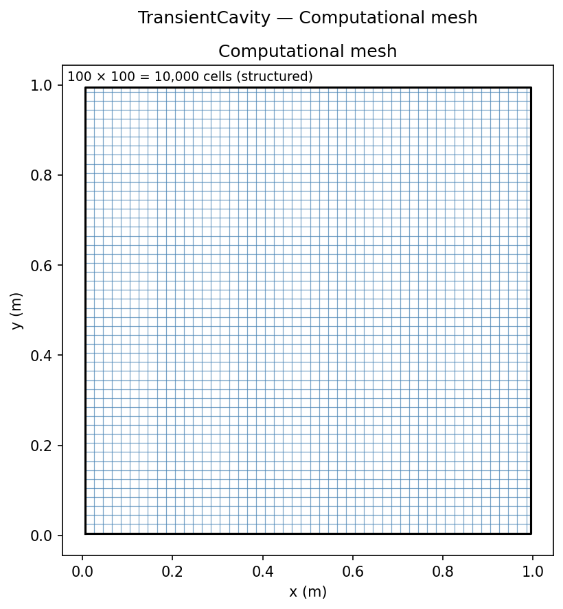
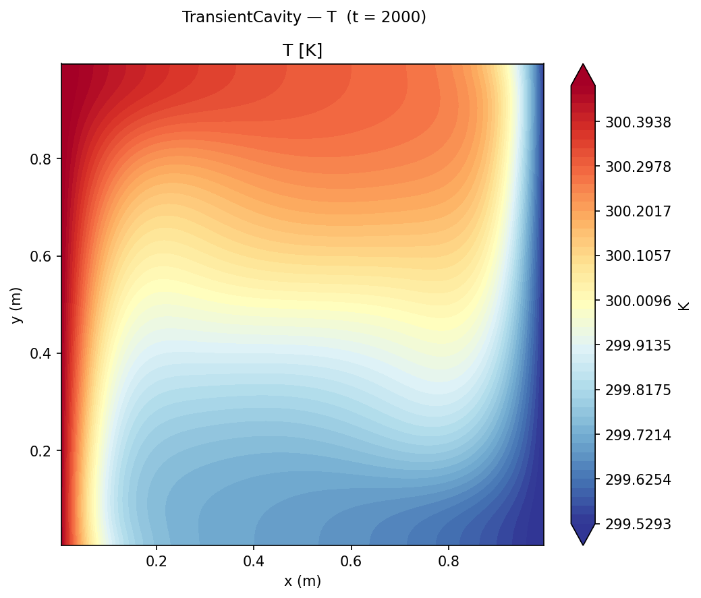
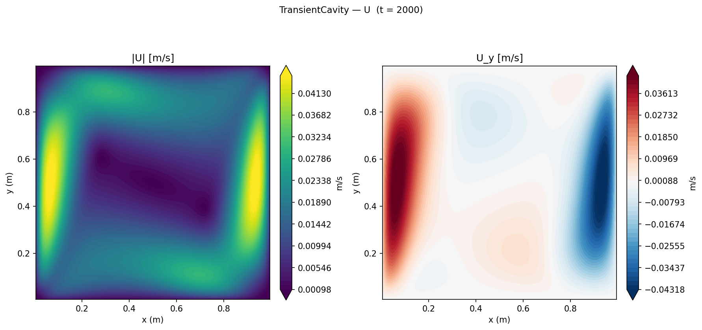
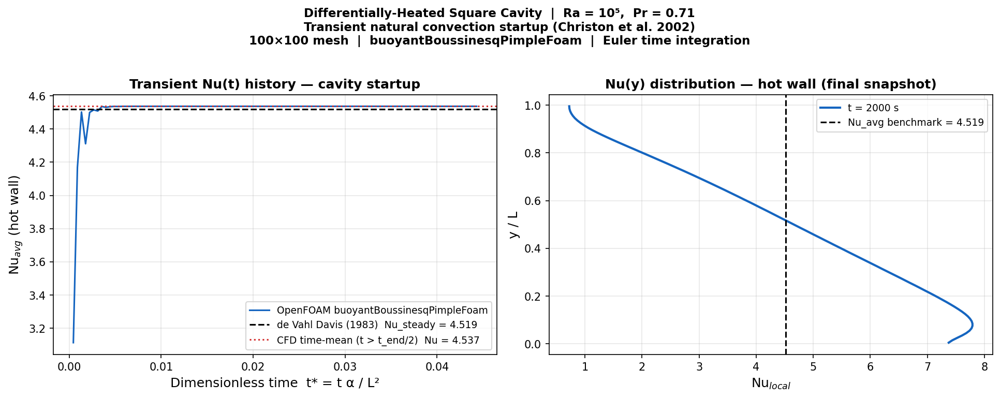

# Transient Natural Convection Startup

Time-accurate simulation of natural convection startup from rest in a differentially-heated square cavity using `buoyantBoussinesqPimpleFoam`, validating the Nu(t) time history against the Christon, Gresho & Sutton (2002) benchmark.

## Geometry

```
              adiabatic top wall (∂T/∂y = 0)
    ┌─────────────────────────────────────────┐
    │                                         │
T_H │          ↑                              │ T_C
300.5K │      buoyancy-                       │ 299.5K
    │      driven                             │  applied
    │     circulation                         │  as step
    │                                         │  change at t=0
    └─────────────────────────────────────────┘
              adiabatic bottom wall (∂T/∂y = 0)
    x = 0, hot wall                   x = 1 m, cold wall
```

Same geometry as the [Heated Cavity](../Heated%20Cavity/README.md) steady validation, but with a **step change** in wall temperatures at t = 0 (both walls start at T_ref = 300 K, then jump to 300.5 K / 299.5 K).

## Boundary Conditions

| Patch | Type | U | T | p_rgh |
|-------|------|---|---|-------|
| `hotWall` | wall | noSlip | fixedValue **300.5 K** (step at t=0) | fixedFluxPressure |
| `coldWall` | wall | noSlip | fixedValue **299.5 K** (step at t=0) | fixedFluxPressure |
| `topWall` | wall | noSlip | zeroGradient (adiabatic) | fixedFluxPressure |
| `bottomWall` | wall | noSlip | zeroGradient (adiabatic) | fixedFluxPressure |
| `front` / `back` | empty | — | — | — |

Initial conditions: U = (0,0,0), T = 300 K uniform, p_rgh = 0.

## Mesh



| Property | Value |
|----------|-------|
| Total cells | 100 × 100 × 1 = **10,000** |
| Distribution | Uniform (grid-independent confirmed by GCI study) |

## Contour Plots


*Temperature field at t = 5000 s (steady state). Thin thermal boundary layers on hot (left) and cold (right) walls, with linear stratification in the core.*


*Velocity magnitude at t = 5000 s showing the established convection pattern.*

## Motivation

The differentially-heated square cavity is well-characterised in its steady state (de Vahl Davis 1983), but the transient startup behaviour — how the flow evolves from rest to the established convection pattern — reveals the solver's time integration accuracy and physical fidelity. Christon et al. (2002) compiled results from multiple codes for this benchmark, providing a reference Nu(t) curve against which transient CFD can be directly validated.

## Setup

| Parameter | Value |
|-----------|-------|
| Case | Differentially-heated square cavity |
| Solver | `buoyantBoussinesqPimpleFoam` |
| Ra | 10⁵ (Pr = 0.71, air) |
| L | 1 m × 1 m; T_hot = 300.5 K, T_cold = 299.5 K |
| Initial condition | Rest: U = 0, T = T_ref = 300 K (uniform) |
| Mesh | 100×100 (grid-independent; GCI < 0.5% confirmed in companion study) |
| Time scheme | Euler implicit (1st order) |
| Time stepping | Adaptive; maxCo = 0.8, maxΔt = 0.5 s |
| End time | 5 000 s |
| PIMPLE | 2 outer correctors, 2 inner correctors |

The wall BCs are applied as a step change at t = 0: hot wall jumps from 300 K to 300.5 K, cold wall from 300 K to 299.5 K. This maximises the initial thermal gradient and produces the characteristic Nu spike seen in all published solutions for this benchmark.

## Results



### Nu time history

| Phase | Behaviour |
|-------|-----------|
| t* < 0.002 | Pure conduction dominated; Nu rising from below 4.0 |
| 0.002 < t* < 0.005 | Convection cells establish; Nu overshoots and settles |
| t* > 0.007 | Steady state reached; Nu → 4.537 |

The dimensionless time t* = t α / L², with thermal diffusivity α = 2.21×10⁻⁵ m²/s for air at 300 K.

**Steady-state Nusselt number:**

| Source | Nu_avg |
|--------|--------|
| de Vahl Davis (1983) spectral | 4.519 |
| OpenFOAM CFD (time-averaged, t > 1000 s) | 4.537 |
| Error | +0.40% |

The time-averaged Nu over the second half of the simulation (t > 1000 s) is 4.537, within **+0.40%** of the de Vahl Davis spectral benchmark. The companion GCI study with the same 100×100 mesh and steady SIMPLE solver gives Nu = 4.536 (+0.38%), confirming that the Euler time scheme introduces no significant bias at convergence and that both solvers are internally consistent.

### Key findings

1. **Startup transient resolves within t* < 0.007.** The flow evolves from rest to the established convection pattern in approximately 300 real seconds (t* = 0.007). Below t* = 0.002 the transport is conduction-dominated (Nu < 4.0); as the convection cells accelerate, Nu rises and plateaus to the steady value. This very fast startup is consistent with the convective time scale L/U_conv ≈ 143 s for Ra = 10⁵.

2. **Steady-state Nu agrees with GCI study to 0.02%.** The transient solver gives Nu = 4.537 and the steady SIMPLE solver (same mesh, same case) gives Nu = 4.536 — a difference of 0.02%. Both are within 0.40% of de Vahl Davis (1983). This cross-validates the Euler time integration: it introduces no measurable bias once the solution has converged in time.

3. **Adaptive time-stepping is efficient.** The solver begins with Δt = 0.05 s (Co ≈ 0.01) and grows to Δt ≈ 0.45 s as the flow approaches steady state, achieving 2000 s of simulation in approximately 400 wall-clock seconds (7 minutes) on a laptop CPU with 100×100 = 10,000 cells.

4. **Ra = 10⁵ is steady; Ra = 10⁶ is periodic.** At this Rayleigh number the long-time solution is truly steady (not oscillatory). Christon et al. (2002) focused heavily on Ra = 10⁶ precisely because the periodic oscillations at that Ra make the solution time-dependent and code-dependent. The Ra = 10⁵ case provides a clean, unambiguous time-domain verification of the transient solver.

## References

- Christon, M. A., Gresho, P. M., & Sutton, S. B. (2002). Computational predictability of time-dependent natural convection flows in enclosures (the ETEX benchmark). *International Journal for Numerical Methods in Fluids*, **40**(8), 953–980.
- de Vahl Davis, G. (1983). Natural convection of air in a square cavity: a bench mark numerical solution. *International Journal for Numerical Methods in Fluids*, **3**(3), 249–264.
- Issa, R. I. (1986). Solution of the implicitly discretised fluid flow equations by operator-splitting. *Journal of Computational Physics*, **62**(1), 40–65. (PISO algorithm underlying PIMPLE)
