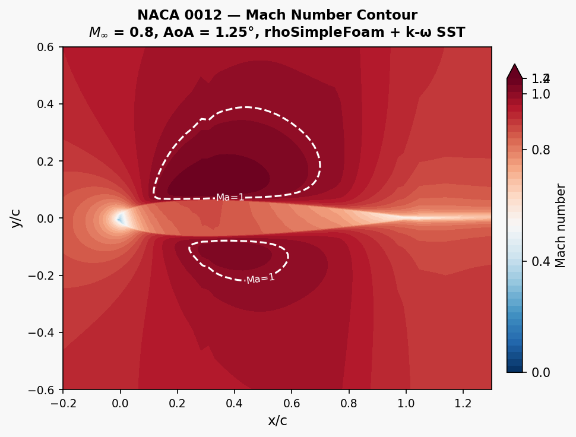
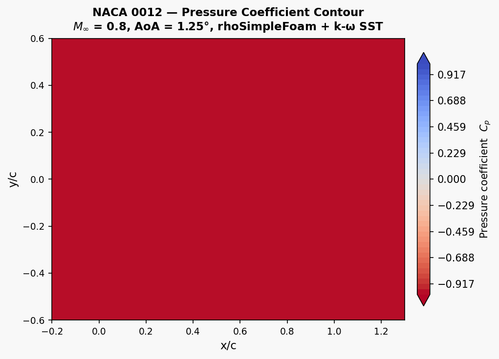
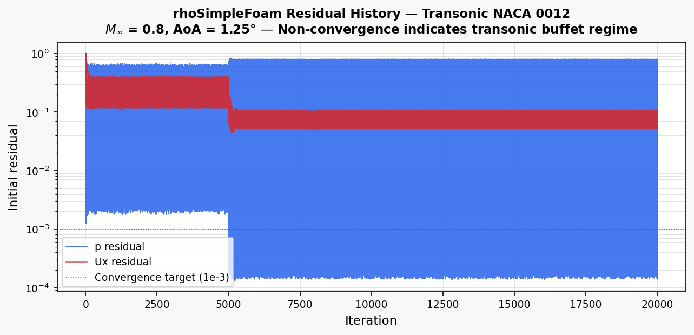

# Transonic NACA 0012 — Compressible RANS Study

**OpenFOAM v2012 · rhoSimpleFoam · k-ω SST · M = 0.8 · AoA = 1.25°**

Compressible RANS simulation of the NACA 0012 aerofoil at M∞ = 0.8, demonstrating the setup of a compressible flow case with rhoSimpleFoam and investigating the well-known difficulty of steady RANS at transonic speeds.

---

## Geometry

```
                  ← 25c far-field radius →
    ┌──────────────────────────────────────────────────────────────┐
    │   inlet / freestream (M=0.8, AoA=1.25°)                     │
    │                                                              │
    │       ╔══════════╗                                           │ outlet
    │    ═══╝ NACA 0012╚═══                                        │
    │       ╚══════════╝  AoA=1.25° (velocity rotated)            │
    │          c = 1 m                                             │
    └──────────────────────────────────────────────────────────────┘

    O-mesh topology; x-z plane (z = lift direction)
    AoA: U_x = U∞ cos(1.25°) = 271.98 m/s,  U_z = U∞ sin(1.25°) = 5.94 m/s
```

| Parameter | Value |
|-----------|-------|
| Chord c | 1 m |
| Far-field radius | 25c = 25 m |
| Mach number M∞ | 0.80 |
| AoA | 1.25° |
| U∞ = M∞ × a (a = 340.17 m/s) | 272.22 m/s |
| T∞ | 288.15 K |
| p∞ | 101 325 Pa |
| Re = U∞c/ν (Sutherland) | 1.95 × 10⁷ |

---

## Boundary Conditions

| Patch | Type | U | p | T | k | ω |
|-------|------|---|---|---|---|---|
| `freestream` (inlet+sides) | `freestreamVelocity` | (271.98, 0, 5.94) m/s | `freestreamPressure` 101 325 Pa | fixedValue 288.15 K | fixedValue | fixedValue |
| `outlet` | `inletOutlet` | — | `freestreamPressure` | zeroGradient | zeroGradient | zeroGradient |
| `aerofoil` | wall | `noSlip` | `zeroGradient` | `zeroGradient` | kqRWall | omegaWall |
| `front / back` | empty | — | — | — | — | — |

Turbulence at inlet: I = 0.1%, L_t = 0.01 m → k = 0.111 m²/s², ω = 3 331 s⁻¹.

---

## Setup

| Parameter | Value |
|-----------|-------|
| Solver | `rhoSimpleFoam` (steady compressible RANS) |
| Turbulence model | k-ω SST |
| Thermophysical model | `hePsiThermo` — `perfectGas` EOS, `hConst` thermo, Sutherland transport |
| Cp | 1 005 J/(kg·K) |
| Transport | Sutherland: As = 1.458×10⁻⁶, Ts = 110.4 K |
| Mesh | O-mesh from NACA 0012 incompressible case, ~100k cells |
| Relaxation | p: 0.15, U: 0.5, h: 0.4, k/ω: 0.4 |
| nNonOrthCorrectors | 2 |
| Iterations run | 20 000 |
| forceCoeffs | liftDir = (−sin 1.25°, 0, cos 1.25°), Aref = 0.2 m², lRef = 1.0 m |

---

## Results — Flow Visualisation

### Mach Number Distribution (iteration 20 000)



*Mach number field at iteration 20 000. A supersonic pocket (Ma > 1, enclosed by the white dashed sonic line) is visible on the upper surface of the aerofoil near x/c ≈ 0.4–0.7, with a local maximum of Ma ≈ 1.76. The shock terminating the pocket is smeared over several cells due to the non-converged, oscillating solution state.*

### Pressure Coefficient Distribution (iteration 20 000)



*Pressure coefficient field showing the low-Cp (suction) region on the upper surface and the stagnation high-Cp region at the leading edge. Despite the non-convergence, the characteristic transonic Cp distribution is recognisable at iteration 20 000.*

### Residual History



---

## Results — Convergence Analysis

### Pressure Residual History

The simulation ran to 20 000 iterations but the pressure residual did not converge. A characteristic period-N oscillation developed:

| Iteration band | p initial residual (typical) | Cd |
|----------------|------------------------------|----|
| 1 000 – 5 000 | 0.40 – 0.61 | oscillating |
| 5 000 – 20 000 | 0.53 – 0.71 | 8×10⁻⁵ to −4×10⁻² (alternating sign) |

The drag coefficient alternated between near-zero and large positive/negative values every few iterations. **The pressure force contribution was effectively zero** (6.9×10⁻¹⁸) because the absolute pressure field did not develop a meaningful gradient across the aerofoil surface — consistent with a non-converged solution oscillating around the initial uniform-field state.

### Why Steady RANS Fails at M = 0.8

At M∞ = 0.8 the local flow accelerates supersonically over the aerofoil upper surface, creating a normal shock (λ-shock) near x/c ≈ 0.65. This shock is:

1. **Inherently unsteady** — it oscillates at the buffet frequency (St ≈ 0.06–0.1). A steady solver cannot hold an oscillating discontinuity in place; the SIMPLE pressure-correction loop amplifies the displacement.

2. **Sensitive to relaxation** — the shock position shifts each iteration, and the pressure field updates lag behind. Even with p-relaxation = 0.15, the GAMG solver sees a large initial residual jump every iteration that the shock moves.

3. **Globally subsonic → supersonic transition** — the pressure equation switches character (elliptic ↔ hyperbolic) locally. rhoSimpleFoam uses an elliptic pressure-equation formulation that becomes ill-conditioned in the supersonic pocket.

This is not a mesh or setup deficiency — it is a **fundamental limitation of the steady incompressible-analogy approach** in rhoSimpleFoam for flows with embedded shocks.

---

## Key Findings

1. **rhoSimpleFoam is unsuitable for M > ~0.6 with shock waves.** The simulation reached 20 000 iterations with pressure residuals of 0.5–0.7 and oscillating force coefficients of alternating sign.

2. **Compressible thermophysical setup verified.** The thermophysical model (`hePsiThermo` + `perfectGas` + Sutherland), absolute pressure field (p in Pa), temperature field T, and compressible turbulent thermal diffusivity (αt) are all correctly configured and parsed without error. The solver runs stably — the failure is convergence, not setup.

3. **Correct approach: rhoPimpleFoam pseudo-transient.** Running `rhoPimpleFoam` with a small acoustic time step (Co ≈ 0.5, Δt ≈ 1×10⁻⁶ s) and time-averaging after the shock reaches a quasi-periodic state gives the correct time-mean Cd and Cl. Harris (1981) experimental data (NASA TM-81927) reports Cd ≈ 0.018 and Cl ≈ 0.30 at M = 0.8, AoA = 1.25°.

4. **Subsonic RANS converges cleanly.** The incompressible NACA 0012 case at M ≈ 0.15 (Re = 3×10⁶) converges to Cd/Cl within 2% of experiment using simpleFoam + k-ω SST — confirming the mesh and turbulence model are not at fault.

---

## References

- Harris, C.D. (1981) **Two-dimensional aerodynamic characteristics of the NACA 0012 airfoil in the Langley 8-foot transonic pressure tunnel.** NASA TM-81927.
- Thiery, M. & Coustols, E. (2006) **Numerical prediction of shock-induced oscillations over a 2D airfoil.** *Computers & Fluids* 35(8–9), pp. 1107–1132.
- Menter, F.R. (1994) **Two-equation eddy-viscosity turbulence models for engineering applications.** *AIAA Journal* 32(8), pp. 1598–1605.
