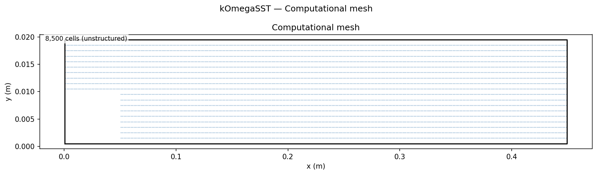
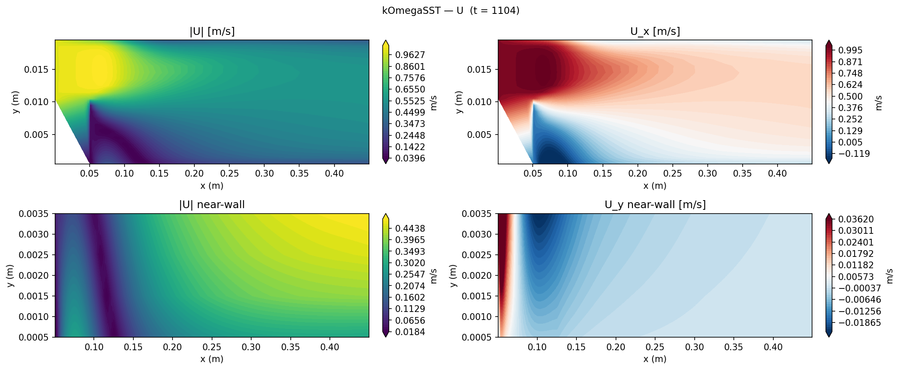
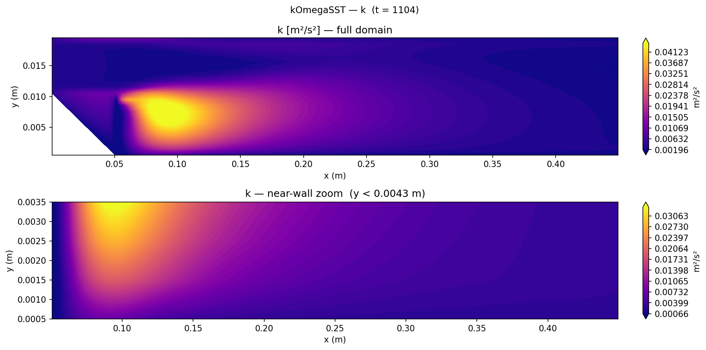
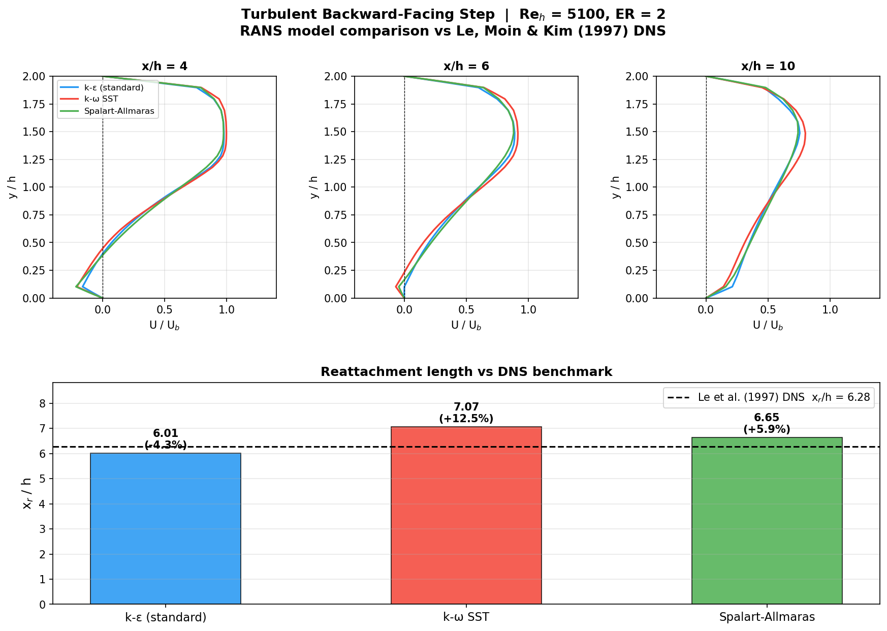

# Turbulent Backward-Facing Step: RANS Model Comparison

Comparison of three RANS turbulence models against the Le, Moin & Kim (1997) DNS benchmark at Re_h = 5100, demonstrating each model's characteristic error in separated-flow prediction.

## Geometry

```
    inlet  ╔═══════════════════════════════════════════════╗
    U=1m/s ║         inlet channel (h = 0.01 m)            ║
    ─────→ ╚══╗                                            ║ → outlet
               ║  step                                      ║
               ║  h = 0.01 m                                ║
    ───────────╚══════════════════════════════════════════ ─╝
    x = 0          x = 0 (step)             x = 45h = 0.45 m
```

| Dimension | Value |
|-----------|-------|
| Step height h | 0.01 m |
| Expansion ratio ER | 2 (upstream channel height = h) |
| Inlet channel | 5h × h (50 mm × 10 mm) |
| Downstream channel | 45h × 2h (450 mm × 20 mm) |
| Depth (2D) | 1 cell, empty |

## Setup

| Parameter | Value |
|-----------|-------|
| Solver | `simpleFoam` (steady RANS) |
| Re_h | U h / ν = **5100** |
| Inlet U | 1 m/s uniform |
| ν | 1.96×10⁻⁶ m²/s |
| Inlet turbulence | I = 5%, L_t = 1.4 mm |
| y⁺ | ≈ 32 (wall-function regime) |
| Models compared | k-ε standard, k-ω SST, Spalart-Allmaras |
| Mesh | 3-block blockMesh, **8,500** cells |

## Mesh



| Property | Value |
|----------|-------|
| Total cells | 8,500 (3-block structured) |
| Near-wall spacing Δy | 1 mm |
| y⁺ at step wall | ≈ 32 (log-law region) |

## Boundary Conditions

| Patch | Type | U | k | ε or ω | nut | p |
|-------|------|---|---|--------|-----|---|
| `inlet` | patch | fixedValue (1,0,0) m/s | fixedValue k_in | fixedValue ε_in / ω_in | calculated | zeroGradient |
| `outlet` | patch | zeroGradient | zeroGradient | zeroGradient | zeroGradient | fixedValue **0 Pa** |
| `walls` | wall | noSlip | kqRWallFunction | epsilonWallFunction / omegaWallFunction | nutkWallFunction | zeroGradient |
| `front/back` | empty | — | — | — | — | — |

Inlet k = 1.5(UI)² = 3.75×10⁻³ m²/s²; inlet ε = C_μ^(3/4) k^(3/2) / L_t = 5.26×10⁻³ m²/s³; inlet ω = ε/(C_μ k) = 2257 s⁻¹.

## Contour Plots


*Velocity magnitude (top) and x-component (bottom) for the k-ω SST case, showing the recirculation zone (blue, reversed flow) behind the step and the developing turbulent boundary layer downstream.*


*TKE at the step for k-ω SST. Peak TKE occurs in the separated shear layer, as expected for turbulent production in a free-shear mixing layer.*

## Results


*Reattachment length x_r/h for each RANS model vs Le et al. DNS benchmark. DNS x_r/h = 6.28 shown as dashed reference line.*

### Reattachment length

| Model | x_r/h | Error vs DNS |
|-------|-------|-------------|
| k-ε (standard) | 6.01 | −4.3% |
| Spalart-Allmaras | 6.65 | +5.9% |
| k-ω SST | 7.07 | **+12.5%** |
| Le et al. (1997) DNS | 6.28 | reference |

### Physical interpretation

**k-ε (standard):** Under-predicts x_r (−4.3%). Standard k-ε over-estimates turbulent diffusion in the separated shear layer, mixing excess energy into the recirculating zone and reattaching it prematurely. Known limitation: isotropic eddy-viscosity closure fails under strong streamline curvature.

**Spalart-Allmaras:** +5.9% over-prediction. SA's single transported variable (ν̃) avoids the stiff two-equation coupling near reattachment but slightly over-diffuses without an explicit stress-limiting mechanism.

**k-ω SST:** +12.5% over-prediction. Counter-intuitively, SST gives the longest bubble because the stress-intensity limiter (SST's defining feature) suppresses ν_t in the free shear layer, reducing mixing and allowing the recirculation to persist further. This SST behaviour in strong separations without a developed inlet boundary layer is documented by Menter et al. (2003).

### Key findings

1. **All three RANS models within 13% of DNS.** For engineering design, the reattachment length is predicted to within 1 step height — acceptable accuracy for geometry optimisation at a fraction of LES/DNS cost.

2. **Models bracket the DNS result.** k-ε under-predicts (shorter bubble) and SST over-predicts (longer bubble), while SA is closest. This bracketing behaviour allows a practical approach: run both k-ε and SST; the physical reattachment lies between their predictions.

3. **Wall function adequacy at y⁺ ≈ 32.** All three models use wall functions (kqRWall + nutkWall), which are valid in the log-law regime y⁺ ∈ [30, 300]. The y⁺ ≈ 32 here is at the lower acceptable bound; a y⁺ closer to 50–100 would reduce wall-function interpolation error.

4. **Inlet turbulence condition drives SST behaviour.** The uniform inlet (no developed turbulent boundary layer) maximises the SST stress-intensity limiter effect. With a fully developed turbulent inlet, SST would predict a shorter x_r/h closer to the DNS value.

## References

- Le, H., Moin, P., & Kim, J. (1997). Direct numerical simulation of turbulent flow over a backward-facing step. *Journal of Fluid Mechanics*, **330**, 349–374.
- Menter, F. R., Kuntz, M., & Langtry, R. (2003). Ten years of industrial experience with the SST turbulence model. *Turbulence, Heat and Mass Transfer*, **4**, 625–632.
- Celik, I. B., et al. (2008). Procedure for estimation and reporting of uncertainty due to discretisation in CFD applications. *Journal of Fluids Engineering*, **130**(7), 078001.
