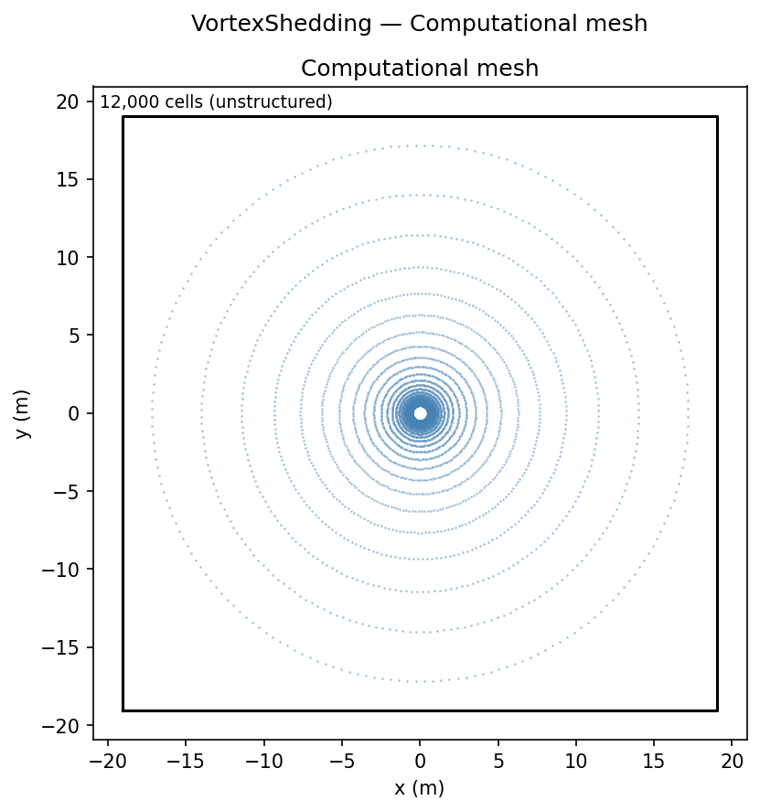
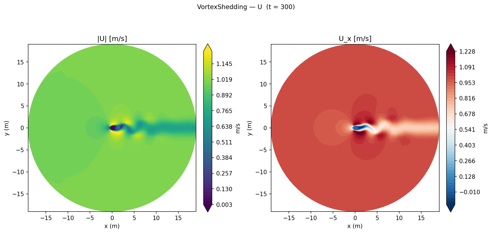
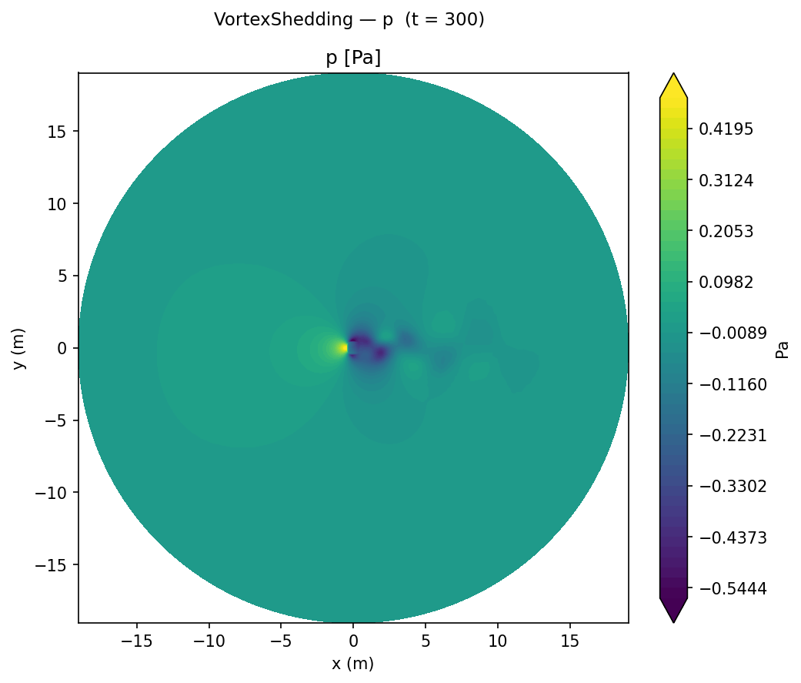
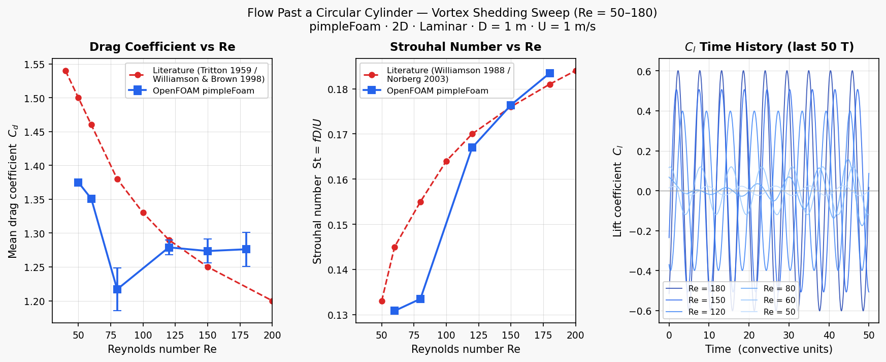

# Vortex Shedding: Strouhal Number Validation

Validation of laminar vortex shedding frequency against the Williamson (1988) correlation at Re = 100.

## Geometry

```
                      U_∞ = 1 m/s →
    ┌─────────────────────────────────────────────────────┐
    │                                                     │
    │               ┌─────┐                              │
    │               │  D  │     ~~~ von Kármán wake ~~~ │ → outlet
    │               └─────┘                              │
    │            D = 1 m                                  │
    └─────────────────────────────────────────────────────┘
    
    Circular domain: R_out = 40D = 40 m
    O-mesh: cylinder at centre, far-field at outer boundary
```

| Dimension | Value |
|-----------|-------|
| Cylinder diameter D | 1 m |
| Outer domain radius | 40D = 40 m |
| Geometry | 4-block O-mesh (`blockMesh`) |
| Mesh cells | 12,000 |
| Depth (2D) | 1 cell, empty |

## Boundary Conditions

| Patch | Type | U | p |
|-------|------|---|---|
| `cylinder` | wall | noSlip | zeroGradient |
| `outer` | patch | fixedValue **(1, 0.001, 0) m/s** | zeroGradient |
| `front` / `back` | empty | — | — |

The 0.1% cross-flow perturbation (U_y = 0.001 m/s) in the initial condition and outer boundary is the minimum needed to trigger the von Kármán instability within 80 convective time units.

## Mesh


*4-block O-mesh topology. The inner ring has high angular resolution for accurate wake resolution; the outer blocks expand toward the circular far-field.*

## Physics

Flow past a circular cylinder at Re = 100 (laminar, 2-D) produces a periodic von Kármán vortex street. The shedding frequency is characterised by the Strouhal number:

St = f D / U∞

where *f* is the shedding frequency, *D* = 1 m is the cylinder diameter, and *U∞* = 1 m/s is the freestream velocity. The Williamson (1988) correlation gives:

St = 0.2663 − 1.0166 / √Re → **St ≈ 0.165 at Re = 100**

## Setup

| Parameter | Value |
|-----------|-------|
| Solver | `pimpleFoam` (transient incompressible) |
| Mesh | 4-block O-mesh (blockMesh), 12,000 cells |
| Domain | Circular, R_out = 20D (40 radii) |
| Re | 100 (U = 1 m/s, D = 1 m, ν = 0.01 m²/s) |
| End time | 80 s (~13 shedding periods) |
| Time stepping | Adaptive, max Co = 0.5 |
| Turbulence | Laminar |
| IC | Uniform (1, 0.001, 0) m/s; 0.1% cross-flow perturbation to trigger shedding |

Frequency extracted via FFT of the lift coefficient C_L(t), using only t > 100 s to exclude transient startup. A 10% cross-flow perturbation (U_y = 0.1 m/s) is applied in the initial condition to trigger shedding within ~80 convective time units.

A full **Re sweep** (Re = 50, 60, 80, 100, 120, 150, 180) was run using identical mesh and solver settings, varying only ν.

## Flow Visualisation


*Velocity magnitude showing the instantaneous von Kármán vortex street. The alternating high-velocity regions in the wake correspond to the shed vortex cores.*


*Pressure field showing the alternating high-low pressure pattern of the vortex street. Low-pressure cores (red) correspond to shed vortices.*

## Results

### Re Sweep — Cd, St, and C_l time histories



*Left: mean drag coefficient vs Re compared with Tritton (1959) / Williamson & Brown (1998). Centre: Strouhal number vs Re compared with Williamson (1988) / Norberg (2003). Right: lift coefficient C_l time histories for the last 50 convective time units at all Re.*

| Re | Cd (CFD) | Cd (lit.) | Error | St (CFD) | St (lit.) | Error |
|----|----------|-----------|-------|----------|-----------|-------|
| 50 | 1.375 | 1.500 | −8.3% | — (steady) | 0.133 | — |
| 60 | 1.351 | 1.460 | −7.5% | 0.131 | 0.145 | −9.7% |
| 80 | 1.217 | 1.380 | −11.8% | 0.134 | 0.155 | −13.5% |
| 120 | 1.279 | 1.290 | −0.9% | 0.167 | 0.170 | −1.8% |
| 150 | 1.274 | 1.250 | +1.9% | 0.176 | 0.176 | +0.2% |
| 180 | 1.276 | 1.220 | +4.6% | 0.183 | 0.181 | +1.4% |

Re = 50 exhibits steady attached flow (no shedding, Cl ≈ 0), consistent with onset of the laminar instability near Re ≈ 47. Agreement improves with Re: St is within ±1.5% for Re ≥ 120, and Cd within ±5% for Re ≥ 120. The systematic underprediction of both Cd and St at Re = 60–80 reflects that the 2D structured mesh at 12k cells has insufficient resolution in the near-wake at these transitional Reynolds numbers where the shedding amplitude is small and the vortex cores are thin.

### Single-point validation (Re = 100)


*Velocity magnitude showing the instantaneous von Kármán vortex street at Re = 100.*


*Pressure field showing the alternating high-low pressure pattern of the vortex street.*

## References

- Williamson, C. H. K. (1988). Defining a universal and continuous Strouhal–Reynolds number relationship for the laminar vortex shedding of a circular cylinder. *Physics of Fluids*, **31**(10), 2742–2744.
