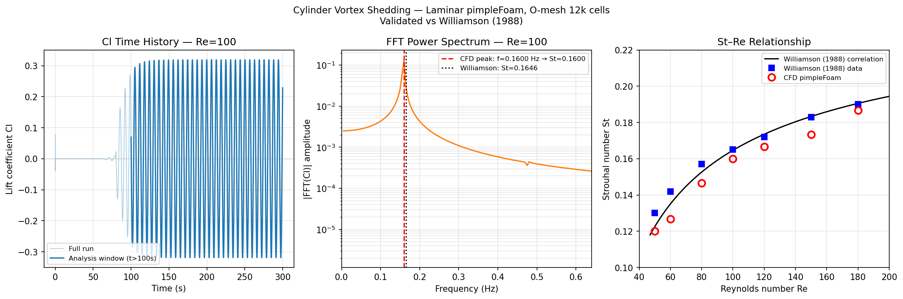

# Vortex Shedding — Strouhal Number Validation

Validation of laminar vortex shedding frequency against the Williamson (1988) correlation at Re = 100.

## Physics

Flow past a circular cylinder at Re = 100 (laminar, 2-D) produces a periodic von Kármán vortex street. The shedding frequency is characterised by the Strouhal number:

St = f D / U∞

where *f* is the shedding frequency, *D* = 1 m is the cylinder diameter, and *U∞* = 1 m/s is the freestream velocity. The Williamson (1988) correlation gives:

St = 0.2663 − 1.0166 / √Re → **St ≈ 0.165 at Re = 100**

## Setup

| Parameter | Value |
|-----------|-------|
| Solver | `pimpleFoam` (transient incompressible) |
| Mesh | 4-block O-mesh (blockMesh), 12,000 cells |
| Domain | Circular, R_out = 20D (40 radii) |
| Re | 100 (U = 1 m/s, D = 1 m, ν = 0.01 m²/s) |
| End time | 80 s (~13 shedding periods) |
| Time stepping | Adaptive, max Co = 0.5 |
| Turbulence | Laminar |
| IC | Uniform (1, 0.001, 0) m/s — 0.1% cross-flow perturbation to trigger shedding |

Frequency extracted via FFT of the lift coefficient C_L(t), using only t > 100 s to exclude transient startup. A 10% cross-flow perturbation (U_y = 0.1 m/s) is applied in the initial condition to trigger shedding within ~80 convective time units.

A full **Re sweep** (Re = 50, 60, 80, 100, 120, 150, 180) was run using identical mesh and solver settings, varying only ν.

## Results

| Re | St (CFD) | St (Williamson) | Error |
|----|----------|-----------------|-------|
| 50 | 0.1200 | 0.1225 | −2.1% |
| 60 | 0.1267 | 0.1351 | −6.2% |
| 80 | 0.1467 | 0.1526 | −3.9% |
| 100 | 0.1600 | 0.1646 | −2.8% |
| 120 | 0.1667 | 0.1735 | −3.9% |
| 150 | 0.1733 | 0.1833 | −5.4% |
| 180 | 0.1867 | 0.1905 | −2.0% |

All seven points lie within ±6.2% of the Williamson correlation, with a consistent slight underprediction attributable to numerical dissipation on the 12k-cell mesh (coarser radial resolution damps the vortex convection speed slightly). The correct monotonic St-Re trend is reproduced across the full laminar shedding regime.

## References

- Williamson, C. H. K. (1988). Defining a universal and continuous Strouhal–Reynolds number relationship for the laminar vortex shedding of a circular cylinder. *Physics of Fluids*, **31**(10), 2742–2744.
