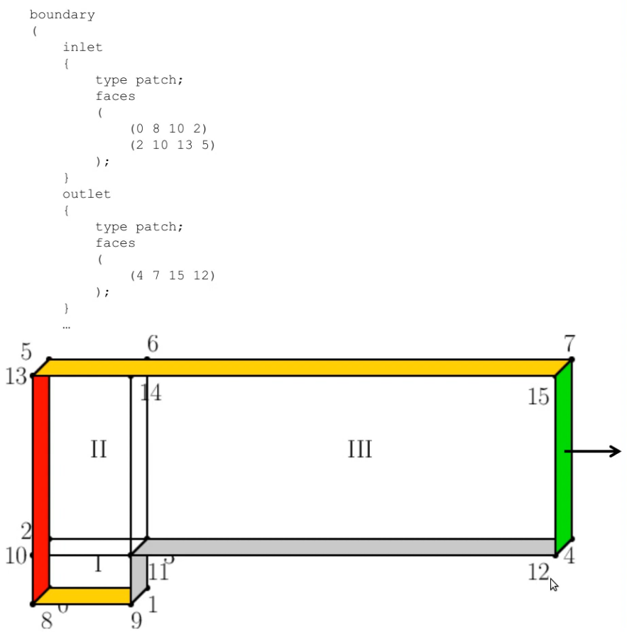
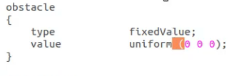

# Helpful Commands
cp controlDict ControlDict.foam
fluentMeshToFoam .msh_file
refineMesh -overwrite
nano system/controlDict
icoFoam
sonicFoam
foamToVTK

# General Notes

# How to create a grid with block mesh in OpenFOAM
within polyMesh/blockMeshDict.txt file, convertToMeters 1; is units in meter, convertToMeters 0.001; is units in millimeters
hex blocks are done counter clock wise with respect to the vertices. Ie, hex (0 1 3 2) if vertices are in 0 1 3 2 ccw order

(25 10 1) = 25 cells in x, 10 in y, 1 in z
declare inlet/outlet faces using RHR to determine proper direction for vertices order:

Inlet AND outlet should point outward
Symmetry planes means geometry can be mirrored along planes

Unspecified faces are given type empty, such as the front and back most face of a 2D simulation (OpenFOAM treats it as 1 mesh in the z direction)
No slip BC:
